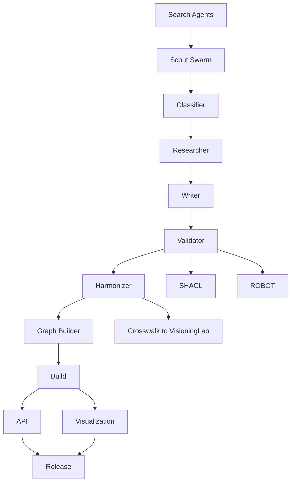

# AI-Ontology: Multi-Stage Framework for Building a Comprehensive AI & GenAI Ontology

## Executive Summary

This document presents an enhanced, research-driven framework for constructing a high-authority AI and GenAI ontology through an agent-orchestrated pipeline. The plan leverages the latest international standards, authoritative sources, and automated validation processes to create a living, interoperable knowledge graph that serves as a definitive reference for the AI domain.

## Unified Ontology Project Architecture

This project is now organized under a unified `ontology/` directory, containing two isolated but interoperable ontologies. This structure provides a clear separation of concerns while enabling cross-ontology linking and validation.

```file_tree
ontology/
├── ai-grounded-ontology/
│   ├── .claude/
│   │   └── agents/
│   │       └── README.md
│   ├── concepts/
│   ├── standards/
│   ├── schemas/
│   │   ├── OntologyDefinition.md
│   │   ├── PropertySchema.md
│   │   ├── AI-SHACL.ttl
│   │   └── InteroperabilitySpec.md
│   ├── crosswalk/
│   │   ├── VisioningLab-Property-Crosswalk.md
│   │   └── VisioningLab-URI-Mapping.json
│   ├── validation/
│   │   ├── robot/
│   │   ├── shacl/
│   │   └── reports/
│   ├── artifacts/
│   │   ├── owl/
│   │   ├── ttl/
│   │   ├── json-ld/
│   │   └── skos/
│   └── docs/
│       ├── AuthoritativeSources.md
│       ├── MethodologyGuide.md
│       ├── ContributionGuide.md
│       ├── TEMPLATE.md
│       └── validation/
│           └── ROBOT_QC.md
└── metaverse-ontology/
    ├── agents/
    ├── concepts/
    ├── docs/
    ├── schemas/
    │   ├── OntologyDefinition.md
    │   └── PropertySchema.md
    └── tooling/
        └── logseq-owl-extractor/
```

## Stage 0: Foundation & Strategic Planning

**Objective**: Establish robust technical infrastructure and authoritative source registry.

**Agent Orchestration**:
- **Architect Agent**: Creates the enhanced directory structure with standards integration paths
- **Standards Harmonizer Agent**: Maps relationships between ISO/IEC 42001-42006, NIST AI RMF, EU AI Act, and OECD frameworks
- **Librarian Agent**: Compiles and vets authoritative sources with quality scoring

**High-Authority Source Registry** (Enhanced):

### Primary Standards Bodies
- **ISO/IEC JTC 1/SC 42 Series**:
  - ISO/IEC 22989:2022 (AI concepts and terminology)
  - ISO/IEC 42001:2023 (AI management systems)
  - ISO/IEC 42005:2025 (AI impact assessment)
  - ISO/IEC 42006:2025 (AIMS certification requirements)
  - ISO/IEC 21838-1:2021 (Top-level ontologies requirements)
  - ISO/IEC 23894:2023 (AI risk management)

### Regulatory Frameworks
- **EU AI Act** (Regulation 2024/1689) and associated guidelines
- **NIST AI RMF 1.0** and Generative AI Profile (NIST AI 600-1)
- **OECD AI Principles** (2024 revision) and Classification Framework

### Research Institutions
- **Stanford HAI AI Index 2025** (comprehensive annual report)
- **MIT CSAIL** research publications
- **DeepMind Technical Reports**
- **OpenAI Research Papers**
- **Anthropic Safety Research**

### Academic Resources
- **Key Papers**: "Attention Is All You Need", "BERT", "GPT series", "Constitutional AI"
- **Textbooks**: 
  - "Deep Learning" (Goodfellow, Bengio, Courville)
  - "Pattern Recognition and Machine Learning" (Bishop)
  - "The Alignment Problem" (Christian)

### Industry Standards
- **Partnership on AI** publications
- **IEEE Standards** (P2802, P2863, P2976 for XAI)
- **W3C** AI vocabulary initiatives

**Deliverables**:
1. Complete ontology infrastructure with multi-format support
2. `OntologyDefinition.md` with ISO/IEC 21838-1 compliant top-level structure
3. `PropertySchema.md` incorporating OECD classification dimensions
4. `AuthoritativeSources.md` with weighted authority scoring

## Stage 1: Intelligent Term Discovery & Prioritization

**Objective**: Build comprehensive, prioritized terminology backlog through multi-source analysis.

**Agent Workflow**:
1. **Scout Swarm** (5-10 parallel agents):
   - Each agent assigned specific source categories
   - Extract candidate terms with context and frequency metrics
   - Flag emerging terminology from recent publications

2. **Classifier Agent**:
   - Applies hierarchical clustering using:
     - OECD Framework dimensions (People & Planet, Economic Context, Data & Input, AI Model, Task & Output)
     - EU AI Act risk categories
     - NIST AI RMF functions (Govern, Map, Measure, Manage)
   - Assigns priority scores based on:
     - Regulatory importance (High-risk AI systems get priority)
     - Technical fundamentality (Core concepts before specialized)
     - Cross-reference frequency across sources

**Enhanced Categorization Matrix**:
```
Priority 1 (Foundational): Core AI/ML concepts, regulatory definitions
Priority 2 (Essential): Key architectures, primary techniques, governance concepts  
Priority 3 (Important): Specific applications, emerging methods
Priority 4 (Specialized): Domain-specific implementations, niche techniques
```

**Deliverables**:
1. Structured backlog of 500-800 prioritized terms
2. Term provenance tracking (which authoritative sources define each)
3. Cross-reference mapping showing term relationships

## Stage 2: Automated Term Research & Documentation (Iterative)

**Objective**: Generate comprehensive, standards-compliant documentation for each term.

**Enhanced Agent Pipeline** (per term batch):

1. **Research Agent** receives term assignment with context:
   - Queries 5-7 authoritative sources minimum
   - Extracts definitions, technical specifications, regulatory relevance
   - Identifies synonyms and related terminology across frameworks
   - Maps to relevant standards clauses

2. **Writer Agent** creates documentation following template:
   ```markdown
   # [Term Name]
   
   ## Definition
   [Synthesized authoritative definition with source attribution]
   
   ## Standards Alignment
   - ISO/IEC: [Relevant standards and clauses]
   - NIST: [Framework mappings]
   - EU AI Act: [Regulatory classifications]
   - OECD: [Principle alignments]
   
   ## Technical Characteristics
   [Detailed technical description]
   
   ## Ontological Classification
   - Type: [Entity/Process/Property/Relationship]
   - Domain: [Primary domain assignment]
   - Risk Level: [Per EU AI Act if applicable]
   
   ## Formal Axioms
   ```owl
   [OWL2 representation]
   ```
   
   ## Relationships
   - is-a: [Parent concepts]
   - has-part: [Component concepts]
   - related-to: [Associated concepts]
   
   ## Provenance
   [Authoritative sources with specific citations]
   ```

3. **Compliance Checker Agent**:
   - Validates against ISO/IEC 22989 terminology standards
   - Ensures EU AI Act classification accuracy
   - Verifies NIST AI RMF alignment

**Deliverables**:
1. Fully documented concept files with multi-framework alignment
2. Automated compliance reports per batch
3. Cross-standard mapping database

## Stage 3: Ontological Validation & Graph Construction

**Objective**: Build logically consistent, richly interconnected knowledge graph.

**Multi-Layer Validation Process**:

1. **Ontology Validator Agent**:
   - Executes `logseq-owl-extractor` on concept directory
   - Runs reasoning with `horned-owl` (Rust) or `ROBOT` tool
   - Performs consistency checking:
     - Disjointness violations
     - Circular dependencies
     - Missing required properties
     - Conflicting classifications

2. **Standards Harmonizer Agent**:
   - Identifies conceptual overlaps between frameworks
   - Creates bridging axioms for interoperability
   - Generates equivalence mappings

3. **Graph Builder Agent**:
   - Constructs multi-layer relationship network:
     - Taxonomic layer (is-a hierarchies)
     - Mereological layer (part-whole relationships)
     - Associative layer (semantic connections)
     - Regulatory layer (compliance mappings)
   - Optimizes for navigability and query performance

**Quality Metrics**:
- Logical consistency score
- Coverage completeness (% of authoritative terms included)
- Cross-reference density
- Standards alignment percentage

**Deliverables**:
1. Validated OWL2 ontology passing all reasoning checks
2. Multi-format exports (OWL/XML, Turtle, JSON-LD)
3. Validation report with quality metrics
4. Interoperability mapping tables

## Stage 4: Deployment & Knowledge Dissemination

**Objective**: Create accessible, multi-format knowledge products.

**Production Pipeline**:

1. **Build Agent**:
   - Generates production artifacts in all target formats
   - Creates versioned releases with changelogs
   - Produces SKOS (Simple Knowledge Organization System) exports

2. **Visualization Agent**:
   - Deploys WebVOWL interactive visualization
   - Generates static diagrams for key concept clusters
   - Creates navigable HTML documentation

3. **API Generator Agent**:
   - Builds SPARQL endpoint configuration
   - Creates REST API specifications
   - Generates client libraries

**Deliverables**:
1. Complete ontology package with multiple format options
2. Interactive web-based exploration tools
3. Comprehensive glossary with 500+ terms
4. API access for programmatic integration

## Stage 5: Continuous Evolution & Governance

**Objective**: Maintain currency with rapidly evolving AI landscape.

**Monitoring & Update Cycle**:

1. **Horizon Scanner Agent** (Weekly activation):
   - Monitors authoritative sources for new publications
   - Tracks standards updates and regulatory changes
   - Identifies emerging terminology trends

2. **Curator Agent** (Monthly review):
   - Prioritizes update requirements
   - Schedules re-validation cycles
   - Manages version control

3. **Community Liaison Agent**:
   - Processes external contributions
   - Manages feedback integration
   - Coordinates with standards bodies

**Governance Framework**:
- Quarterly full ontology review
- Bi-annual standards realignment
- Annual major version release
- Continuous integration of regulatory updates

## Implementation Considerations

### Scalability
- Designed for parallel agent execution
- Batch processing capabilities for 20-50 terms simultaneously
- Incremental validation to avoid full reprocessing

### Interoperability
- Native support for multiple ontology formats
- Standards-compliant metadata
- Cross-framework mapping tables

### Quality Assurance
- Multi-stage validation pipeline
- Authoritative source verification
- Automated consistency checking
- Human-in-the-loop review for critical terms

### Community Engagement
- Open contribution model
- Transparent governance process
- Regular stakeholder consultations
- Integration with standards development processes

## Success Metrics

1. **Coverage**: >90% of terms from authoritative sources included
2. **Accuracy**: 100% logical consistency in formal ontology
3. **Alignment**: >95% mapping to relevant standards
4. **Currency**: <30 days lag for critical terminology updates
5. **Adoption**: Active use by >10 organizations within first year

This enhanced framework provides a robust, scalable approach to building a definitive AI/GenAI ontology that serves as both a technical resource and a bridge between multiple regulatory and standards frameworks, while remaining agile enough to evolve with the rapidly advancing field of artificial intelligence.
## Swarm Research and Implementation Guide

This document serves as the primary guide for the agent swarm responsible for building and maintaining the AI Grounded Ontology. It outlines the project's architecture, agent workflows, standards, and validation procedures.

### Purpose and Scope
- **Isolate and Link**: The AI ontology is developed in an isolated directory (`ontology/ai-grounded-ontology`) but remains interoperable with the `metaverse-ontology`.
- **Agent-Driven**: Swarms of non-browser, net-connected agents are responsible for all research, validation, and content generation.
- **Hybrid Style**: The output must conform to the hybrid human/machine-readable style of the Metaverse ontology, using `ontology/metaverse-ontology/concepts/World Instance.md` as a style guide.

### Interoperability with Metaverse Ontology
- **Crosswalk**: Property mappings are defined in `ontology/ai-grounded-ontology/crosswalk/VisioningLab-Property-Crosswalk.md`.
- **Property Alignment**: Page templates and relationship properties are aligned with `ontology/metaverse-ontology/schemas/PropertySchema.md`.
- **Top-Level Conformance**: The ontology maintains a separate class structure compliant with ISO/IEC 21838-1, as defined in `ontology/ai-grounded-ontology/schemas/OntologyDefinition.md`.
- **Validation**: SHACL shapes for ensuring conformance are located in `ontology/ai-grounded-ontology/schemas/AI-SHACL.ttl`.

### Term Page Template (Human + Machine Readable)
The official template for creating new AI terms is located at `ontology/ai-grounded-ontology/docs/TEMPLATE.md`. This template ensures consistency with the hybrid, human/machine-readable style of the Metaverse ontology.

Agent Swarms And Token Efficiency Policy
- Non-browser web search agents only. Use source-specific search APIs and site-restricted queries. No headless browsing.
- Retrieval budget control: micro-batches of 20–50 terms; max parallel per batch 5–10; per-domain rate limits; early stopping on confidence.
- Evidence first: require at least 3 independent authoritative sources per definition. Compute a document fingerprint: {canonical-URL, last-modified, checksum}.
- Dedup and canonicalization: normalize citations, resolve redirects, collapse variants, maintain a single canonical URI per source.
- Rank fusion: blend ranked results from multiple search agents; penalize blogs and vendor marketing unless explicitly whitelisted.
- Caching: store snippet caches and full-text hashes; cache invalidation when last-modified changes.
- Claim-level grounding: each definitional claim and each relationship asserts an evidence list of cited clauses or sections.
- Safety gates: flag terms touching safety, fairness, privacy, or high-risk categories for additional human review.
- Cost controls: prefer abstracts, official overviews, and clause-level retrieval before downloading full PDFs; escalate only if confidence < target.

### Expanded Authoritative Sources Registry
Authoritative sources are curated and scored in `ontology/ai-grounded-ontology/docs/AuthoritativeSources.md`. Swarms will validate publication status and permalinks.

Standards Bodies and Regulatory
- ISO-IEC JTC 1 SC 42 series
  - ISO-IEC 22989 AI concepts and terminology [validate edition and clause references]
  - ISO-IEC 23894 AI risk management [validate edition and clause references]
  - ISO-IEC 42001 AI management system [validate]
  - ISO-IEC 42005 AI impact assessment [validate current status]
  - ISO-IEC 42006 AIMS certification requirements [validate current status]
  - ISO-IEC TR 24028 AI trustworthiness [validate]
  - ISO-IEC 24029-1 AI robustness evaluation [validate]
  - ISO-IEC 24029-2 AI robustness evaluation for neural networks [validate]
  - ISO-IEC TR 38507 Governance guidance for AI [validate]
  - ISO-IEC 25012 Data quality model [validate]
- EU
  - EU AI Act Regulation 2024/1689 official OJ link and consolidated text [validate]
  - Implementing and delegated acts as released [monitor]
- NIST
  - NIST AI RMF 1.0 [validate canonical URL]
  - NIST AI 600-1 GenAI Profile [validate]
  - NIST SP 1270 Managing bias in AI [validate]
- OECD
  - OECD AI Principles 2024 revision [validate]
  - OECD AI Classification Framework [validate]
- W3C
  - OWL 2 recommendation set [validate canonical REC URIs]
  - SKOS reference [validate]
  - SHACL recommendation [validate]
  - PROV-O and DCAT for provenance and dataset metadata [validate]
- IEEE
  - IEEE 7000 series for ethical systems design [validate series subset]
  - IEEE P2802, P2863, P2976 for XAI and related guidance [validate]
- UNESCO
  - 2021 Recommendation on the Ethics of AI [validate]
- ENISA
  - AI cybersecurity and assurance guidance [validate]

Pipeline Deltas From Existing Stages
- Stage 0: add isolated project scaffolding, crosswalk authoring, and authoritative source validation epics with API-based search agents.
- Stage 1: apply source de-duplication, rank fusion, and confidence gating before backlog prioritization.
- Stage 2: emit term pages using the aligned template above, with mandatory evidence lists and clause-level citations.
- Stage 3: expand validation gates to include SHACL conformance and ROBOT QC; fail builds on missing required properties and invalid relationships.
- Stage 4: include SKOS exports and JSON-LD contexts optimized for API and search indexing.
- Stage 5: add weekly horizon scanning queries per source family with change detection based on last-modified and checksum diffs.

Agent Workflow Diagram


Success Metrics Addendum
- Evidence coverage: 3+ authoritative citations per term with clause-level references.
- Validation conformance: 100 percent SHACL shapes satisfied and ROBOT QC pass rate 100 percent for release builds.
- Interop completeness: 95 percent term-level property mapping coverage in crosswalk files.
- Update freshness: authoritative registry items revalidated within 30 days of detected change.

### Immediate Next Steps for Agent Swarm
1.  **Validate Sources**: Begin validating the authoritative sources listed in `ontology/ai-grounded-ontology/docs/AuthoritativeSources.md` using non-browser search agents.
2.  **Implement Validation**: A code-focused agent will author the non-Markdown assets, including the SHACL shapes (`AI-SHACL.ttl`) and ROBOT configurations.
3.  **Begin Term Discovery**: The Scout Swarm will commence term discovery based on the validated sources.
4.  **Configure Agents**: The Orchestrator agent will configure all other agents based on the guidelines in `ontology/ai-grounded-ontology/.claude/agents/README.md`.