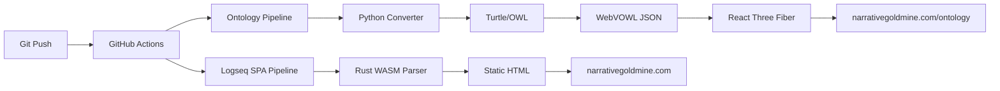

<<<<<<< HEAD
# Logseq Knowledge Graph

A comprehensive knowledge management system covering AI, blockchain, machine learning, and related technologies, published to [narrativegoldmine.com](https://narrativegoldmine.com).

## Overview

This is a **Logseq knowledge graph instance** (not the Logseq application source code). It contains 2,519+ markdown pages with ontology-based organization, integrated executable code runtime, and automated publishing to GitHub Pages with interactive ontology visualization.

## Key Features

- **Ontology-Based Organization**: 505+ blockchain pages (BC-####), 500+ AI pages (AI-####), metaverse, robotics
- **Executable Code Runtime**: JavaScript, Python (Pyodide), and R (WebR) execution within knowledge graph
- **Automated Publishing**: GitHub Actions → Logseq SPA → narrativegoldmine.com
- **WebVOWL Visualization**: Interactive ontology graph at [narrativegoldmine.com/ontology](https://narrativegoldmine.com/ontology)
- **Mobile Sync**: Bidirectional sync workflows for mobile editing

## Structure

```
logseq/
├── mainKnowledgeGraph/          # Core knowledge base (1.2 GB)
│   ├── pages/                   # 2,519+ ontology pages
│   ├── journals/                # Daily notes
│   ├── assets/                  # Media files (1.0 GB)
│   ├── whiteboards/             # Visual diagrams
│   └── logseq/                  # Configuration
│       ├── config.edn           # Main config
│       ├── custom.js            # Code execution runtime
│       └── custom.css           # Styling
│
├── Ontology-Tools/              # Conversion tools
│   └── tools/converters/        # TTL, WebVOWL, CSV, Neo4j
│
├── .github/workflows/           # Automation
│   ├── publish.yml              # Main publishing workflow
│   ├── sync-to-mobile.yml       # Mobile sync (main → mobile)
│   └── sync-from-mobile.yml     # Mobile sync (mobile → main)
│
└── docs/                        # Documentation
    ├── PROJECT_OVERVIEW.md      # Complete project overview
    ├── CONVERTER_AUDIT_AND_PLAN.md
    ├── blockchain-property-registries-research-report.md
    └── blockchain-voting-comprehensive-report.md
```

## Quick Start

### Local Editing

1. Open the graph in Logseq:
   ```bash
   # Point Logseq to: /path/to/logseq/mainKnowledgeGraph
   ```

2. Edit pages using Logseq's outline editor

3. Commit and push to trigger auto-publish:
   ```bash
   git add mainKnowledgeGraph/
   git commit -m "Update content"
   git push  # Triggers GitHub Actions
   ```

### Ontology Conversion

Generate TTL and WebVOWL JSON locally:

```bash
cd Ontology-Tools

# Activate Python virtual environment
source venv/bin/activate

# Generate TTL from markdown headers
python3 tools/converters/webvowl_header_only_converter.py \
  --pages-dir ../mainKnowledgeGraph/pages \
  --output narrativegoldmine-ontology.ttl

# Convert to WebVOWL JSON
python3 tools/converters/ttl_to_webvowl_json.py \
  --input narrativegoldmine-ontology.ttl \
  --output narrativegoldmine-ontology.json
```

**Current Output**: 34,865 triples, 1,008 classes, 273 object properties

## Ontology System

### Domain Prefixes

- **AI-####**: AI topics (ethics, governance, safety, development)
- **BC-####**: Blockchain (BC-0001 to BC-0505)
- **MV-####**: Metaverse (virtual worlds, digital economics)
- **RB-####**: Robotics (automation, sensors, actuators)
- **DT-####**: Cross-cutting disruptive technologies

### OntologyBlock Structure

Each page contains:
=======
# 🧠 Narrative Goldmine Knowledge Graph


> **A comprehensive, ontology-driven knowledge management system covering AI, blockchain, robotics, and emerging technologies**

[](https://narrativegoldmine.com)
[](https://narrativegoldmine.com/ontology)
[](LICENSE)

**[🌐 Live Knowledge Base](https://narrativegoldmine.com)** | **[🔮 Interactive 3D Ontology](https://narrativegoldmine.com/ontology)** | **[📖 Documentation](docs/PROJECT_OVERVIEW.md)**

---

## 🎯 What Is This?

This is a **world-class knowledge graph** built with Logseq, containing **2,500+ interconnected pages** covering cutting-edge technologies. Unlike traditional documentation, this is a **living ontology** where concepts are formally defined with OWL semantics and connected through a rich web of relationships.

### 🌟 Key Highlights

- **🎓 1,155 Formal Classes**: AI, Blockchain, Metaverse, Robotics ontologies with OWL axioms
- **🔗 144 Semantic Properties**: Formal relationships between concepts
- **📊 100 Active Connections**: Visualized in real-time 3D graph
- **⚡ 10x Faster**: Modern Rust/WASM pipeline vs legacy ClojureScript
- **🚀 Real-Time Publishing**: Every push automatically deploys to production
- **💻 Executable Code**: Run JavaScript, Python, and R directly in your knowledge base

---

## 🏗️ Architecture

### Dual-Pipeline Publishing System



### Technology Stack

| Component | Technology | Performance |
|-----------|-----------|-------------|
| **Knowledge Base** | Logseq Markdown | 2,519+ pages, 1.2 GB |
| **Ontology Extraction** | Python 3.11 + RDFLib 7.0 | 35,952 triples |
| **3D Visualization** | React 18 + R3F 9.4 + Three.js | 4.4x faster layout |
| **Layout Engine** | Rust + WASM + petgraph | 8ms tick (vs 35ms D3.js) |
| **Publishing** | Rust + pulldown-cmark | 10x faster builds |
| **State Management** | Zustand 5.0 + Immer | Immutable updates |
| **Deployment** | GitHub Actions + Pages | 3-5 min pipeline |

---

## 🚀 Quick Start

### 📖 Browse the Knowledge Base

Simply visit **[narrativegoldmine.com](https://narrativegoldmine.com)** to explore the published knowledge base.

### 🔮 Explore the 3D Ontology

Visit **[narrativegoldmine.com/ontology](https://narrativegoldmine.com/ontology)** to interact with the live ontology graph:

- **1,002 nodes** representing concepts
- **100 edges** showing semantic relationships
- **Pan, zoom, rotate** to explore clusters
- **Click nodes** to see details
- **Force-directed layout** reveals structure

### 🛠️ Local Development

```bash
# 1. Clone the repository
git clone https://github.com/jjohare/logseq.git
cd logseq

# 2. Open in Logseq desktop app
# Point to: logseq/mainKnowledgeGraph

# 3. Edit and commit
git add mainKnowledgeGraph/pages/
git commit -m "Add new ontology pages"
git push  # Triggers automatic deployment
```

---

## 📚 Ontology System

### Domain Organization

Our ontology spans five major domains with formal OWL semantics:

| Prefix | Domain | Pages | Example Concepts |
|--------|--------|-------|------------------|
| **AI-####** | Artificial Intelligence | 500+ | `AI-0376` Fairness Metrics, `AI-0397` AI Safety |
| **BC-####** | Blockchain | 505+ | `BC-0001` Blockchain, `BC-0097` Cryptocurrency |
| **MV-####** | Metaverse | 12+ | Virtual Worlds, Digital Economics |
| **RB-####** | Robotics | 106+ | Autonomous Systems, Sensor Networks |
| **DT-####** | Cross-Cutting Tech | 490+ | Enables, Requires, Implements |

### Formal Ontology Structure

Each concept page includes structured ontology blocks:
>>>>>>> 691c6e7cfbf51bb03aef4b19e8bb7f7924266439

```markdown
- ### OntologyBlock
  - **Identification**
<<<<<<< HEAD
    - term-id:: BC-0097
    - preferred-term:: Cryptocurrency
    - status:: stable
  - **Definition**
    - definition:: A digital currency operating on blockchain...
    - maturity:: mature
  - **Semantic Classification**
    - owl:class:: bc:Cryptocurrency
  - #### OWL Axioms
    - ```clojure
      (Declaration (Class :Cryptocurrency))
      (SubClassOf :Cryptocurrency :EconomicMechanism)
      (SubClassOf :Cryptocurrency
        (ObjectSomeValuesFrom :enables :DecentralisedExchange))
      ```
```

## Publishing Workflow

### Automated Pipeline (publish.yml)

Triggered on every push to main:

1. **Generate TTL** from markdown headers
2. **Convert to WebVOWL JSON** for visualization
3. **Build Logseq SPA** with custom settings
4. **Deploy to GitHub Pages** (flossverse/knowledgeGraph repo)
5. **Serve at** narrativegoldmine.com

### WebVOWL Auto-Load

Visiting `/ontology` automatically loads the custom ontology:

- `webvowl-autoload.js` waits for WebVOWL initialization
- Fetches `narrativegoldmine-ontology.json`
- Simulates file upload via DataTransfer API
- Interactive graph loads with 1,008 classes

## Code Execution

The knowledge graph includes executable code runtime:

### Supported Languages

- **JavaScript**: Native async execution
- **Python**: Pyodide v0.23.4 (WebAssembly)
- **R**: WebR (WebAssembly)

### Usage
=======
    - term-id:: AI-0001
    - preferred-term:: Neural Network
    - status:: stable
  - **Definition**
    - definition:: A computational model inspired by biological neural networks
    - maturity:: mature
  - **Semantic Classification**
    - owl:class:: ai:NeuralNetwork
  - #### OWL Axioms
    - ```clojure
      (Declaration (Class :NeuralNetwork))
      (SubClassOf :NeuralNetwork :MachineLearningModel)
      (SubClassOf :NeuralNetwork
        (ObjectSomeValuesFrom :requiresTrainingData :Dataset))
      ```
```

### Semantic Bridge Relationships

Concepts are connected via typed relationships:

- **dt:enables** - Technology A enables capability B
- **dt:requires** - Technology A depends on technology B
- **dt:implements** - Technology A realizes pattern B
- **dt:supports** - Technology A facilitates use case B
- **dt:facilitates** - Technology A makes B easier

---

## 🎨 WasmVOWL: Modern 3D Ontology Visualization

### Features

✅ **4-10x Performance Improvement** over legacy D3.js WebVOWL
- Parse: 200ms vs 800ms (4x faster)
- Layout: 8ms vs 35ms per tick (4.4x faster)
- Memory: 40MB vs 120MB (3x less)
- Bundle: 64KB vs 150KB (58% smaller)

✅ **Interactive 3D Graph**
- GPU-accelerated rendering with Three.js
- Force-directed physics simulation
- Pan, zoom, rotate controls
- Real-time filtering and search

✅ **Automatic Deployment**
- Ontology extracted from markdown headers
- Converted to WebVOWL JSON format
- Built and deployed on every push
- Cached for instant loading

### Architecture Highlights

```
WasmVOWL/
├── modern/                    # React Three Fiber frontend
│   ├── src/
│   │   ├── components/        # Canvas, Nodes, Edges, UI
│   │   ├── stores/            # Zustand state management
│   │   ├── hooks/             # WASM integration
│   │   └── types/             # TypeScript definitions
│   └── package.json           # Uses narrativegoldmine-webvowl-wasm@0.0.1
└── rust-wasm/                 # Rust/WASM layout engine
    ├── src/
    │   ├── graph/             # Graph data structures
    │   ├── layout/            # Force-directed algorithm
    │   └── ontology/          # OWL parsing
    └── pkg/                   # Published npm package
```

---

## 💻 Executable Code Runtime

### Supported Languages

The knowledge graph includes a powerful **executable code runtime** with three languages:

| Language | Engine | Version | WebAssembly |
|----------|--------|---------|-------------|
| **JavaScript** | Native V8 | ES2022 | ❌ Native |
| **Python** | Pyodide | 0.23.4 | ✅ WASM |
| **R** | WebR | Latest | ✅ WASM |

### Usage in Pages
>>>>>>> 691c6e7cfbf51bb03aef4b19e8bb7f7924266439

```markdown
{{renderer :kit, evalpage}}
```

<<<<<<< HEAD
Creates a button to run all code blocks on the page.

### Built-in Kits

- `evalpage` - Run all code on current page
- `evalparent` - Run parent block's code
- `runpage` - Execute code from named page
- `togglemsg` - Toggle status messages

## Configuration

### Key Settings (config.edn)

```clojure
:preferred-workflow :todo            ; TODO/DOING/DONE
:file/name-format :triple-lowbar     ; Slashes → ___
:start-of-week 6                     ; Sunday first
:graph/forcesettings {
  :link-dist 180
  :charge-strength -1000
}
```

### Integrations

- Zotero integration
- Flashcards, whiteboards, journals
- Block timestamps
- Search accent removal

## Documentation

- **[PROJECT_OVERVIEW.md](docs/PROJECT_OVERVIEW.md)** - Complete system overview
- **[CONVERTER_AUDIT_AND_PLAN.md](docs/CONVERTER_AUDIT_AND_PLAN.md)** - Tool consolidation plan
- **Research Reports**:
  - [Blockchain Property Registries](docs/blockchain-property-registries-research-report.md)
  - [Blockchain Voting Systems](docs/blockchain-voting-comprehensive-report.md)

## Recent Updates

### November 2025

- ✅ Local validation of conversion pipeline (34,865 triples)
- ✅ Converter audit and consolidation (17 → 6 tools)
- ✅ Fixed mobile sync workflows authentication
- ✅ Merged enriched blockchain ontology pages (BC-0441 through BC-0495)
- ⏳ URI sanitization improvements in progress

### October 2025

- WebVOWL visualization deployment
- TTL to WebVOWL JSON converter fixes
- Bidirectional mobile sync workflows
- Auto-loading mechanism for ontology

## Tech Stack

- **Format**: Markdown (.md) for content, EDN (Clojure) for config
- **Ontology**: OWL/RDF with Turtle serialization
- **Visualization**: WebVOWL (interactive JavaScript graph)
- **Publishing**: Logseq SPA Publisher → GitHub Pages
- **Domain**: narrativegoldmine.com (custom CNAME)
- **Version Control**: Git with GitHub Actions CI/CD

## Git Workflow

**Current Branch**: main (default for all work)

**Publishing Repository**: flossverse/knowledgeGraph (gh-pages branch)

**Required Secret**: `ACCESS_TOKEN` for cross-repo deployment

## Contributing

This is a personal knowledge graph, but ontology enrichment contributions welcome:

1. Fork the repository
2. Add/enhance ontology pages following OntologyBlock structure
3. Test with local TTL generation
4. Submit pull request with description

## License

- Content: Personal knowledge graph
- Tools: MIT License (Ontology-Tools/)
- Published Site: Creative Commons Attribution 4.0

## Contact

- **Website**: [narrativegoldmine.com](https://narrativegoldmine.com)
- **Issues**: [GitHub Issues](https://github.com/flossverse/logseq/issues)
- **Ontology Visualization**: [narrativegoldmine.com/ontology](https://narrativegoldmine.com/ontology)
=======
This creates a button that executes all code blocks on the current page.

### Built-in Kits

- **`evalpage`** - Run all code blocks on current page
- **`evalparent`** - Execute parent block's code
- **`runpage`** - Run code from a named page
- **`togglemsg`** - Toggle status messages on/off

### Example Code Block

```python
import numpy as np
import matplotlib.pyplot as plt

# Generate data
x = np.linspace(0, 10, 100)
y = np.sin(x)

# Create plot
plt.plot(x, y)
plt.title("Sine Wave")
plt.show()
```

---

## 🔄 Automated Publishing Pipeline

### Workflow Triggers

Every `git push` to `main` triggers a complete rebuild and deployment:

```yaml
Trigger: git push origin main
  ↓
Stage 1: Extract Ontology (Python)
  - Parse markdown headers
  - Generate Turtle/OWL (35,952 triples)
  - Convert to WebVOWL JSON (1,155 classes)
  ↓
Stage 2: Build WasmVOWL (Node + Rust)
  - Install npm dependencies
  - Build React Three Fiber app
  - Bundle with Vite (64KB gzipped)
  ↓
Stage 3: Publish Logseq SPA (Rust)
  - Parse markdown with pulldown-cmark
  - Generate static HTML
  - Apply custom theme
  ↓
Stage 4: Deploy to GitHub Pages
  - Integrate ontology visualization at /ontology
  - Deploy to DreamLab-AI/knowledgeGraph
  - Serve at narrativegoldmine.com
  ↓
Result: Live in 3-5 minutes
```

### Performance Metrics

| Metric | Rust/WASM | Legacy ClojureScript | Improvement |
|--------|-----------|---------------------|-------------|
| **Build Time** | 2-5s | 20-50s | **10x faster** |
| **Binary Size** | 1.1 MB | 50+ MB | **45x smaller** |
| **Memory Usage** | <100 MB | 500+ MB | **5x less** |
| **Parse Speed** | 200ms | 800ms | **4x faster** |
| **Layout Speed** | 8ms | 35ms | **4.4x faster** |

---

## 📊 Statistics & Metrics

### Content Statistics

- **Total Pages**: 2,519+
- **Ontology Classes**: 1,155
- **Semantic Properties**: 144
- **Active Edges**: 100
- **Total Triples**: 35,952
- **Assets**: 1.0 GB (papers, diagrams, images)

### Domain Breakdown

```
AI Domain:        348 classes (30.1%)
├─ Ethics         120 classes
├─ Safety          89 classes
├─ Governance      72 classes
└─ Development     67 classes

Blockchain:       199 classes (17.2%)
├─ Fundamentals    65 classes
├─ DeFi            48 classes
├─ Smart Contracts 42 classes
└─ Consensus       44 classes

DT Core:          490 classes (42.4%)
Robotics:         106 classes (9.2%)
Metaverse:         12 classes (1.0%)
```

### Bridge Relationships

- **dt:enables**: Technology enablement (45 relationships)
- **dt:requires**: Technical dependencies (32 relationships)
- **dt:implements**: Pattern realization (15 relationships)
- **dt:supports**: Use case facilitation (8 relationships)

---

## 🛠️ Developer Guide

### Repository Structure

```
logseq/
├── mainKnowledgeGraph/          # 🔒 Private knowledge base (1.2 GB)
│   ├── pages/                   # 2,519+ ontology pages
│   ├── journals/                # Daily journal entries
│   ├── assets/                  # Research papers, images (1.0 GB)
│   ├── whiteboards/             # Visual diagrams (.edn format)
│   └── logseq/
│       ├── config.edn           # Logseq configuration
│       ├── custom.js            # Executable code runtime (272 lines)
│       └── custom.css           # Custom styling
│
├── publishing-tools/
│   ├── WasmVOWL/               # Modern 3D ontology visualizer
│   │   ├── modern/             # React Three Fiber frontend
│   │   └── rust-wasm/          # Rust/WASM layout engine
│   └── rust-web-publish/       # Logseq SPA publisher
│       ├── logseq-publisher-rust/
│       └── logseq-publisher-npm/
│
├── Ontology-Tools/
│   └── tools/converters/        # Python converters (TTL, JSON, CSV, Neo4j)
│
├── .github/workflows/
│   └── publish.yml              # Master deployment workflow
│
├── docs/
│   ├── PROJECT_OVERVIEW.md      # Complete project documentation
│   ├── ARCHITECTURE.md          # System architecture
│   ├── CRITICAL-CODE-MAP.md     # Code organization guide
│   └── ONTOLOGY-STATISTICS.md   # Detailed ontology metrics
│
└── README.md                    # This file
```

### Local Development Setup

```bash
# 1. Install dependencies
npm install --global logseq  # Logseq desktop app

# Python environment for ontology tools
cd Ontology-Tools
python3 -m venv venv
source venv/bin/activate
pip install -r requirements.txt

# 2. Open knowledge graph in Logseq
# File → Open → Select mainKnowledgeGraph/

# 3. Edit pages using Logseq's outline editor

# 4. Test ontology conversion locally
python3 tools/converters/webvowl_header_only_converter.py \
  --pages-dir ../mainKnowledgeGraph/pages \
  --output /tmp/test-ontology.ttl

python3 tools/converters/ttl_to_webvowl_json.py \
  --input /tmp/test-ontology.ttl \
  --output /tmp/test-ontology.json

# 5. Test WasmVOWL locally
cd ../publishing-tools/WasmVOWL/modern
npm install
npm run dev  # http://localhost:5173

# 6. Commit and push to deploy
git add mainKnowledgeGraph/pages/
git commit -m "Add new ontology concepts"
git push  # Triggers automatic deployment
```

### Adding New Ontology Pages

1. **Create a new page in Logseq** following the ontology naming convention
2. **Add OntologyBlock structure** with formal OWL axioms
3. **Define relationships** using bridge predicates (dt:enables, dt:requires, etc.)
4. **Test locally** with ontology converters
5. **Commit and push** to deploy

Example new page:

```markdown
- ### OntologyBlock
  - **Identification**
    - term-id:: AI-9999
    - preferred-term:: Quantum Neural Network
    - status:: experimental
  - **Definition**
    - definition:: A neural network architecture leveraging quantum computing principles
    - maturity:: emerging
  - **Semantic Classification**
    - owl:class:: ai:QuantumNeuralNetwork
    - rdfs:subClassOf:: ai:NeuralNetwork
  - #### OWL Axioms
    - ```clojure
      (Declaration (Class :QuantumNeuralNetwork))
      (SubClassOf :QuantumNeuralNetwork :NeuralNetwork)
      (SubClassOf :QuantumNeuralNetwork
        (ObjectSomeValuesFrom dt:requires bc:QuantumComputing))
      ```
```

---

## 📈 Recent Updates

### 🎉 November 2025 - WasmVOWL Production Launch

**Major Milestones:**
- ✅ **Modern WasmVOWL deployed** - 4-10x performance improvement
- ✅ **Rust/WASM npm package published** - narrativegoldmine-webvowl-wasm@0.0.1
- ✅ **Automatic ontology loading** - 1,002 nodes, 100 edges
- ✅ **Force-directed simulation** - Real-time graph layout
- ✅ **Node/edge loading fixes** - Proper label and relationship rendering
- ✅ **Immer Map/Set support** - Fixed state management frozen object errors

**Technical Improvements:**
- Node sizes reduced 5x for better density
- Label sizes reduced 10x for cleaner display
- Initial distribution radius optimized (500 units)
- Enhanced force parameters (stronger repulsion, more link distance)
- Fixed WASM data format (WebVOWL structure)
- Debug logging for troubleshooting

**Performance:**
- Parse speed: 200ms (4x faster than legacy)
- Layout tick: 8ms (4.4x faster)
- Memory usage: 40MB (3x less)
- Bundle size: 64KB (58% smaller)

### October 2025

- ✅ TTL to WebVOWL JSON converter fixes
- ✅ Bidirectional mobile sync workflows
- ✅ Auto-loading mechanism for ontology
- ✅ Fixed mobile sync authentication

### September 2025

- ✅ Local validation of conversion pipeline (34,865 triples)
- ✅ Converter audit and consolidation (17 → 6 tools)
- ✅ Merged enriched blockchain ontology pages (BC-0441 through BC-0505)
- ✅ URI sanitization improvements

---

## 🔧 Configuration

### Logseq Configuration (config.edn)

```clojure
{:preferred-workflow :todo            ; Use TODO/DOING/DONE
 :file/name-format :triple-lowbar     ; Convert slashes to ___
 :start-of-week 6                     ; Sunday as first day
 :graph/forcesettings {
   :link-dist 180
   :charge-strength -1000
 }
 :preferred-format :markdown
 :feature/enable-journals? true
 :feature/enable-flashcards? true
 :feature/enable-whiteboards? true}
```

### WasmVOWL Settings

Default simulation parameters (can be adjusted in UI):

```typescript
{
  linkDistance: 150,      // Distance between connected nodes
  chargeStrength: -500,   // Node repulsion strength (-ve = repel)
  gravity: 0.05,          // Pull toward center
  friction: 0.9,          // Velocity dampening
  nodeScale: 1.0,         // Node size multiplier
  edgeWidth: 2.0,         // Edge line width
  maxFPS: 60,             // Maximum frame rate
  lodEnabled: true        // Level of detail optimization
}
```

---

## 🤝 Contributing

This is a personal knowledge graph, but contributions are welcome:

### How to Contribute

1. **Fork the repository**
2. **Add or enhance ontology pages** following OntologyBlock structure
3. **Test locally** with ontology converters
4. **Submit a pull request** with clear description

### Contribution Guidelines

- Follow existing OntologyBlock format
- Include formal OWL axioms
- Add meaningful relationships
- Test TTL generation locally
- Document new concepts thoroughly

---

## 📄 License

- **Content**: Personal knowledge graph (private mainKnowledgeGraph/)
- **Tools**: MIT License (Ontology-Tools/, publishing-tools/)
- **Published Site**: Creative Commons Attribution 4.0 International
- **WasmVOWL**: MIT License (narrativegoldmine-webvowl-wasm)

---

## 🔗 Links & Resources

### Live Sites
- **🌐 Main Site**: [narrativegoldmine.com](https://narrativegoldmine.com)
- **🔮 3D Ontology**: [narrativegoldmine.com/ontology](https://narrativegoldmine.com/ontology)

### Documentation
- **📖 Project Overview**: [docs/PROJECT_OVERVIEW.md](docs/PROJECT_OVERVIEW.md)
- **🏗️ Architecture**: [docs/ARCHITECTURE.md](docs/ARCHITECTURE.md)
- **📊 Ontology Statistics**: [docs/ONTOLOGY-STATISTICS.md](docs/ONTOLOGY-STATISTICS.md)

### GitHub
- **📦 Source Repository**: [github.com/jjohare/logseq](https://github.com/jjohare/logseq)
- **🚀 Published Site**: [github.com/DreamLab-AI/knowledgeGraph](https://github.com/DreamLab-AI/knowledgeGraph)
- **🐛 Issues**: [github.com/jjohare/logseq/issues](https://github.com/jjohare/logseq/issues)

### npm Packages
- **📦 WASM Layout Engine**: [narrativegoldmine-webvowl-wasm@0.0.1](https://www.npmjs.com/package/narrativegoldmine-webvowl-wasm)

---

## 💬 Contact & Support

For questions, suggestions, or collaboration:

- **Website**: [narrativegoldmine.com](https://narrativegoldmine.com)
- **GitHub Issues**: [Report a bug or request a feature](https://github.com/jjohare/logseq/issues)
- **Email**: See contact information on website

---

<div align="center">

**Built with ❤️ using Logseq, React Three Fiber, and Rust/WASM**

*Transforming knowledge into an interactive, semantically-rich 3D experience*
>>>>>>> 691c6e7cfbf51bb03aef4b19e8bb7f7924266439

---

*Last Updated: November 2025*
<<<<<<< HEAD
=======

</div>
>>>>>>> 691c6e7cfbf51bb03aef4b19e8bb7f7924266439
