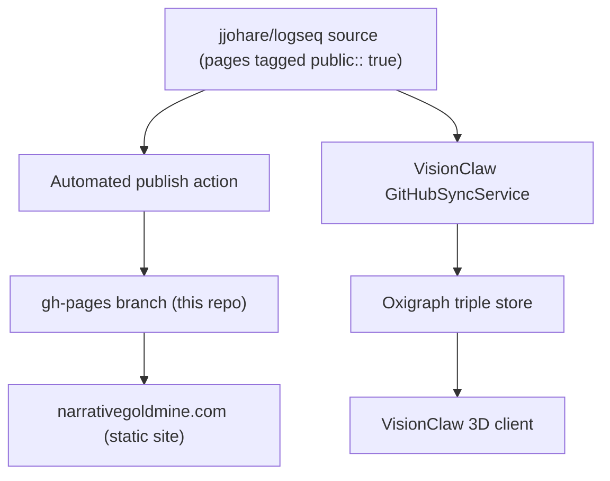

# narrativegoldmine — the published DreamLab knowledge graph

**The readable front door to the corpus VisionClaw renders in 3D.**

This repository publishes [narrativegoldmine.com](https://narrativegoldmine.com): a
static, publicly browsable rendering of the subset of DreamLab's Logseq knowledge
graph tagged `public:: true`. It is the plain-browser reading surface for the same
corpus that the [VisionClaw](https://github.com/DreamLab-AI/VisionClaw)
engine ingests and renders as an ontology-grounded, immersive 3D graph.

> **What this corpus is:** mostly **AI-generated synthetic content, produced under
> human direction, by design**. It exists as a medium-scale ontology testbed
> (~7.4k OWL classes, ~100k relations, ~6.8M words) to exercise and demonstrate the
> VisionFlow pipeline and the VisionClaw engine. Treat it as a demonstration dataset
> with machine-readable semantics and traceable generation — not as an authoritative
> human-authored encyclopedia.

The `main` branch you are looking at is deliberately near-empty. It carries two things
only — the `CNAME` that points the domain at GitHub Pages, and this README. The actual
site content lives on the `gh-pages` branch, which is built and pushed by an automated
publish action running inside the private `jjohare/logseq` source repository. Deploy
commits on `gh-pages` read `Deploy from jjohare/logseq @ <sha>` (verified from the
`gh-pages` worktree history, 2026-07-22). Nothing here is hand-edited; the published
graph is a build artefact of the source repo, not of this one.

## Where this sits in the ecosystem

The same source — `public:: true` pages in the private `jjohare/logseq` Logseq
graph — feeds **two independent, parallel consumers**. This is not one linear
pipeline; the two paths do not build each other:

1. **This repo (narrativegoldmine.com).** An automated publish action in
   `jjohare/logseq` renders the public pages to static HTML and pushes them to the
   `gh-pages` branch here, served over GitHub Pages at the CNAME domain. Purpose:
   plain-browser reading of the corpus.
2. **VisionClaw.** Its `GitHubSyncService` ingests the *same* `public:: true` pages
   into an Oxigraph triple store and renders them as an OWL 2 EL–grounded, GPU-driven
   3D knowledge graph. This is a separate pipeline that happens to share the source —
   it does **not** build the static site above.

Pipeline detail for the VisionClaw side lives in that repo's docs:

- [System overview](https://github.com/DreamLab-AI/VisionClaw/blob/main/docs/explanation/system-overview.md)
- [Insight migration loop](https://github.com/DreamLab-AI/VisionClaw/blob/main/docs/explanation/insight-migration-loop.md)
- [Graph schema](https://github.com/DreamLab-AI/VisionClaw/blob/main/docs/reference/graph-schema.md)
- [REST API reference](https://github.com/DreamLab-AI/VisionClaw/blob/main/docs/reference/rest-api.md)

Sibling repositories in the DreamLab ecosystem:

| Repo | Role |
|---|---|
| [VisionFlow](https://github.com/DreamLab-AI/VisionFlow) | Ecosystem canon — vision report, ADRs/PRDs, marketing site, pitch decks |
| [VisionClaw](https://github.com/DreamLab-AI/VisionClaw) | Flagship engine — ontology-grounded immersive 3D knowledge-graph platform |
| [agentbox](https://github.com/DreamLab-AI/agentbox) | Sovereign agent runtime that helps build and maintain this pipeline |
| [nostr-rust-forum](https://github.com/DreamLab-AI/nostr-rust-forum) | Human+agent communication substrate — Nostr-native forum + relay in Rust |
| [solid-pod-rs](https://github.com/DreamLab-AI/solid-pod-rs) | Personal-data-sovereignty layer — Rust Solid pod server |
| [dreamlab-ai-website](https://github.com/DreamLab-AI/dreamlab-ai-website) | DreamLab AI company website — the commercial face |

## Architecture

```mermaid
flowchart TD
    src["jjohare/logseq source (pages tagged public:: true)"]
    pub["Automated publish action"]
    gh["gh-pages branch (this repo)"]
    site["narrativegoldmine.com (static site)"]
    sync["VisionClaw GitHubSyncService"]
    store["Oxigraph triple store"]
    client["VisionClaw 3D client"]

    src --> pub
    pub --> gh
    gh --> site
    src --> sync
    sync --> store
    store --> client
```

The left path (publish action to `gh-pages` to static site) and the right path
(`GitHubSyncService` to Oxigraph to 3D client) are independent consumers of one source.

## Quickstart

There is nothing to build or run in this repository — it holds no application code.

- **To read the corpus:** visit [narrativegoldmine.com](https://narrativegoldmine.com).
- **To inspect or change the publish pipeline:** that logic lives in the private
  `jjohare/logseq` source repo, not here.
- **To inspect the VisionClaw ingestion side:** see VisionClaw's `GitHubSyncService`
  and the pipeline docs linked above.

## Status & remaining work

*Dated 2026-07-22.*

- `main` branch = `README.md` + `CNAME` only; 2 commits total; no application code,
  no `docs/` tree, no `LICENSE` file in this repo.
- `gh-pages` is live and serving narrativegoldmine.com, built by the `jjohare/logseq`
  publish automation (verified from `gh-pages` commit history).
- This repo has no open work items of its own beyond keeping this README current.
- For open items on the **ingestion / sync side** of the pipeline, consult VisionClaw's
  canonical work register:
  [`docs/TODO-unified.md`](https://github.com/DreamLab-AI/VisionClaw/blob/main/docs/TODO-unified.md)
  (six-state work taxonomy). This README does not restate its contents.

## Licence & maintainers

This repository carries **no `LICENSE` file of its own** (verified 2026-07-22 — only
`README.md` and `CNAME` are present). It does not inherit a licence implicitly. For the
ecosystem's licensing and maintainer contacts, see:

- **VisionClaw** — `LICENSE` and `LICENSE.MPL` in
  [DreamLab-AI/VisionClaw](https://github.com/DreamLab-AI/VisionClaw).
- **VisionFlow** — `LICENSES/` and `MAINTAINERS.md` in
  [DreamLab-AI/VisionFlow](https://github.com/DreamLab-AI/VisionFlow).

The published corpus content itself originates in the private `jjohare/logseq` graph;
its generation was directed by, and its rights sit with, DreamLab AI (the content is
mostly AI-generated synthetic material — see the corpus note at the top).
