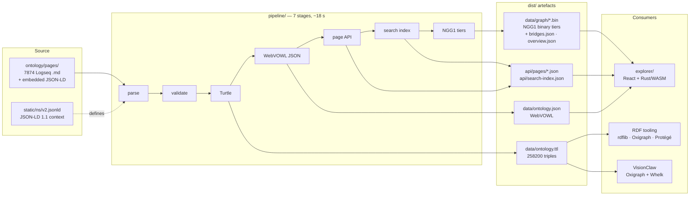

# narrativegoldmine: a Logseq graph that is also an OWL ontology


This repository holds an 8,124-class OWL ontology whose source of truth is 8,124
ordinary Logseq markdown pages, the Python pipeline that compiles them into RDF and
a binary graph format, and the WebAssembly explorer that renders the result. It is a
self-contained release: corpus, build, viewer and method in one tree, published at
[narrativegoldmine.com](https://narrativegoldmine.com).

It is also a working example of the layer the industry began demanding of agentic
systems in 2026: a shared, formal semantic substrate — an ontology agents can be
grounded in and checked against (neurosymbolic AI, in the current vocabulary). The
sibling [VisionClaw](https://github.com/DreamLab-AI/VisionClaw) engine reasons over
this corpus with OWL 2 EL and measured the grounding lift; this repo gives you the
corpus, the pipeline and the method to build your own.

> **What this corpus is.** Mostly **AI-generated synthetic content, produced under
> human direction, by design**. It is an ontology testbed (built to exercise a
> medium-scale Logseq→OWL pipeline and a GPU graph renderer), not an authoritative
> encyclopaedia. The provenance it carries (`did:nostr` attribution,
> `prov:generatedAtTime`, stable URNs) attests **traceable generation under human
> direction, not human authorship**. That framing is emitted by the pipeline itself
> and is asserted in `dist/data/graph/stats.json` under `corpus.nature: "synthetic"`.

## Numbers

Measured on the build of 2026-08-07 (`pipelineVersion: ng-1.0.0`), reproducible with
the quickstart below.

| | |
|---|---|
| Source pages | 8,124 markdown files in `ontology/pages/` (132 MB) |
| OWL classes | 8,124 (0 individuals) |
| RDF triples | 262,028 in Turtle (12.4 MB) |
| Declared edges | 113,433 (9,735 `subClassOf` + 103,698 object-property) |
| Resolvable graph edges | 101,249 after self-loop, duplicate and unresolved-target removal |
| Domains / categories | 6 / 34 |
| Multiple inheritance | 1,403 classes with more than one parent; 479 spanning categories, 156 spanning domains |
| Validation | 0 errors, 0 warnings, 1,404 info |
| Build time | ~18 s, single-threaded, `rdflib` only |

Classes per domain, before the 1,500-node tier cap (`nodes` + `nodesTruncated`
for each `domain-*` scope in `stats.json`): Infrastructure 2,717 · Artificial
Intelligence 1,976 · Blockchain 1,455 · Spatial Computing 1,231 · Robotics 601 ·
Distributed Collaboration 144. Only the first two exceed the cap.

**The taxonomy is a lattice, not a tree, and that is deliberate.** 1,403 of the
8,124 classes declare more than one `subClassOf`; 479 of them thereby sit in more
than one of the 34 categories and 156 in more than one of the 6 domains. A Star
Algorithm is under Search Algorithm, Informed Search and Graph Search at once.
Multiple inheritance is legal in OWL 2 EL and here it carries meaning: it is how a
concept that genuinely belongs to two branches is bridged rather than duplicated.
The pipeline used to report each such class as a `MULTI_PARENT` validation
*warning*: 957 of the 961 warnings the previous (2026-07-23) build published were
this one code, the other four being `INVALID_DOMAIN`. That published a design
property as a defect list. `MULTI_PARENT` is now `info`, and the overlap is
published as data instead: `dist/data/graph/bridges.json` names all
542 classes that cross a category or domain boundary (65 cross both) with their full
membership, and `overview.json` carries 90 weighted category-to-category bridge edges
alongside the 34 backbone edges.

## What makes it interesting: the hybrid page

Every page in `ontology/pages/` is simultaneously two things, and neither degrades
the other. Open one in Logseq and it behaves like any other note: outline bullets,
`[[wikilinks]]`, `property::` values, aliases. Run the pipeline over the same file
and it yields a formally typed OWL class with a definition, a taxonomy position and
twelve kinds of typed relation.

The trick is that the machine layer lives in fenced ` ```json-ld ` blocks that Logseq
renders as inert code, and the human layer lives in the outline below them, which the
pipeline never reads. There is no lossy round-trip because there is no round-trip:
each layer is authoritative for its own audience.

From `ontology/pages/A Star Algorithm.md`, the first block identifies the page, the
second the class. Abridged: the real file carries 41 wikilinks, three parents, eight
relation groups and a full-paragraph definition.

````markdown
public:: true

# A Star Algorithm

```json-ld
{
  "@context": "https://narrativegoldmine.com/ns/v1",
  "@id": "urn:visionflow:page:a-star-algorithm",
  "@type": "Page",
  "vc:slug": "a-star-algorithm",
  "vc:public": true,
  "vc:schemaVersion": 2,
  "vc:outboundWikilinks": [
    {"@id": "urn:visionflow:linked:search-algorithm", "vc:label": "Search Algorithm"}
  ]
}
```

```json-ld
{
  "@context": "https://narrativegoldmine.com/ns/v2.jsonld",
  "@id": "urn:ngm:class:a-star-algorithm",
  "@type": "Class",
  "label": "A Star Algorithm",
  "definition": "The A* algorithm is an informed best-first graph-search method…",
  "domain": "artificial-intelligence",
  "maturity": "established",
  "subClassOf": [
    {"@id": "urn:ngm:class:search-algorithm", "label": "Search Algorithm"}
  ],
  "relations": {
    "hasPart": [{"@id": "urn:ngm:class:priority-queue", "label": "Priority Queue"}]
  }
}
```

- ### Definition
  - A* expands the open-list node with the lowest f(n) = g(n) + h(n)…
````

Three design consequences worth stating plainly:

- **`vc:public` is the only publication gate**, defaulting to `false` when absent
  (`pipeline/jsonld_parser.py:205`) and re-checked independently in each of the five
  emitting modules: Turtle, WebVOWL, page API, search index and graph tiers.
  Fourteen pages in the private source are withheld by it and are not in this
  repository.
- **Wikilinks live in a weaker namespace than classes.** `urn:visionflow:linked:*` is
  a surface link that may resolve to nothing; `urn:ngm:class:*` is an asserted class
  reference. Conflating them would fabricate taxonomy.
- **Parse the JSON, never grep it.** 1,004 pages emit their Page block as compact
  single-line JSON. A whitespace-sensitive `grep '"vc:public": true'` matches only
  6,984 of 7,874 files — an 890-page silent drop, and the reason the class-count
  contract gate is in CI (`.github/workflows/build.yml`, gate 3: `stats.json`
  `classes` and `ontology.json` `class[]` length must both equal the pinned
  `EXPECTED_CLASSES` or the build fails; the pin reads `7874` and moves only
  alongside the corpus).

The context document that the class blocks dereference is `static/ns/v2.jsonld`
(JSON-LD 1.1), which maps the bare terms onto `rdfs`, `owl`, `skos` and `prov` and
declares the twelve canonical relations: `hasPart`, `partOf`, `requires`, `enables`,
`dependsOn`, `implements`, `uses`, `supports`, `contrastsWith`, `bridgesTo`,
`relatedTo`, `standardizedBy`.

## How it fits together


```mermaid
flowchart LR
    subgraph source["Source"]
        md["ontology/pages/<br/>7874 Logseq .md<br/>+ embedded JSON-LD"]
        ctx["static/ns/v2.jsonld<br/>JSON-LD 1.1 context"]
    end

    subgraph pipe["pipeline/ — 7 stages, ~18 s"]
        p1["parse"] --> p2["validate"] --> p3["Turtle"]
        p3 --> p4["WebVOWL JSON"] --> p5["page API"]
        p5 --> p6["search index"] --> p7["NGG1 tiers"]
    end

    subgraph art["dist/ artefacts"]
        ttl["data/ontology.ttl<br/>258200 triples"]
        vowl["data/ontology.json<br/>WebVOWL"]
        bin["data/graph/*.bin<br/>NGG1 binary tiers<br/>+ bridges.json · overview.json"]
        api["api/pages/*.json<br/>api/search-index.json"]
    end

    subgraph cons["Consumers"]
        rdf["RDF tooling<br/>rdflib · Oxigraph · Protégé"]
        exp["explorer/<br/>React + Rust/WASM"]
        vc["VisionClaw<br/>Oxigraph + Whelk"]
    end

    md --> p1
    ctx -.defines.-> p1
    p3 --> ttl
    p4 --> vowl
    p7 --> bin
    p5 --> api
    p6 --> api
    ttl --> rdf
    ttl --> vc
    bin --> exp
    api --> exp
    vowl --> exp
```

## Repository layout

| Path | What it is |
|---|---|
| `ontology/pages/` | The corpus. 7,874 Logseq markdown pages, each with a Page block, a Class block and often a link-resolutions annotation. |
| `pipeline/` | The build. 9 modules plus a one-line `__init__.py`, 2,472 lines in total, one dependency (`rdflib>=7.0.0`). |
| `pipeline/tests/` | 9 pytest cases, including a byte-exact 183-byte NGG1 golden fixture parsed by an independently written struct reader. |
| `static/ns/v2.jsonld` | The published JSON-LD 1.1 context the class blocks reference. |
| `explorer/modern/` | React 19 + Vite 6 + React Three Fiber SPA. One instanced mesh for all nodes, one line-segment mesh for all edges. |<!-- slop-ignore: "React Three Fiber" is the library's own name, not US spelling of "fibre" -->
| `explorer/rust-wasm/` | Crate `webvowl-wasm` 0.3.4, NGG1 reader (`src/ngg1.rs`) and CSR force simulation (`src/layout/csr_sim.rs`), `#![deny(unsafe_code)]`. |
| `explorer/FORMAT-NGG1.md` | The frozen binary contract. Three implementations (Python writer, Rust reader, TypeScript reader/writer) agree byte-for-byte against it. |
| `explorer/CAPABILITIES.md` | Honest capability register for the explorer: what is verified, and with what evidence. |
| `dist/data/` | Committed dataset artefacts: Turtle, WebVOWL JSON, NGG1 tiers, `stats.json`, `bridges.json`, `overview.json`. |
| `dist/api/` | Website surface: 15,701 files, gitignored, rebuilt in seconds. |
| `docs/` | The method in prose: `methodology/the-hybrid-approach.md`, `architecture/pipeline.md`, `architecture/explorer.md`, `ci-cd/build-and-gates.md`, `reference/jsonld-schema.md`, `ecosystem.md`. |

## Quickstart

```bash
git clone https://github.com/DreamLab-AI/knowledgeGraph.git
cd knowledgeGraph

python3 -m venv .venv
source .venv/bin/activate
pip install "rdflib>=7.0.0"

python -m pipeline.build ontology/pages dist
```

Expected output, from a clean run:

```
[1/7] Parsing ontology/pages...
       7874 pages (7874 OntologyClass, 7874 public)
[2/7] Validating...
       0 errors, 0 warnings
[3/7] Generating Turtle...
       258200 triples → dist/data/ontology.ttl
...
Pipeline complete in 18.3s
```

Individual stages, if you want only one artefact:

```bash
python -m pipeline.validate ontology/pages [--json]         # advisory report
python -m pipeline.jsonld_to_turtle ontology/pages out.ttl  # Turtle only
pip install pytest && python -m pytest pipeline/tests -q    # 9 passed
```

The explorer needs a Rust toolchain and Node:

```bash
cd explorer/rust-wasm && wasm-pack build --release --target web --out-dir pkg
cd ../modern && npm install && npm install ../rust-wasm/pkg && npm run build
```

## What you get, and how to consume it

**`dist/data/ontology.ttl`**: 258,200 triples, 12.1 MB. Load it in anything that
speaks RDF. IRIs are `https://narrativegoldmine.com/class/<slug>`, rewritten from the
`urn:ngm:class:<slug>` form in the source. The ontology targets **OWL 2 EL**:
`owl:inverseOf` and `owl:SymmetricProperty` are deliberately omitted because neither
is in the profile. `requires` and `dependsOn` are transitive; `requires` is a
sub-property of `dependsOn`; `uses`, `supports` and `implements` are sub-properties
of `vc:utilises`. <!-- slop-ignore: vc:utilises is a real ontology property IRI (pipeline/jsonld_to_turtle.py:207), not a stylistic word choice -->
Every `requires` and `hasPart` edge onto a declared class also emits
an `owl:Restriction` (`someValuesFrom`) as an extra `rdfs:subClassOf`, and the six
domain roots are asserted pairwise disjoint via a single `owl:AllDisjointClasses`.

```python
from rdflib import Graph
g = Graph().parse("dist/data/ontology.ttl", format="turtle")
print(len(g))  # 258200
```

**`dist/data/ontology.json`** is 38.5 MB of WebVOWL-format JSON (`class` /
`classAttribute` / `property` / `propertyAttribute` mirror arrays), consumable by
WebVOWL-lineage viewers.

**`dist/data/graph/*.bin`** holds NGG1, a little-endian CSR binary designed so a browser
can fetch a tier and hand it straight to WebAssembly with no JSON parse. 32-byte
header, 24-byte node records, CSR adjacency, `u8` edge types, and a UTF-8 string table
where `strings[n*2]` is node *n*'s label and `strings[n*2+1]` its IRI. `full.bin` is
7,874 nodes and 98,776 edges in 1,339,983 bytes. Six domain tiers cap at 1,500 nodes
and 8 object-property edges per source node (the `subClassOf` backbone is never
capped, and node degree is always the full-graph value so scale and label ranking stay
correct). The format is specified in `explorer/FORMAT-NGG1.md` §1–§7.

**`dist/data/graph/bridges.json`** is the overlap the binary cannot carry. The NGG1
node record holds a single `u16` category (FORMAT-NGG1 §3), so a tier keeps only the
nearest category ancestor of each node; the full membership lives here — 542 entries,
each with the class IRI, label, every category and domain index it belongs to, and
the parent labels that put it there. Indices match `overview.json`, whose 40 nodes
(6 domains + 34 categories) and 124 edges (34 backbone, 90 weighted bridges) are the
category-level summary graph. The bridge edges also feed the force layout, so the
baked positions match the topology the explorer draws.

**`dist/api/`**: 7,874 class JSON files plus a `_domain-index.json`, a flat search
index (6.8 MB), and a markdown mirror of each page body. 7,823 of 7,874 pages have a
body to mirror.

**`dist/data/graph/stats.json`** carries every headline number above, machine-readable,
including the `bridging` block (`multiParent` 1,401, `crossCategory` 454,
`crossDomain` 153).

## Licensing

Three components, three licences, deliberately. Where the American spelling appears
below it is a literal filename on disk; the prose uses "licence" for the noun.

| Component | Licence | Why |
|---|---|---|
| `pipeline/`, CI, integration glue | **AGPL-3.0-or-later** | Wholly original work; copyleft chosen so pipeline improvements stay open when run as a service. |
| `explorer/` | **MIT** | A derivative of WebVOWL, © 2014–2019 Vincent Link, Steffen Lohmann, Eduard Marbach, Stefan Negru, Vitalis Wiens (`explorer/license.txt`), also published as [DreamLab-AI/WasmVOWL](https://github.com/DreamLab-AI/WasmVOWL/tree/master). AGPL-ing it would be hollow while identical code sits MIT one repository away. |<!-- slop-ignore: `explorer/license.txt` is a filename -->
| `ontology/` corpus and `dist/data/` | **ODbL-1.0** | A database, licensed as one.<!-- slop-ignore: "licensed" is the UK verb form --> Rights basis: UK CDPA 1988 s.9(3), computer-generated works vest in the person who made the arrangements. |

Full texts: `LICENSE` (AGPL-3.0), `LICENSE-EXPLORER` (MIT, carrying the WebVOWL <!-- slop-ignore: filenames -->
copyright verbatim), `LICENSE-DATA` (ODbL-1.0). The per-path mapping and the <!-- slop-ignore: filenames -->
reasoning behind the split are in `LICENSING.md`; separate commercial terms are in
`COMMERCIAL.md`.

## Ecosystem
<!-- slop-ignore: "ecosystem" here is DreamLab-AI's own name for its family of related repos, not vague/biological usage -->

Verified 2026-07-25. Only repositories with real content and a real relationship to
this one are listed.

| Repository | Relationship | Licence |
|---|---|---|
| [VisionClaw](https://github.com/DreamLab-AI/VisionClaw) | Second, independent consumer of the same corpus. Its `GitHubSyncService` writes SHACL-gated triples into an embedded Oxigraph store and reasons over them with Whelk. Does **not** build this site. | AGPL-3.0-only |
| [VisionFlow](https://github.com/DreamLab-AI/VisionFlow) | Ecosystem canon: vision report, ADRs, PRDs, website. | No root licence file |
| [WasmVOWL](https://github.com/DreamLab-AI/WasmVOWL/tree/master) | Upstream of `explorer/`; itself a fork of VisualDataWeb/WebVOWL. Default branch is `master`. | MIT |
| [agentbox](https://github.com/DreamLab-AI/agentbox) | Agent runtime used to build and maintain this pipeline. | AGPL-3.0 |
| [Metaverse-Ontology](https://github.com/DreamLab-AI/Metaverse-Ontology) | Independent precedent: Logseq markdown to OWL Functional Syntax via a Rust extractor, rather than embedded JSON-LD via Python. | No licence file |

VisionClaw's pipeline documentation: [system overview](https://github.com/DreamLab-AI/VisionClaw/blob/main/docs/explanation/system-overview.md) ·
[graph schema](https://github.com/DreamLab-AI/VisionClaw/blob/main/docs/reference/graph-schema.md) ·
[REST API](https://github.com/DreamLab-AI/VisionClaw/blob/main/docs/reference/rest-api.md).
Note that VisionFlow's `docs/architecture/licensing.md` still lists VisionClaw as
MPL 2.0; that is stale. VisionClaw relicensed to AGPL-3.0-only at ADR-032 M1 when it
began linking the `solid-pod-rs` crates, and its `NOTICE` records why.

## Status

**Works, verified by running it.** The seven-stage build completes in about 18 s
with 0 errors. `python -m pytest pipeline/tests -q` reports 9 passed, including the
byte-exact NGG1 golden. The Rust crate carries 154 unit tests and 49 integration
tests.

**The published site is one build behind.** `dist/` in this tree is the
2026-07-25 build described above. `https://narrativegoldmine.com/data/graph/stats.json`
still returns the 2026-07-23 build (`classes: 7457`, `uncategorised: 4498`, no
`bridging` block); `pipelineVersion` is `ng-1.0.0` in both, so it does not
distinguish them — read `datasetDate` and `classes`. The corrected build lands on
the site at the next publish.

**Partial.** The explorer's SharedArrayBuffer position transport is disabled in
shipped builds: an unsynchronised read/write race let the force simulation amplify
half-written frames to ~1e20 and blank the view in production only. Transferable
ping-pong is the sole transport until a double-buffered, `Atomics`-gated flip lands.
`MAX_EDGES = 4000` is declared to mirror the client contract but is not enforced by
the writer; domain tiers legitimately ship up to 12,093 edges because the client
sub-selects. Four benchmark suites cover the inherited WebVOWL stack and none covers
the live NGG1 path.

**Known gaps in the data.** All of these are measured, not estimated. Three of the
gaps the previous release listed here have gone, and the reasons are worth naming:
the category walk was one hop deep and mislabelled 4,033 classes as uncategorised;
`MULTI_PARENT` was reported as a warning when it is a design property; and a repair
pass created 417 pages for concepts that two or more existing pages already
referenced, which also cleared the four invalid domains. What follows is what is
left.

- **1,401 validation notices, all `info`, all `MULTI_PARENT`.** 0 errors, 0 warnings.
  The notice is a statement about the shape of the taxonomy, not a fault; see the
  lattice note above.
- **3 of 7,874 classes are uncategorised.** Category membership is now resolved by a
  breadth-first walk of `subClassOf`/`instanceOf` ancestry, nearest category ancestor
  winning, parents visited in declared order so the NGG1 tiers stay byte-identical
  across runs (`pipeline/emit_graph_tiers.py:480`). The deepest real path needs 7
  hops; the walk stops at 12 (`MAX_DEPTH`). The three with no category root anywhere
  in their ancestry are `electric-vehicle`, `ethan-mollick` and `urban-planning`.
- **The binary format carries one category per node.** The NGG1 node record is
  `<u32 id, f32 x, f32 y, u16 domain, u16 category, u8 flags, 3× pad, u32 degree>`,
  so a tier keeps only the nearest category and the other memberships of the 454
  cross-category classes are invisible to any consumer reading `.bin` alone. They are
  in `bridges.json`. This is a limitation of the frozen format, not of the data.
- **Unresolved reference targets.** 111,827 declared edges resolve to 98,776; the
  13,051-edge difference is self-loops, duplicates, and references to classes that do
  not exist. Most of the missing targets are named exactly once in the whole corpus,
  and materialising a page for each singleton is deferred rather than done.
- **789 classes emit `vc:qualityScore "0.0"`.** The context defines `qualityScore`;
  the parser reads `quality` first and falls back to `vc:qualityScore`, a key that
  appears in 0 of the 7,874 pages. 742 of the 789 carry a bare `qualityScore` the
  parser never looks at; the other 47 carry no score at all. A further 1,259 carry
  both `quality` and `qualityScore`, and the two disagree on 1,013 of them.
- **`stats.json` reports 7,870 pages against 7,874 classes.** Four pairs of files
  share a page IRI (`bitcoin`, `comfy-ui`, `ethereum`, `foundation-models`). The page
  count is deliberately deduplicated by IRI rather than reported as the class count
  under a "pages" label.
- **0 individuals.** The corpus is terminology only: every entity is a class, and
  nothing is asserted as an instance of one.
- **97 wikilinks across 2 files** (`Data Parallelism.md`, `Data Preprocessing.md`) are
  bare strings rather than `{@id, vc:label}` objects and therefore produce no backlinks.
- **51 pages have an empty body** and so get no markdown mirror in `dist/api/markdown/`.
- **95 classes carry a `urn:ngm:class:` slug that differs from their page's
  `vc:slug`.** A substring rewrite in the corpus source turned `bitcoin-cash` into
  `bitcoin-proof-of-work-protocol-cash` and `apple-vision-pro` into
  `apple-inc-technology-corporation-vision-pro`. For those 95 the class IRI in
  `ontology.ttl` and the filename in `dist/api/pages/` do not join.
- Backlinks are derived by slug-suffix matching, not IRI resolution, so a wikilink
  whose slug differs from the target page's `vc:slug` silently produces nothing.
- **Vocabulary drift is tolerated, not corrected.** `maturity` takes 9 observed values
  where 4 were intended; `domain` takes 16 raw strings that a 10-entry alias table
  collapses onto 6. 45 non-canonical relation predicates appear in the corpus and are
  dropped by the parser.

## Provenance

Class-level attribution resolves to four DIDs: `did:nostr:ontology-mesh` (3,541),
`did:nostr:lcr-swarm` (1,565), `did:nostr:jjohare` (1,079) and
`did:nostr:enrichment-swarm` (226), with the generating pass named in
`provenance.inferenceRule`: `GapMaterialisation`, `RelationEnrichment`,
`R5DomainRootFallback`, `R1Explicit`, `ManualEnrichment` and others. Those rule names
are self-describing about machine origin, which is the point. Coverage is partial:
6,411 of 7,874 classes carry a `provenance.attributedTo`; the remaining 1,463 carry
none. The record is an audit trail of generation, not a claim of authorship.
