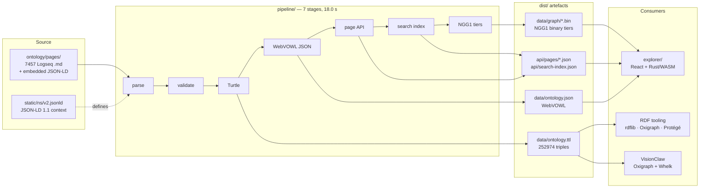

# narrativegoldmine: a Logseq graph that is also an OWL ontology


This repository holds a 7,457-class OWL ontology whose source of truth is 7,457
ordinary Logseq markdown pages, the Python pipeline that compiles them into RDF and
a binary graph format, and the WebAssembly explorer that renders the result. It is a
self-contained release: corpus, build, viewer and method in one tree, published at
[narrativegoldmine.com](https://narrativegoldmine.com).

> **What this corpus is.** Mostly **AI-generated synthetic content, produced under
> human direction, by design**. It is an ontology testbed (built to exercise a
> medium-scale Logseq→OWL pipeline and a GPU graph renderer), not an authoritative
> encyclopaedia. The provenance it carries (`did:nostr` attribution,
> `prov:generatedAtTime`, stable URNs) attests **traceable generation under human
> direction, not human authorship**. That framing is emitted by the pipeline itself
> and is asserted in `dist/data/graph/stats.json` under `corpus.nature: "synthetic"`.

## Numbers

Measured on the build of 2026-07-25 (`pipelineVersion: ng-1.0.0`), reproducible with
the quickstart below.

| | |
|---|---|
| Source pages | 7,457 markdown files in `ontology/pages/` (127 MB) |
| OWL classes | 7,457 (0 individuals) |
| RDF triples | 252,974 in Turtle (11.7 MB) |
| Declared edges | 110,617 (8,616 `subClassOf` + 102,001 object-property) |
| Resolvable graph edges | 96,377 after self-loop and duplicate removal |
| Domains / categories | 6 / 34 |
| Validation | 0 errors, 961 warnings |
| Build time | 18.0 s, single-threaded, `rdflib` only |

Classes per domain, before the 1,500-node tier cap (`nodes` + `nodesTruncated`
for each `domain-*` scope in `stats.json`): Infrastructure 2,443 · Artificial
Intelligence 1,752 · Blockchain 1,374 · Spatial Computing 1,175 · Robotics 572 ·
Distributed Collaboration 137. Only the first two exceed the cap.

## What makes it interesting: the hybrid page

Every page in `ontology/pages/` is simultaneously two things, and neither degrades
the other. Open one in Logseq and it behaves like any other note: outline bullets,
`[[wikilinks]]`, `property::` values, aliases. Run the pipeline over the same file
and it yields a formally typed OWL class with a definition, a taxonomy position and
twelve kinds of typed relation.

The trick is that the machine layer lives in fenced ` ```json-ld ` blocks that Logseq
renders as inert code, and the human layer lives in the outline below them, which the
pipeline never reads. There is no lossy round-trip because there is no round-trip:
each layer is authoritative for its own audience.

From `ontology/pages/A Star Algorithm.md`, the first block identifies the page, the
second the class. Abridged: the real file carries 41 wikilinks, three parents, eight
relation groups and a full-paragraph definition.

````markdown
public:: true

# A Star Algorithm

```json-ld
{
  "@context": "https://narrativegoldmine.com/ns/v1",
  "@id": "urn:visionflow:page:a-star-algorithm",
  "@type": "Page",
  "vc:slug": "a-star-algorithm",
  "vc:public": true,
  "vc:schemaVersion": 2,
  "vc:outboundWikilinks": [
    {"@id": "urn:visionflow:linked:search-algorithm", "vc:label": "Search Algorithm"}
  ]
}
```

```json-ld
{
  "@context": "https://narrativegoldmine.com/ns/v2.jsonld",
  "@id": "urn:ngm:class:a-star-algorithm",
  "@type": "Class",
  "label": "A Star Algorithm",
  "definition": "The A* algorithm is an informed best-first graph-search method…",
  "domain": "artificial-intelligence",
  "maturity": "established",
  "subClassOf": [
    {"@id": "urn:ngm:class:search-algorithm", "label": "Search Algorithm"}
  ],
  "relations": {
    "hasPart": [{"@id": "urn:ngm:class:priority-queue", "label": "Priority Queue"}]
  }
}
```

- ### Definition
  - A* expands the open-list node with the lowest f(n) = g(n) + h(n)…
````

Three design consequences worth stating plainly:

- **`vc:public` is the only publication gate**, defaulting to `false` when absent
  (`pipeline/jsonld_parser.py:205`) and re-checked independently in each of the five
  emitting modules: Turtle, WebVOWL, page API, search index and graph tiers.
  Fourteen pages in the private source are withheld by it and are not in this
  repository.
- **Wikilinks live in a weaker namespace than classes.** `urn:visionflow:linked:*` is
  a surface link that may resolve to nothing; `urn:ngm:class:*` is an asserted class
  reference. Conflating them would fabricate taxonomy.
- **Parse the JSON, never grep it.** 716 pages emit their Page block as compact
  single-line JSON. A whitespace-sensitive `grep '"vc:public": true'` matches only
  6,804 of 7,457 files, exactly the 653-page silent drop that put the class-count
  contract gate into CI (`.github/workflows/build.yml`, gate 3: `stats.json` `classes`
  and `ontology.json` `class[]` length must both equal 7457 or the build fails).

The context document that the class blocks dereference is `static/ns/v2.jsonld`
(JSON-LD 1.1), which maps the bare terms onto `rdfs`, `owl`, `skos` and `prov` and
declares the twelve canonical relations: `hasPart`, `partOf`, `requires`, `enables`,
`dependsOn`, `implements`, `uses`, `supports`, `contrastsWith`, `bridgesTo`,
`relatedTo`, `standardizedBy`.

## How it fits together


```mermaid
flowchart LR
    subgraph source["Source"]
        md["ontology/pages/<br/>7457 Logseq .md<br/>+ embedded JSON-LD"]
        ctx["static/ns/v2.jsonld<br/>JSON-LD 1.1 context"]
    end

    subgraph pipe["pipeline/ — 7 stages, 18.0 s"]
        p1["parse"] --> p2["validate"] --> p3["Turtle"]
        p3 --> p4["WebVOWL JSON"] --> p5["page API"]
        p5 --> p6["search index"] --> p7["NGG1 tiers"]
    end

    subgraph art["dist/ artefacts"]
        ttl["data/ontology.ttl<br/>252974 triples"]
        vowl["data/ontology.json<br/>WebVOWL"]
        bin["data/graph/*.bin<br/>NGG1 binary tiers"]
        api["api/pages/*.json<br/>api/search-index.json"]
    end

    subgraph cons["Consumers"]
        rdf["RDF tooling<br/>rdflib · Oxigraph · Protégé"]
        exp["explorer/<br/>React + Rust/WASM"]
        vc["VisionClaw<br/>Oxigraph + Whelk"]
    end

    md --> p1
    ctx -.defines.-> p1
    p3 --> ttl
    p4 --> vowl
    p7 --> bin
    p5 --> api
    p6 --> api
    ttl --> rdf
    ttl --> vc
    bin --> exp
    api --> exp
    vowl --> exp
```

## Repository layout

| Path | What it is |
|---|---|
| `ontology/pages/` | The corpus. 7,457 Logseq markdown pages, each with a Page block, a Class block and often a link-resolutions annotation. |
| `pipeline/` | The build. 9 modules plus a one-line `__init__.py`, 2,309 lines in total, one dependency (`rdflib>=7.0.0`). |
| `pipeline/tests/` | 9 pytest cases, including a byte-exact 183-byte NGG1 golden fixture parsed by an independently written struct reader. |
| `static/ns/v2.jsonld` | The published JSON-LD 1.1 context the class blocks reference. |
| `explorer/modern/` | React 19 + Vite 6 + React Three Fiber SPA. One instanced mesh for all nodes, one line-segment mesh for all edges. |
| `explorer/rust-wasm/` | Crate `webvowl-wasm` 0.3.4, NGG1 reader (`src/ngg1.rs`) and CSR force simulation (`src/layout/csr_sim.rs`), `#![deny(unsafe_code)]`. |
| `explorer/FORMAT-NGG1.md` | The frozen binary contract. Three implementations (Python writer, Rust reader, TypeScript reader/writer) agree byte-for-byte against it. |
| `explorer/CAPABILITIES.md` | Honest capability register for the explorer: what is verified, and with what evidence. |
| `dist/data/` | Committed dataset artefacts: Turtle, WebVOWL JSON, NGG1 tiers, `stats.json`. |
| `dist/api/` | Website surface: 14,889 files, gitignored, rebuilt in seconds. |
| `docs/` | The method in prose: `methodology/the-hybrid-approach.md`, `architecture/pipeline.md`, `architecture/explorer.md`, `ci-cd/build-and-gates.md`, `reference/jsonld-schema.md`, `ecosystem.md`. |

## Quickstart

```bash
git clone https://github.com/DreamLab-AI/knowledgeGraph.git
cd knowledgeGraph

python3 -m venv .venv
source .venv/bin/activate
pip install "rdflib>=7.0.0"

python -m pipeline.build ontology/pages dist
```

Expected output, from a clean run:

```
[1/7] Parsing ontology/pages...
       7457 pages (7457 OntologyClass, 7457 public)
[2/7] Validating...
       0 errors, 961 warnings
[3/7] Generating Turtle...
       252974 triples → dist/data/ontology.ttl
...
Pipeline complete in 18.0s
```

Individual stages, if you want only one artefact:

```bash
python -m pipeline.validate ontology/pages [--json]         # advisory report
python -m pipeline.jsonld_to_turtle ontology/pages out.ttl  # Turtle only
pip install pytest && python -m pytest pipeline/tests -q    # 9 passed
```

The explorer needs a Rust toolchain and Node:

```bash
cd explorer/rust-wasm && wasm-pack build --release --target web --out-dir pkg
cd ../modern && npm install && npm install ../rust-wasm/pkg && npm run build
```

## What you get, and how to consume it

**`dist/data/ontology.ttl`**: 252,974 triples, 11.7 MB. Load it in anything that
speaks RDF. IRIs are `https://narrativegoldmine.com/class/<slug>`, rewritten from the
`urn:ngm:class:<slug>` form in the source. The ontology targets **OWL 2 EL**:
`owl:inverseOf` and `owl:SymmetricProperty` are deliberately omitted because neither
is in the profile. `requires` and `dependsOn` are transitive; `requires` is a
sub-property of `dependsOn`; `uses`, `supports` and `implements` are sub-properties
of `vc:utilises`. <!-- slop-ignore: vc:utilises is a real ontology property IRI (pipeline/jsonld_to_turtle.py:207), not a stylistic word choice -->
Every `requires` and `hasPart` edge onto a declared class also emits
an `owl:Restriction` (`someValuesFrom`) as an extra `rdfs:subClassOf`, and the six
domain roots are asserted pairwise disjoint via a single `owl:AllDisjointClasses`.

```python
from rdflib import Graph
g = Graph().parse("dist/data/ontology.ttl", format="turtle")
print(len(g))  # 252974
```

**`dist/data/ontology.json`** is 37.5 MB of WebVOWL-format JSON (`class` /
`classAttribute` / `property` / `propertyAttribute` mirror arrays), consumable by
WebVOWL-lineage viewers.

**`dist/data/graph/*.bin`** holds NGG1, a little-endian CSR binary designed so a browser
can fetch a tier and hand it straight to WebAssembly with no JSON parse. 32-byte
header, 24-byte node records, CSR adjacency, `u8` edge types, and a UTF-8 string table
where `strings[n*2]` is node *n*'s label and `strings[n*2+1]` its IRI. `full.bin` is
7,457 nodes and 96,377 edges in 1,282,989 bytes. Six domain tiers cap at 1,500 nodes
and 8 object-property edges per source node (the `subClassOf` backbone is never
capped, and node degree is always the full-graph value so scale and label ranking stay
correct). The format is specified in `explorer/FORMAT-NGG1.md` §1–§7.

**`dist/api/`**: 7,457 class JSON files plus a `_domain-index.json`, a flat search
index, and a markdown mirror of each page body. 7,428 of 7,457 pages have a body to
mirror.

**`dist/data/graph/stats.json`** carries every headline number above, machine-readable.

## Licensing

Three components, three licences, deliberately.

| Component | Licence | Why |
|---|---|---|
| `pipeline/`, CI, integration glue | **AGPL-3.0-or-later** | Wholly original work; copyleft chosen so pipeline improvements stay open when run as a service. |
| `explorer/` | **MIT** | A derivative of WebVOWL, © 2014–2019 Vincent Link, Steffen Lohmann, Eduard Marbach, Stefan Negru, Vitalis Wiens (`explorer/license.txt`), also published as [DreamLab-AI/WasmVOWL](https://github.com/DreamLab-AI/WasmVOWL/tree/master). AGPL-ing it would be hollow while identical code sits MIT one repository away. |
| `ontology/` corpus and `dist/data/` | **ODbL-1.0** | A database, licensed as one. Rights basis: UK CDPA 1988 s.9(3), computer-generated works vest in the person who made the arrangements. |

Full texts: `LICENSE` (AGPL-3.0), `LICENSE-EXPLORER` (MIT, carrying the WebVOWL
copyright verbatim), `LICENSE-DATA` (ODbL-1.0). The per-path mapping and the
reasoning behind the split are in `LICENSING.md`; separate commercial terms are in
`COMMERCIAL.md`.

## Ecosystem
<!-- slop-ignore: "ecosystem" here is DreamLab-AI's own name for its family of related repos, not vague/biological usage -->

Verified 2026-07-25. Only repositories with real content and a real relationship to
this one are listed.

| Repository | Relationship | Licence |
|---|---|---|
| [VisionClaw](https://github.com/DreamLab-AI/VisionClaw) | Second, independent consumer of the same corpus. Its `GitHubSyncService` writes SHACL-gated triples into an embedded Oxigraph store and reasons over them with Whelk. Does **not** build this site. | AGPL-3.0-only |
| [VisionFlow](https://github.com/DreamLab-AI/VisionFlow) | Ecosystem canon: vision report, ADRs, PRDs, website. | No root licence file |
| [WasmVOWL](https://github.com/DreamLab-AI/WasmVOWL/tree/master) | Upstream of `explorer/`; itself a fork of VisualDataWeb/WebVOWL. Default branch is `master`. | MIT |
| [agentbox](https://github.com/DreamLab-AI/agentbox) | Agent runtime used to build and maintain this pipeline. | AGPL-3.0 |
| [Metaverse-Ontology](https://github.com/DreamLab-AI/Metaverse-Ontology) | Independent precedent: Logseq markdown to OWL Functional Syntax via a Rust extractor, rather than embedded JSON-LD via Python. | No licence file |

VisionClaw's pipeline documentation: [system overview](https://github.com/DreamLab-AI/VisionClaw/blob/main/docs/explanation/system-overview.md) ·
[graph schema](https://github.com/DreamLab-AI/VisionClaw/blob/main/docs/reference/graph-schema.md) ·
[REST API](https://github.com/DreamLab-AI/VisionClaw/blob/main/docs/reference/rest-api.md).
Note that VisionFlow's `docs/architecture/licensing.md` still lists VisionClaw as
MPL 2.0; that is stale. VisionClaw relicensed to AGPL-3.0-only at ADR-032 M1 when it
began linking the `solid-pod-rs` crates, and its `NOTICE` records why.

## Status

**Works, verified by running it.** The seven-stage build completes in 18.0 s with
0 errors. `python -m pytest pipeline/tests -q` reports 9 passed, including the
byte-exact NGG1 golden. The Rust crate carries 154 unit tests and 49 integration
tests. The published site serves this same build:
`https://narrativegoldmine.com/data/graph/stats.json` returns
`pipelineVersion: ng-1.0.0` and `https://narrativegoldmine.com/api/search-index.json`
returns the 6.7 MB index.

**Partial.** The explorer's SharedArrayBuffer position transport is disabled in
shipped builds: an unsynchronised read/write race let the force simulation amplify
half-written frames to ~1e20 and blank the view in production only. Transferable
ping-pong is the sole transport until a double-buffered, `Atomics`-gated flip lands.
`MAX_EDGES = 4000` is declared to mirror the client contract but is not enforced by
the writer; domain tiers legitimately ship up to 11,914 edges because the client
sub-selects. Four benchmark suites cover the inherited WebVOWL stack and none covers
the live NGG1 path.

**Known gaps in the data.** All of these are measured, not estimated.

- **961 validation warnings**, all advisory: 957 `MULTI_PARENT` (a class declaring
  more than one `subClassOf`: A Star Algorithm sits under Search Algorithm, Informed
  Search and Graph Search) and 4 `INVALID_DOMAIN`.
- **4,498 of 7,457 classes are uncategorised.** Category membership is inherited one
  hop from the first parent whose slug is one of the 34 category slugs. There is no
  transitive walk, so anything two or more hops below a category root gets nothing.
- **4 classes are domainless.** Three declare `economics`, one declares `ai-governance`,
  neither of which is in the 16-entry accepted set. They are the same four pages as
  the four `INVALID_DOMAIN` warnings, and they appear only in `full.bin`.
- **718 classes emit `vc:qualityScore "0.0"`.** The context defines `qualityScore`;
  the parser reads `quality` first and falls back to `vc:qualityScore`, a key that
  appears in 0 of the 7,457 pages. The 718 classes carrying only `qualityScore` are
  the ones that lose their score. A further 1,259 carry both `quality` and
  `qualityScore`, and the two disagree on 1,013 of them.
- **`stats.json` reports 7,454 pages against 7,457 classes.** Three pairs of files
  share a page IRI (`bitcoin`, `comfy-ui`, `ethereum`). The page count is deliberately
  deduplicated by IRI rather than reported as the class count under a "pages" label.
- **97 wikilinks across 2 files** (`Data Parallelism.md`, `Data Preprocessing.md`) are
  bare strings rather than `{@id, vc:label}` objects and therefore produce no backlinks.
- **29 pages have an empty body** and so get no markdown mirror in `dist/api/markdown/`.
- **95 classes carry a `urn:ngm:class:` slug that differs from their page's
  `vc:slug`.** A substring rewrite in the corpus source turned `bitcoin-cash` into
  `bitcoin-proof-of-work-protocol-cash` and `apple-vision-pro` into
  `apple-inc-technology-corporation-vision-pro`. For those 95 the class IRI in
  `ontology.ttl` and the filename in `dist/api/pages/` do not join.
- Backlinks are derived by slug-suffix matching, not IRI resolution, so a wikilink
  whose slug differs from the target page's `vc:slug` silently produces nothing.
- **Vocabulary drift is tolerated, not corrected.** `maturity` takes 9 observed values
  where 4 were intended; `domain` takes 18 raw strings that a 10-entry alias table
  collapses onto 6. 45 non-canonical relation predicates appear in the corpus and are
  dropped by the parser.

## Provenance

Class-level attribution resolves to four DIDs: `did:nostr:ontology-mesh` (3,224),
`did:nostr:lcr-swarm` (1,565), `did:nostr:jjohare` (1,055) and
`did:nostr:enrichment-swarm` (226), with the generating pass named in
`provenance.inferenceRule`: `GapMaterialisation`, `RelationEnrichment`,
`R5DomainRootFallback`, `R1Explicit`, `ManualEnrichment` and others. Those rule names
are self-describing about machine origin, which is the point. Coverage is partial:
6,070 of 7,457 classes carry a `provenance.attributedTo`; the remaining 1,387 carry
none. The record is an audit trail of generation, not a claim of authorship.
