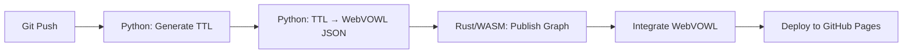

# Logseq Knowledge Graph Documentation

Comprehensive documentation for the narrativegoldmine.com knowledge graph publishing system.

## Quick Links

- **[Getting Started](#quick-start)** - Set up and deploy your first build
- **[Architecture Overview](architecture/PROJECT_OVERVIEW.md)** - System design and components
- **[Publishing Guide](#publishing)** - Deployment workflows
- **[Ontology System](ontology/)** - RDF/OWL generation and visualization

## System Overview

This repository publishes a Logseq knowledge graph to GitHub Pages with integrated ontology visualization using a high-performance Rust/WASM pipeline.

**Key Features:**
- 🚀 10x faster publishing with Rust/WASM
- 🧠 Automated OWL/RDF ontology generation
- 📊 Interactive WebVOWL visualization
- 🔄 Continuous deployment via GitHub Actions
- 📱 Mobile sync support

**Live Site:** https://narrativegoldmine.com
**Ontology Viewer:** https://narrativegoldmine.com/ontology

## Documentation Structure

```
docs/
├── README.md (this file)
├── architecture/           System design and technical architecture
│   ├── PROJECT_OVERVIEW.md
│   ├── ONTOLOGY_DEPLOYMENT_ARCHITECTURE.md
│   └── ONTOLOGY_C4_DIAGRAMS.md
├── ontology/              Ontology generation and tooling
│   ├── ONTOLOGY_QUICK_REFERENCE.md
│   ├── ONTOLOGY_SOURCE_DATA_ANALYSIS.md
│   ├── ONTOLOGY_FIX_IMPLEMENTATION.md
│   ├── ONTOLOGY_ANALYSIS_SUMMARY.md
│   └── CONVERTER_AUDIT_AND_PLAN.md
├── publishing/            WebVOWL and deployment
│   ├── WEBVOWL-QUICKSTART.md
│   ├── WEBVOWL-INVESTIGATION-REPORT.md
│   ├── WEBVOWL-FIXES.md
│   ├── WEBVOWL-INDEX.md
│   └── WEBVOWL-SUMMARY.md
├── research/              Domain research and analysis
│   ├── blockchain-voting-comprehensive-report.md
│   └── blockchain-property-registries-research-report.md
└── archive/               Historical documentation
```

## Quick Start

### Prerequisites

- Node.js 20+
- Python 3.11+
- Git

### Local Publishing

```bash
# 1. Clone repository
git clone https://github.com/flossverse/logseq.git
cd logseq

# 2. Install Python dependencies
cd Ontology-Tools
python3 -m venv venv
source venv/bin/activate
pip install rdflib==7.0.0
cd ..

# 3. Install Rust/WASM publisher
cd logseq-pusher/logseq-publisher-npm
npm install
npm run build
npm install -g .
cd ../..

# 4. Generate ontology and publish
python3 Ontology-Tools/tools/converters/webvowl_header_only_converter.py \
  --pages-dir mainKnowledgeGraph/pages \
  --output /tmp/ontology.ttl

logseq-publish build \
  --input mainKnowledgeGraph \
  --output www
```

### Automated Deployment

Every push to `main` triggers automatic deployment:

1. Generates TTL and WebVOWL JSON from OntologyBlocks
2. Publishes Logseq graph with Rust/WASM
3. Integrates WebVOWL visualization
4. Deploys to GitHub Pages

**Workflow:** `.github/workflows/publish.yml`

## Publishing

### Architecture Components

| Component | Technology | Location |
|-----------|-----------|----------|
| **Publisher** | Rust/WASM | `logseq-pusher/logseq-publisher-rust/` |
| **NPM Wrapper** | TypeScript | `logseq-pusher/logseq-publisher-npm/` |
| **Ontology Tools** | Python | `Ontology-Tools/` |
| **Workflow** | GitHub Actions | `.github/workflows/publish.yml` |

### Performance Metrics

- **Build Time:** 10x faster than ClojureScript (Rust/WASM)
- **Binary Size:** 50x smaller (1.1MB WASM)
- **Ontology Generation:** 34,865 triples from 2,519 pages
- **Graph Size:** 1,008 OWL classes, 316 properties

### Publishing Workflow



**Detailed Guide:** [Publishing Documentation](publishing/)

## Ontology System

### OntologyBlock Format

Knowledge is structured using OntologyBlock headers in markdown:

```markdown
- ### OntologyBlock
  - **Identification**
    - term-id:: BC-0097
    - preferred-term:: Cryptocurrency
  - **Definition**
    - definition:: A digital currency using cryptography...
    - category:: [[Digital Asset]]
  - **Semantic Classification**
    - owl:class:: bc:Cryptocurrency
  - #### OWL Axioms
    - ```clojure
      (Declaration (Class :Cryptocurrency))
      (SubClassOf :Cryptocurrency :EconomicMechanism)
      ```
```

### Ontology Domains

- **AI (AI-####):** Artificial intelligence, ethics, governance
- **Blockchain (BC-####):** Distributed ledger, crypto, DeFi
- **Metaverse (MV-####):** Virtual worlds, XR
- **Robotics (RB-####):** Automation, embodied AI
- **Disruptive Tech (DT-####):** Cross-cutting technologies

### Toolchain

**Essential Tools (6):**
1. `webvowl_header_only_converter.py` - Markdown → Turtle (TTL)
2. `ttl_to_webvowl_json.py` - TTL → WebVOWL JSON
3. `extract_owl_from_markdown.py` - Extract OWL blocks
4. `convert-to-csv.py` - TTL → CSV export
5. `convert-to-cypher.py` - TTL → Neo4j Cypher
6. `convert-to-jsonld.py` - TTL → JSON-LD

**Detailed Guide:** [Ontology Documentation](ontology/)

## Development

### Repository Structure

```
logseq/
├── .github/workflows/      GitHub Actions
├── logseq-pusher/          Rust/WASM publisher (active)
│   ├── logseq-publisher-rust/    Rust core
│   ├── logseq-publisher-npm/     NPM wrapper
│   ├── publish-spa-legacy/       Archived ClojureScript
│   └── docs/                     Publisher docs
├── Ontology-Tools/         Python ontology pipeline
├── mainKnowledgeGraph/     Logseq content (2,519 pages)
├── docs/                   Master documentation (this)
└── CLAUDE.md              Project configuration
```

### Tech Stack

| Layer | Technology |
|-------|-----------|
| **Publishing** | Rust + WebAssembly |
| **Ontology** | Python 3.11 + rdflib 7.0 |
| **Visualization** | WebVOWL 1.1.6 (D3.js) |
| **Content** | Logseq (Markdown + EDN) |
| **CI/CD** | GitHub Actions |
| **Hosting** | GitHub Pages |

### Contributing

See project-specific documentation:
- **Publisher:** `logseq-pusher/README.md`
- **Ontology:** `Ontology-Tools/README.md`
- **Testing:** `logseq-pusher/docs/testing/`

## Troubleshooting

### Common Issues

**Publishing fails:**
```bash
# Check workflow logs
gh run list --limit 5
gh run view <run-id> --log
```

**Ontology generation errors:**
```bash
# Validate TTL syntax
cd Ontology-Tools
python3 << 'EOF'
from rdflib import Graph
g = Graph()
g.parse('/tmp/ontology.ttl', format='turtle')
print(f"✅ Valid: {len(g)} triples")
EOF
```

**WebVOWL not loading:**
- Check browser console for CORS errors
- Verify `www/ontology/data/foaf.json` exists
- Ensure HTTPS for Google Fonts (mixed content fix)

## Resources

### Internal Documentation

- [Architecture Overview](architecture/PROJECT_OVERVIEW.md)
- [Ontology Quick Reference](ontology/ONTOLOGY_QUICK_REFERENCE.md)
- [WebVOWL Setup Guide](publishing/WEBVOWL-QUICKSTART.md)
- [Publisher Testing Guide](../logseq-pusher/docs/testing/TESTING_GUIDE.md)

### External Links

- **Logseq Docs:** https://docs.logseq.com
- **WebVOWL:** http://vowl.visualdataweb.org/webvowl.html
- **OWL 2 Primer:** https://www.w3.org/TR/owl2-primer/
- **Turtle Spec:** https://www.w3.org/TR/turtle/

## License

MIT License - See [LICENSE](../LICENSE)

## Maintenance

**Last Updated:** November 2025
**Current Version:** Rust/WASM Publisher v0.1.0
**Ontology Version:** BC-0505 (Blockchain complete)

For issues or questions, open a GitHub issue or see [Contributing Guidelines](CONTRIBUTING.md).
