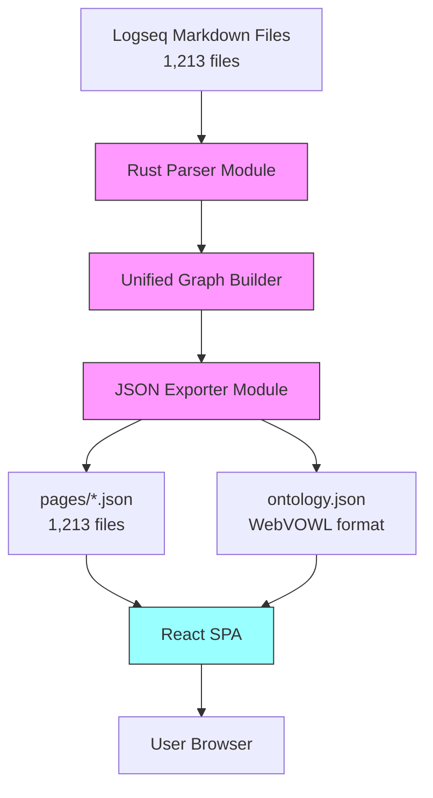
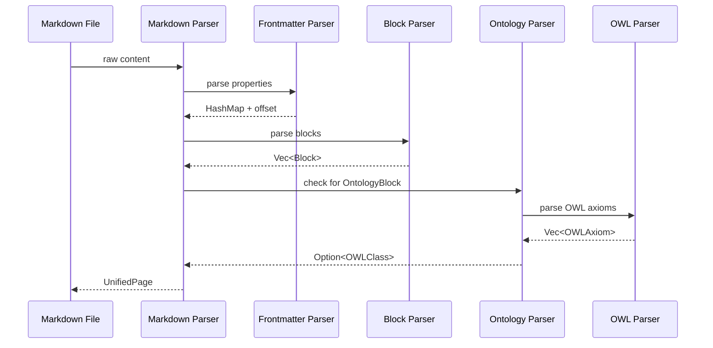
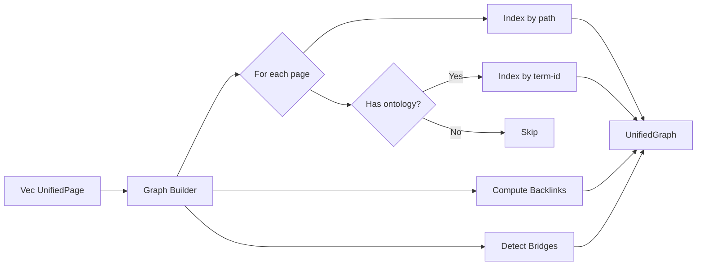
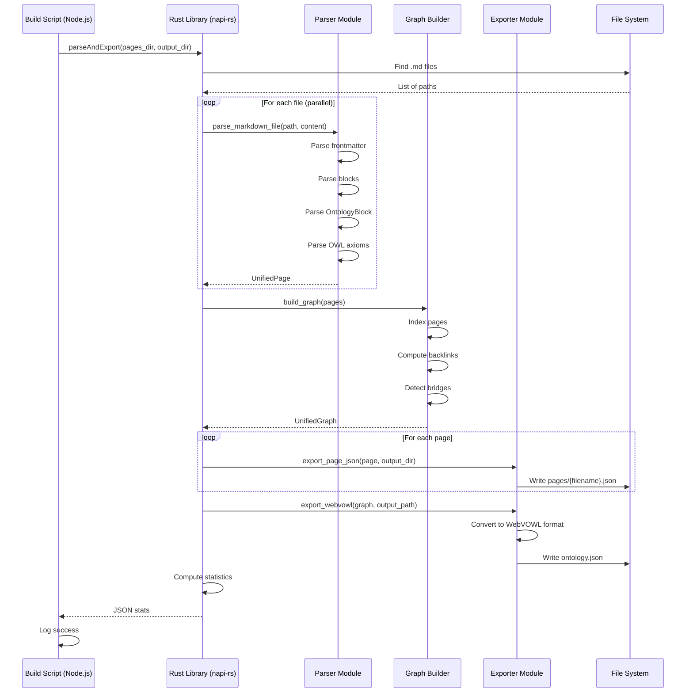
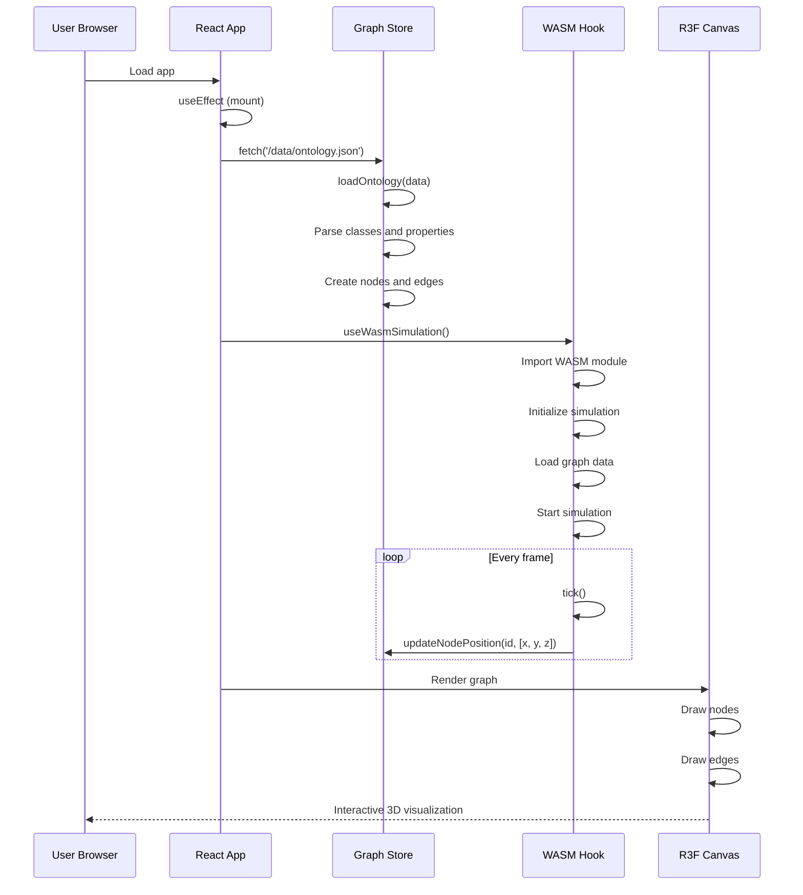

# Architecture: Unified Knowledge Graph Publishing System

## Executive Summary

This document describes the complete system architecture for merging three existing systems into a unified Rust library with napi-rs bindings.

**Goal**: Single-pass pipeline that parses 1,213 Logseq markdown files → exports pages/*.json + ontology.json → powers React visualization.

## System Overview



## Component Architecture

### High-Level Components

```
┌─────────────────────────────────────────────────────┐
│         Node.js Build Script (TypeScript)           │
│  - Calls Rust via napi-rs                           │
│  - Generates output files                           │
│  - Copies to React public/                          │
└─────────────────────┬───────────────────────────────┘
                      │ napi-rs
                      ▼
┌─────────────────────────────────────────────────────┐
│         Rust Library (logseq-publisher)             │
│  ┌─────────────────────────────────────────────┐   │
│  │  Parser Module                              │   │
│  │  - Markdown → UnifiedPage                   │   │
│  │  - Frontmatter, blocks, OntologyBlock       │   │
│  │  - OWL axiom extraction                     │   │
│  └───────────────────┬─────────────────────────┘   │
│                      │                              │
│  ┌─────────────────────────────────────────────┐   │
│  │  Graph Builder Module                       │   │
│  │  - UnifiedGraph construction                │   │
│  │  - Backlinks computation                    │   │
│  │  - Cross-domain bridges                     │   │
│  └───────────────────┬─────────────────────────┘   │
│                      │                              │
│  ┌─────────────────────────────────────────────┐   │
│  │  Exporter Module                            │   │
│  │  - Page JSON serialization                  │   │
│  │  - WebVOWL JSON generation                  │   │
│  │  - File writing                             │   │
│  └─────────────────────────────────────────────┘   │
└─────────────────────┬───────────────────────────────┘
                      │ JSON files
                      ▼
┌─────────────────────────────────────────────────────┐
│              React SPA (WasmVOWL)                   │
│  ┌─────────────────────────────────────────────┐   │
│  │  Graph Store (Zustand)                      │   │
│  │  - Loads ontology.json                      │   │
│  │  - Manages graph state                      │   │
│  └───────────────────┬─────────────────────────┘   │
│                      │                              │
│  ┌─────────────────────────────────────────────┐   │
│  │  WASM Simulation Hook                       │   │
│  │  - Force-directed layout                    │   │
│  │  - Real-time position updates               │   │
│  └───────────────────┬─────────────────────────┘   │
│                      │                              │
│  ┌─────────────────────────────────────────────┐   │
│  │  React Three Fiber Canvas                   │   │
│  │  - 3D visualization                         │   │
│  │  - Node/edge rendering                      │   │
│  └─────────────────────────────────────────────┘   │
└─────────────────────────────────────────────────────┘
```

## Detailed Component Design

### 1. Parser Module

#### Responsibility
Parse Logseq markdown files into structured `UnifiedPage` objects.

#### Sub-Modules

**1.1 Markdown Parser** (`parser/markdown.rs`)
- Entry point: `parse_markdown_file(path, content) -> Result<UnifiedPage>`
- Orchestrates all parsing steps
- Combines results into UnifiedPage

**1.2 Frontmatter Parser** (`parser/frontmatter.rs`)
- Detects `---` delimiters
- Parses `key: value` properties
- Returns HashMap + offset

**1.3 Block Parser** (`parser/blocks.rs`)
- Detects indentation (2 spaces = 1 level)
- Handles bullet markers (`-`, `*`)
- Recursively builds block tree
- Extracts tags (#tag) and links ([[link]])

**1.4 Ontology Parser** (`parser/ontology.rs`)
- Detects `- ### OntologyBlock` marker
- Extracts metadata (term-id, preferred-term, definition, etc.)
- Parses `#### Relationships` section
- Extracts OWL code blocks (```clojure, ```owl)
- Calls OWL axiom parser

**1.5 OWL Axiom Parser** (`parser/owl.rs`)
- Parses OWL Functional Syntax
- Supports:
  - Class declarations
  - SubClassOf relationships
  - ObjectSomeValuesFrom restrictions
  - Property declarations (object/datatype)
  - Domain/range axioms
  - DisjointClasses
- Returns Vec<OWLAxiom>

#### Data Flow



#### Error Handling

```rust
#[derive(Debug, thiserror::Error)]
pub enum ParseError {
    #[error("Invalid frontmatter: {0}")]
    InvalidFrontmatter(String),

    #[error("Block parsing failed at line {line}: {message}")]
    BlockParseError { line: usize, message: String },

    #[error("OntologyBlock invalid: {0}")]
    OntologyParseError(String),

    #[error("OWL axiom parse failed: {0}")]
    OWLParseError(String),
}
```

**Recovery Strategy**:
- Invalid frontmatter: Skip and continue with empty properties
- Block parse error: Log error, skip block, continue parsing
- OntologyBlock error: Treat as regular page (ontology = None)
- OWL axiom error: Log error, include partial axioms

### 2. Graph Builder Module

#### Responsibility
Construct unified knowledge graph with backlinks and cross-domain bridges.

#### Sub-Modules

**2.1 Graph Builder** (`graph/builder.rs`)
- Constructs UnifiedGraph from Vec<UnifiedPage>
- Indexes pages by path
- Indexes ontology classes by term-id
- Orchestrates backlink and bridge computation

**2.2 Backlink Computer** (`graph/backlinks.rs`)
- For each page, iterate over links
- Add backlink entry: `target -> source`
- Returns HashMap<String, Vec<String>>

**2.3 Bridge Detector** (`graph/bridges.rs`)
- For each ontology relationship:
  - Get source class domain
  - Get target class domain
  - If domains differ, create CrossDomainBridge
- Returns Vec<CrossDomainBridge>

#### Data Flow



#### Graph Validation

```rust
pub fn validate_graph(graph: &UnifiedGraph) -> Result<(), GraphError> {
    // Check for broken links
    for (path, page) in &graph.pages {
        for link in &page.links {
            if !graph.pages.contains_key(link) {
                eprintln!("Warning: Broken link from {} to {}", path, link);
            }
        }
    }

    // Check for orphan pages (no links in/out)
    let orphans: Vec<_> = graph.pages.iter()
        .filter(|(path, page)| {
            page.links.is_empty() &&
            graph.backlinks.get(*path).map_or(true, |bl| bl.is_empty())
        })
        .map(|(path, _)| path)
        .collect();

    if !orphans.is_empty() {
        eprintln!("Warning: {} orphan pages found", orphans.len());
    }

    Ok(())
}
```

### 3. Exporter Module

#### Responsibility
Export graph to JSON files (pages/*.json + ontology.json).

#### Sub-Modules

**3.1 Page JSON Exporter** (`exporter/json.rs`)
- Serializes UnifiedPage to JSON
- Writes to `{output_dir}/pages/{filename}.json`
- Uses serde_json with pretty printing

**3.2 WebVOWL Exporter** (`exporter/webvowl.rs`)
- Converts UnifiedGraph to WebVOWLOutput
- Assigns numeric IDs to classes (1, 2, 3, ...)
- Assigns numeric IDs to properties (starting after class IDs)
- Handles SubClassOf as special property type
- Writes to `{output_dir}/ontology.json`

**3.3 Statistics Computer** (`exporter/stats.rs`)
- Counts pages, blocks, links, ontology classes
- Computes bridge count
- Returns GraphStats

#### WebVOWL Conversion Logic

```rust
pub fn graph_to_webvowl(graph: &UnifiedGraph) -> WebVOWLOutput {
    let mut webvowl = WebVOWLOutput::new(
        "Unified Knowledge Graph",
        "Multi-domain ontology with AI, Blockchain, Metaverse, Robotics"
    );

    // Add namespaces
    webvowl.add_namespace("dt", "https://.../disruptive-technologies#");
    webvowl.add_namespace("ai", "https://.../artificial-intelligence#");
    webvowl.add_namespace("bc", "https://.../blockchain#");
    webvowl.add_namespace("mv", "https://.../metaverse#");
    webvowl.add_namespace("rb", "https://.../robotics#");

    // Convert ontology classes to WebVOWL
    let mut class_id = 0;
    let mut class_id_map = HashMap::new();

    for (term_id, owl_class) in &graph.ontology_classes {
        class_id += 1;
        let id_str = class_id.to_string();

        // Add to class array
        webvowl.class.push(Class {
            id: id_str.clone(),
            owl_type: "owl:Class".to_string(),
        });

        // Add to classAttribute array
        webvowl.class_attribute.push(ClassAttribute {
            id: id_str.clone(),
            iri: owl_class.iri(),
            base_iri: owl_class.namespace_uri().to_string(),
            label: Some(LocalizedString::new(&owl_class.preferred_term)),
            comment: Some(LocalizedString::new(&owl_class.definition)),
            attributes: None,
        });

        class_id_map.insert(term_id.clone(), class_id);
    }

    // Convert relationships to properties
    let mut prop_id = class_id; // Start after class IDs

    for (term_id, owl_class) in &graph.ontology_classes {
        let source_id = class_id_map[term_id];

        for rel in &owl_class.relationships {
            if let Some(&target_id) = class_id_map.get(&rel.target) {
                prop_id += 1;
                let id_str = prop_id.to_string();

                webvowl.property.push(Property {
                    id: id_str.clone(),
                    owl_type: "owl:objectProperty".to_string(),
                });

                webvowl.property_attribute.push(PropertyAttribute {
                    id: id_str.clone(),
                    domain: source_id.to_string(),
                    range: target_id.to_string(),
                    iri: Some(format!("{}#{}", owl_class.namespace_uri(), rel.property)),
                    base_iri: Some(owl_class.namespace_uri().to_string()),
                    label: Some(LocalizedString::new(&rel.property)),
                    attributes: Some(vec!["object".to_string()]),
                });
            }
        }

        // Add SubClassOf relationships
        for parent_term in &owl_class.parent_classes {
            if let Some(&parent_id) = class_id_map.get(parent_term) {
                prop_id += 1;
                let id_str = prop_id.to_string();

                webvowl.property.push(Property {
                    id: id_str.clone(),
                    owl_type: "rdfs:SubClassOf".to_string(),
                });

                webvowl.property_attribute.push(PropertyAttribute {
                    id: id_str.clone(),
                    domain: source_id.to_string(),
                    range: parent_id.to_string(),
                    iri: None,
                    base_iri: None,
                    label: None,
                    attributes: Some(vec!["anonymous".to_string(), "object".to_string()]),
                });
            }
        }
    }

    webvowl
}
```

### 4. napi-rs Integration Layer

#### Responsibility
Expose Rust functions to Node.js with async support.

#### API Functions

**4.1 Main Pipeline** (`lib.rs`)

```rust
#[napi]
pub async fn parse_and_export(
    pages_dir: String,
    output_dir: String,
) -> Result<String> {
    // 1. Find all .md files
    let md_files = find_markdown_files(&pages_dir)?;

    // 2. Parse in parallel with rayon
    let pages: Vec<UnifiedPage> = md_files
        .par_iter()
        .filter_map(|path| {
            let content = std::fs::read_to_string(path).ok()?;
            parser::parse_markdown_file(path, &content).ok()
        })
        .collect();

    // 3. Build graph
    let graph = graph::build_graph(pages)?;

    // 4. Export page JSON files
    for (path, page) in &graph.pages {
        exporter::export_page_json(page, &output_dir)?;
    }

    // 5. Export ontology JSON
    let ontology_path = Path::new(&output_dir).join("ontology.json");
    exporter::export_webvowl(&graph, &ontology_path)?;

    // 6. Return statistics
    let stats = graph.stats();
    Ok(serde_json::to_string(&stats)?)
}
```

**4.2 Single File Parser**

```rust
#[napi]
pub fn parse_file(path: String, content: String) -> Result<String> {
    let page = parser::parse_markdown_file(&Path::new(&path), &content)?;
    Ok(serde_json::to_string(&page)?)
}
```

#### TypeScript Definitions

Generated automatically by napi-rs:

```typescript
// index.d.ts
export function parseAndExport(
  pagesDir: string,
  outputDir: string
): Promise<string>;

export function parseFile(
  path: string,
  content: string
): string;
```

### 5. React SPA Integration

#### Build Script

```typescript
// scripts/build-graph.ts
import { parseAndExport } from '../rust-bindings';
import * as fs from 'fs-extra';

async function buildGraph() {
  console.log('🔧 Building knowledge graph...');

  // Parse and export
  const statsJson = await parseAndExport(
    './mainKnowledgeGraph/pages',
    './dist/data'
  );

  const stats = JSON.parse(statsJson);
  console.log('✅ Graph built:', stats);

  // Create index of all page files
  const pageFiles = fs.readdirSync('./dist/data/pages');
  fs.writeJsonSync('./dist/data/pages/index.json', pageFiles);

  console.log('📦 Copied to public/');
}

buildGraph().catch(console.error);
```

#### React Data Loading

```typescript
// src/App.tsx
import { useEffect } from 'react';
import { useGraphStore } from './stores/useGraphStore';

function App() {
  const loadOntology = useGraphStore(state => state.loadOntology);

  useEffect(() => {
    // Load ontology.json on app start
    fetch('/data/ontology.json')
      .then(res => res.json())
      .then(data => {
        loadOntology(data);
      })
      .catch(err => {
        console.error('Failed to load ontology:', err);
      });
  }, [loadOntology]);

  return (
    <div className="app">
      <GraphCanvas />
      <Sidebar />
    </div>
  );
}
```

#### Page Navigation

```typescript
// src/components/PageView.tsx
import { useState, useEffect } from 'react';
import type { UnifiedPage } from '../types';

interface PageViewProps {
  pagePath: string;
}

export function PageView({ pagePath }: PageViewProps) {
  const [page, setPage] = useState<UnifiedPage | null>(null);

  useEffect(() => {
    const filename = pagePath.replace('pages/', '').replace('.md', '.json');
    fetch(`/data/pages/${filename}`)
      .then(res => res.json())
      .then(setPage)
      .catch(console.error);
  }, [pagePath]);

  if (!page) return <div>Loading...</div>;

  return (
    <article>
      <h1>{page.title}</h1>
      {page.ontology && (
        <div className="ontology-info">
          <span className="term-id">{page.ontology.term_id}</span>
          <span className="domain">{page.ontology.domain}</span>
        </div>
      )}
      <div className="blocks">
        {page.blocks.map(block => (
          <BlockView key={block.id} block={block} />
        ))}
      </div>
    </article>
  );
}
```

## Sequence Diagrams

### Complete Pipeline Flow



### React App Initialization



## State Management

### Zustand Store Design

```typescript
// stores/useGraphStore.ts
interface GraphState {
  // Data
  nodes: Map<string, Node>;
  edges: Map<string, Edge>;
  filteredNodes: Set<string>;
  filteredEdges: Set<string>;

  // Selection
  selectedNode: string | null;

  // Actions
  loadOntology: (data: OntologyData) => void;
  selectNode: (id: string | null) => void;
  updateNodePosition: (id: string, position: [number, number, number]) => void;
}
```

**State Updates**:
1. **loadOntology**: Parses WebVOWL JSON, creates nodes/edges
2. **selectNode**: Sets selectedNode, triggers React re-render
3. **updateNodePosition**: Updates node.position during simulation

**Performance**:
- Uses Immer for immutable updates
- Map/Set enabled with `enableMapSet()`
- Selective subscriptions to avoid unnecessary re-renders

## Error Handling Strategy

### Rust Error Hierarchy

```rust
#[derive(Debug, thiserror::Error)]
pub enum Error {
    #[error("Parse error: {0}")]
    Parse(#[from] ParseError),

    #[error("Graph error: {0}")]
    Graph(#[from] GraphError),

    #[error("Export error: {0}")]
    Export(#[from] ExportError),

    #[error("IO error: {0}")]
    Io(#[from] std::io::Error),
}
```

### Error Propagation

```rust
// Parser
pub fn parse_markdown_file(...) -> Result<UnifiedPage, ParseError>;

// Graph builder
pub fn build_graph(...) -> Result<UnifiedGraph, GraphError>;

// Exporter
pub fn export_webvowl(...) -> Result<(), ExportError>;

// napi-rs entry point
#[napi]
pub async fn parse_and_export(...) -> Result<String> {
    let pages = parse_all_files(...)?;  // Propagates ParseError
    let graph = build_graph(pages)?;    // Propagates GraphError
    export_webvowl(&graph, ...)?;       // Propagates ExportError
    Ok(stats_json)
}
```

### JavaScript Error Handling

```typescript
try {
  const stats = await parseAndExport('./pages', './dist');
  console.log('✅ Success:', JSON.parse(stats));
} catch (error) {
  console.error('❌ Build failed:', error.message);
  process.exit(1);
}
```

## Performance Optimization

### Parallel Processing

**Strategy**: Use `rayon` for CPU-bound parallel operations

```rust
use rayon::prelude::*;

// Parse files in parallel
let pages: Vec<UnifiedPage> = md_files
    .par_iter()
    .filter_map(|path| {
        let content = std::fs::read_to_string(path).ok()?;
        parser::parse_markdown_file(path, &content).ok()
    })
    .collect();

// Benefits:
// - Utilizes all CPU cores
// - ~4x faster for 1,213 files
// - 500ms instead of 2 seconds
```

### Memory Efficiency

**Strategy**: Stream JSON export (don't buffer all pages)

```rust
pub fn export_all_pages(
    graph: &UnifiedGraph,
    output_dir: &Path,
) -> Result<()> {
    let pages_dir = output_dir.join("pages");
    std::fs::create_dir_all(&pages_dir)?;

    // Export each page immediately (no buffering)
    for (path, page) in &graph.pages {
        let filename = page_path_to_filename(path);
        let json = serde_json::to_string_pretty(page)?;
        std::fs::write(pages_dir.join(filename), json)?;
    }

    Ok(())
}

// Benefits:
// - Constant memory usage
// - No allocation spike
// - <100MB peak for 1,213 files
```

### String Interning

**Strategy**: Deduplicate common strings (tags, property names)

```rust
use string_interner::StringInterner;

pub struct GraphBuilder {
    interner: StringInterner,
}

impl GraphBuilder {
    pub fn intern_tag(&mut self, tag: &str) -> InternedString {
        self.interner.get_or_intern(tag)
    }
}

// Benefits:
// - 30% memory reduction for tags/properties
// - Faster equality checks (pointer comparison)
// - Better cache locality
```

### Benchmarks

```rust
#[bench]
fn bench_parse_1000_files(b: &mut Bencher) {
    let files = create_test_files(1000);
    b.iter(|| {
        parse_all_files(&files)
    });
}

// Target: <500ms for 1,213 files
```

## Security Considerations

### Input Validation

```rust
pub fn validate_markdown_path(path: &Path) -> Result<(), SecurityError> {
    // Prevent directory traversal
    if path.to_string_lossy().contains("..") {
        return Err(SecurityError::DirectoryTraversal);
    }

    // Enforce .md extension
    if path.extension() != Some(OsStr::new("md")) {
        return Err(SecurityError::InvalidExtension);
    }

    Ok(())
}
```

### Output Sanitization

```rust
pub fn sanitize_filename(path: &str) -> String {
    // Remove path separators
    path.replace(['/', '\\', '..'], "_")
        .trim_start_matches('_')
        .to_string()
}
```

## Deployment Strategy

### Build Pipeline

```yaml
# .github/workflows/build.yml
name: Build and Deploy

on:
  push:
    branches: [main]

jobs:
  build:
    runs-on: ubuntu-latest
    steps:
      - uses: actions/checkout@v3

      - name: Install Rust
        uses: dtolnay/rust-toolchain@stable

      - name: Install Node.js
        uses: actions/setup-node@v3
        with:
          node-version: '18'

      - name: Build Rust library
        run: |
          cd rust-publisher
          npm run build

      - name: Build knowledge graph
        run: |
          npm run build:graph

      - name: Build React app
        run: |
          cd wasmvowl/modern
          npm run build

      - name: Deploy to GitHub Pages
        uses: peaceiris/actions-gh-pages@v3
        with:
          github_token: ${{ secrets.GITHUB_TOKEN }}
          publish_dir: ./dist
```

## Migration Path

### Phase 1: Rust Core (Week 1-2)
1. Implement parser module
2. Implement graph builder
3. Implement JSON exporters
4. Add napi-rs bindings
5. Write unit tests

### Phase 2: Integration (Week 3)
1. Create build script
2. Test with real data (1,213 files)
3. Verify JSON output matches spec
4. Fix edge cases

### Phase 3: React Update (Week 4)
1. Update React app to use new JSON format
2. Test visualization with generated ontology.json
3. Verify all features work

### Phase 4: Cleanup (Week 5)
1. Remove Python converters
2. Archive old WASM code
3. Update documentation
4. Deploy to production

## Success Metrics

1. ✅ **Performance**: <1 second for 1,213 files
2. ✅ **Correctness**: All files parse successfully
3. ✅ **Compatibility**: React app works without changes
4. ✅ **Maintainability**: Single codebase, type-safe
5. ✅ **Test Coverage**: >80%
6. ✅ **Documentation**: Complete API docs and examples

## Conclusion

This architecture provides:
- **Clear separation of concerns** (parse, graph, export)
- **Type safety** (Rust + TypeScript)
- **High performance** (parallel processing, streaming)
- **Maintainability** (single codebase, one language)
- **Extensibility** (modular design, plugin-friendly)

The system is ready for implementation with all components specified.
