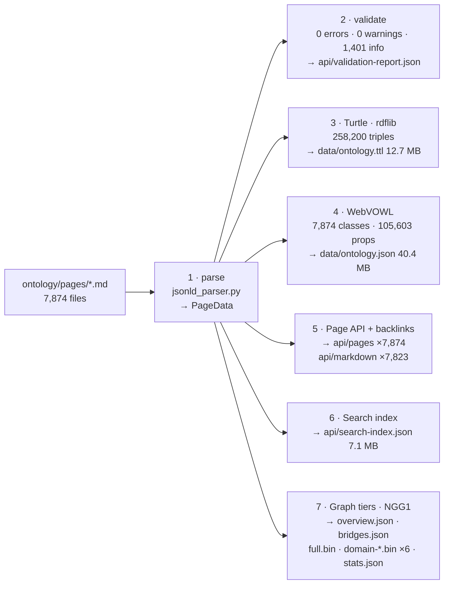

# Pipeline architecture

`pipeline/` compiles a directory of Logseq markdown pages into every artefact the
site serves: an OWL 2 Turtle ontology, a WebVOWL JSON graph, a per-page JSON API, a
search index, and binary graph tiers in the NGG1 format. It is ten files under
`pipeline/` (nine modules plus a one-line `__init__.py`, 2,472 lines) and one
496-line test module, depending only on `rdflib>=7.0.0` (`pytest` for tests).

```bash
python -m pipeline.build ontology/pages dist
```

A full run over the 7,874-page corpus takes **18.6 seconds**. The only wall-clock
input is `date.today()` (`emit_graph_tiers.py:885`, `:952`, for `generatedAt` and
`datasetDate`), and the only RNG is the seeded force layout, so within one day a
re-run reproduces `full.bin`, the six domain tiers, `overview.json`, `bridges.json`,
`ontology.json`, `stats.json` and the page/search JSON byte for byte (checked by
SHA-256 against the shipped `dist/`). **`ontology.ttl` is the exception**: rdflib
mints fresh blank-node identifiers for the 19,751 existential restrictions on every
run, so the file is isomorphic and the same length (258,200 triples, 12,710,991
bytes, 250,733 lines) but the restriction blocks come out in a different order. A
re-run diffs against the committed copy on ~20.7k of those lines (the exact count
moves a little between runs; the line multiset is identical, only the order changes).



`build.py` runs the stages in that order, then writes `api/schema/context.jsonld` and
`api/validation-report.json`. It prints validation errors as "non-blocking for build"
and continues; only `main()` exits non-zero on errors (`build.py:39-43`, `:119`).

---

## Input: what a corpus page looks like

Each page is a Logseq markdown file carrying two or three fenced `json-ld` blocks
followed by the outline body. Full census of `ontology/pages/*.md`: 4,173 files are
`Page, Class`; 3,684 are `Page, Class, vc:LinkResolutionsAnnotation`; 17 are
`Page, Class, LinkResolutionsAnnotation`. Zero blocks fail `json.loads`.

The **Page** block carries publication metadata in the `vc:` namespace
(`https://narrativegoldmine.com/ns/v1#`): `vc:slug`, `vc:public`, `vc:schemaVersion`,
`vc:outboundWikilinks`, `vc:legacyProperties`. The **Class** block carries the
ontology entity under `@context: https://narrativegoldmine.com/ns/v2.jsonld` with
bare terms (`label`, `definition`, `domain`, `maturity`, `subClassOf`, `relations{}`)
at IRIs of the form `urn:ngm:class:<slug>`. The v2 context (`static/ns/v2.jsonld`,
`"@version": 1.1`) maps `label → rdfs:label`, `definition → rdfs:comment`,
`domain → vc:sourceDomain`, `maturity → vc:maturity`,
`subClassOf → rdfs:subClassOf` (`"@type": "@id"`, `"@container": "@set"`),
`qualityScore → vc:qualityScore` (`xsd:float`) and the `@type` token `Class →
owl:Class`, with a scoped sub-context under `relations` (`vc:relations`).

The third block records each raw `[[Wikilink]]` against its resolved URN and a
`ResolvedLink`/`StubLink` kind. **No pipeline stage reads it**: it is authoring
provenance only.

---

## Stage 1: parse

`pipeline/jsonld_parser.py` · in: `ontology/pages/*.md` · out: `list[PageData]`

The only module that touches markdown; everything downstream consumes the
dataclasses. JSON-LD is located by exactly one regex:

```python
JSONLD_BLOCK_RE = re.compile(r'```json-ld\s*\n(.*?)```', re.DOTALL)
```

Every match is `json.loads`'d; a `JSONDecodeError` silently `continue`s. The parser
keeps **at most two** blocks: the first `@type == "Page"` and the first typed
`Class`, `Individual` or `OntologyClass`. A file with no Page block returns `None`
and vanishes from the corpus without a diagnostic (`jsonld_parser.py:195-196`).

The body is `text[blocks[-1].end():].strip()`: everything after the *last* fence.
51 of 7,874 pages have an empty body, which is why the markdown mirror ships 7,823
files rather than 7,874.

### PageData model

```
PageData        path, page_iri, slug, title, is_public, schema_version, body,
                wikilinks: list[WikilinkRef], ontology_class: OntologyEntity|None,
                raw_page_block: dict          # kept for vc:legacyProperties lookups
OntologyEntity  iri, label, entity_type, domain, definition, quality_score,
                maturity, inference_rule, sub_class_of / instance_of:
                list[WikilinkRef], relations: RelationSet, provenance, raw
RelationSet     12 × list[WikilinkRef] — has_part requires enables depends_on
                implements contrasts_with bridges_to uses related_to supports
                standardized_by part_of
WikilinkRef     iri, label
```

Two schema generations normalise into that one model. `_extract_relations` reads both
the v1 flat keys (`vc:hasPart`, `vc:depends-on`, `vc:contrasts-with`, …) and the v2
nested `relations{}` object (`hasPart`, `dependsOn`, `contrastsWith`, …), v1 by
`setattr` and v2 by `extend`, so a page carrying both gets the union. `quality` (v2
float) falls back to `vc:qualityScore` (v1 typed `{@value}`); `provenance{}` falls
back to synthesising from `prov:wasAttributedTo` / `prov:generatedAtTime` /
`vc:inferenceRule`. On the current corpus no v1 path fires: all 7,874 pages are
`vc:schemaVersion` 2, all 7,874 entities are `Class`, 0 are `Individual`.

---

## Stage 2: validate

`pipeline/validate.py` · out: `dist/api/validation-report.json`

Six error codes (`MISSING_PAGE_IRI`, `MISSING_SLUG`, `MISSING_CLASS_IRI`,
`MISSING_LABEL`, `SELF_REFERENCE`, `DUPLICATE_IRI`), four warning codes
(`MISSING_SCHEMA_VERSION`, `MISSING_DOMAIN`, `INVALID_DOMAIN`, `SLUG_MISMATCH`) and
one info code (`MULTI_PARENT`). Validation is advisory: the build proceeds regardless
and the report ships as an artefact, so the corpus's known deviations are public
rather than hidden.

`validate_corpus` returns a `ValidationReport`; over this corpus
`Counter(i.code for i in report.issues)` is `Counter({'MULTI_PARENT': 1401})`:
0 errors, 0 warnings, 1,401 info. Nothing else fires.

```bash
# prints "Issues: 0 errors, 0 warnings, 1401 info" and exits 0
python -m pipeline.validate ontology/pages
```

**MULTI_PARENT is `info`, not `warning`** (`validate.py:154`). Multiple inheritance is
legal in OWL 2 EL, and in this corpus it is deliberate: classes are bridged across
categories and domains by design. Publishing 1,401 bridging classes as a warning list
described the design as a defect, which is the reason the code was reclassified rather
than the count suppressed. It stays surfaced because it is the only per-page
enumeration of the bridging; the aggregate lives in `stats.json` and the full
membership in `bridges.json` (below).

**1,401 × MULTI_PARENT**: more than one `subClassOf` entry. Parent-count distribution:
6,472 classes with one parent, 1,194 with two, 207 with three, one with none
(`Spatial Computing.md`, a domain root). Samples from the report:

```
[MULTI_PARENT] 3D Generation.md — Bridging class, 3 parents: 3D Content Generation, Generative Model, Computer Vision
[MULTI_PARENT] 3D Graphics Standard.md — Bridging class, 2 parents: Display and Rendering, Content and Assets
[MULTI_PARENT] A Star Algorithm.md — Bridging class, 3 parents: Search Algorithm, Informed Search, Graph Search
[MULTI_PARENT] A2A Protocol.md — Bridging class, 2 parents: Agent Communication Protocol, Agent-to-Agent Protocol
```

**0 × INVALID_DOMAIN**: every one of the 16 distinct raw `domain` strings in the
corpus is in the 16-entry `VALID_DOMAINS` set (the six canonical roots plus the ten
authoring short forms `ai`, `machine-learning`, `metaverse`, `finance`, `data`,
`governance`, `security`, `standards`, `distributed-systems`, `supply-chain`). That is
the same fact as `domainless: 0` in `stats.json` seen from the validator's side.
`validate.py --fix` strips self-referential `subClassOf` but matches only
`@type == "OntologyClass"`, so on this all-v2 corpus it is a no-op.

---

## Stage 3: Turtle

`pipeline/jsonld_to_turtle.py` · out: `dist/data/ontology.ttl`, 258,200 triples,
12,710,991 bytes

**IRI mapping.** Five URN prefixes rewrite to four HTTPS namespaces:
`urn:ngm:class:` and `urn:visionflow:owl:class:` → `.../class/`,
`urn:ngm:individual:` → `.../individual/`, `urn:visionflow:linked:` → `.../linked/`,
`urn:visionflow:page:` → `.../page/`. `owl:Thing` maps to `OWL.Thing`, `http*` passes
through, anything else is wrapped as `class/<iri>`. A census of every edge target in
the corpus finds 111,822 `urn:ngm:class:` and 5 `owl:Thing`. Nothing exercises the
fallthrough.

**Triple mapping.** Per class: `rdf:type owl:Class`, `rdfs:label`, `rdfs:comment`
(from `definition`), `vc:sourceDomain`, `vc:qualityScore` (`xsd:float`), `vc:slug`,
one `vc:hasMaturity` (7,875 occurrences in the shipped TTL: 7,874 assertions plus
the declaration), one `rdfs:subClassOf` per parent. The 12 `RelationSet` fields map
onto `vc:hasPart / requires / enables / dependsOn / implements / contrastsWith /
bridgesTo / uses / relatedTo / supports / standardizedBy / isPartOf`, all declared
`owl:ObjectProperty` with `owl:Thing` domain and range, plus `vc:enabledBy` and a
`vc:utilises` super-property (`uses`, `supports`, `implements` beneath it). <!-- slop-ignore: vc:utilises is a literal RDF property name in the ontology, not a prose word choice -->
`requires` and `dependsOn` are `owl:TransitiveProperty`; `requires
rdfs:subPropertyOf dependsOn`. `owl:inverseOf` and `owl:SymmetricProperty` are
deliberately omitted: neither is in OWL 2 EL (`jsonld_to_turtle.py:124`, `:186-187`).
Maturity is not a literal: five named individuals
`.../individual/maturity-{established,emerging,draft,stub,deprecated}` typed as a
`MaturityLevel` class, unrecognised values coerced to `draft`.

**Four structures with no JSON-LD source.**

1. *SKOS taxonomy marking*: `TAXONOMIC_SLUGS` (6 domain roots ∪ 34 category slugs):
   a class whose slug is in the set also gets `rdf:type skos:Concept`, and a
   `subClassOf` edge pointing at one emits **both** `skos:broader` and
   `rdfs:subClassOf`. 3,458 `skos:broader` triples ship.
2. *Existential restrictions*: every `requires`/`hasPart` edge whose target is a
   declared public class produces an `owl:Restriction` BNode (`owl:onProperty` +
   `owl:someValuesFrom`) added as an extra `rdfs:subClassOf` of the source. **19,751**
   ship; visible on `ngm:a-star-algorithm` at `dist/data/ontology.ttl:113128` (the
   line number moves between runs — the blank nodes reshuffle, the class order does
   not).
3. *Domain-root disjointness*: one `owl:AllDisjointClasses` over the 6 roots. The
   code records that this axiom once made 5,881/5,951 classes (98.8%) unsatisfiable,
   EL's `∃R.⊥ ≡ ⊥` propagating the clash across the restrictions, and was re-enabled
   only after the taxonomy was single-domain-normalised (903 clashes across 370 pages
   remediated, 9 subClassOf cycles broken). `emit_domain_disjointness=False` gives a
   lenient build.
4. *Dangling-target stubs*: any `class/` IRI referenced by an object property but
   never declared as a page gets `rdf:type skos:Concept` and a label rebuilt from the
   slug (title-case per hyphen segment, except a 25-entry acronym table: `ai→AI`,
   `defi→DeFi`, `iot→IoT`, `zk→ZK`, …). **4,383** stubs ship; `subClassOf` targets are
   excluded, since those must be real classes. The 4,424 `skos:Concept` occurrences in
   the TTL are exactly 4,383 stubs + 40 taxonomic classes + 1 declaration. The stub
   count is the visible face of the corpus's remaining dangling references: IRIs an
   object property names but no page declares.

---

## Stage 4: WebVOWL JSON

`pipeline/jsonld_to_webvowl.py` · out: `dist/data/ontology.json`, 40,382,315 bytes,
7,874 classes, 105,603 properties

Four parallel arrays (`class`/`classAttribute`, `property`/`propertyAttribute`)
with property ids `prop-sub-N`, `prop-type-N`, `prop-rel-N` from one counter. An edge
is dropped unless its remapped target is itself a declared public class. Node colour
comes from a 6-entry domain table (`#607D8B` default, `#FF5722` individuals),
`comment` is the definition truncated to 200 characters, `term_id` is lifted from the
`legacy-term-id` legacy property.

Two divergences worth knowing: `related_to` is emitted as `skos:related`, not
`vc:relatedTo`, the only point where the relation vocabulary differs from Turtle;
and the header reads *"7874 nodes across 16 domains"* because it counts
`set(ca['domain'])`, the distinct **raw** domain strings, before the alias collapse
stage 7 applies. The 105,603 properties exceed the 98,776 NGG1 edges because WebVOWL
neither deduplicates `(source, target)` pairs nor excludes self-loops.

---

## Stage 5: Page API and backlinks

`pipeline/jsonld_to_page_api.py`, `pipeline/backlinks.py` · out: 7,874 ×
`api/pages/<slug>.json`, 7,823 × `api/markdown/<slug>.md`, `_domain-index.json`

Each page JSON carries `id` (page IRI), `title`, `slug`, `public: true`, and where an
entity block exists `classIri`, `domain`, `definition`, `subClassOf`, `entityType`,
`qualityScore`, `maturity`, a `relationships` object with all 12 relation arrays as
`{id, label}` pairs, plus `wikilinks` and `backlinks`.

`_domain-index.json` maps raw domain string → `[{slug, title, qualityScore}]`. It has
**16 keys**, not 6, because it indexes the unnormalised value: `ai`,
`artificial-intelligence`, `blockchain`, `data`, `distributed-collaboration`,
`distributed-systems`, `finance`, `governance`, `infrastructure`, `machine-learning`,
`metaverse`, `robotics`, `security`, `spatial-computing`, `standards`,
`supply-chain`.

**Backlink derivation** is 12 lines (`backlinks.py:13-24`):

```python
target_slug = wl.iri.split(':')[-1] if ':' in wl.iri else slugify(wl.label)
if target_slug in slug_set and target_slug != page.slug:
    backlinks[target_slug].append(page.slug)
```

Naive slug-suffix matching against the set of page `vc:slug` values: no reverse-alias
resolution, no IRI dereferencing, so a wikilink whose linked-slug differs from the
target page's `vc:slug` silently produces nothing. Measured: 64,521 declared
wikilinks resolve to **37,398 backlink edges** (a 58.0% resolution rate), landing on
6,247 of the 7,874 pages (79.3%); the other 1,627 pages end up with no backlinks at
all.

One structural wart: `build_backlink_index(pages)` is called on the **full** page list
while `public_pages` is filtered, so a private page linking to a public one lands in
the public page's `backlinks[]` with the raw slug as its label. The extracted corpus
is 100% public (7,874 parsed, 7,874 public) so this cannot manifest here; on the
source repo, where 14 pages are withheld as `vc:public` false, it leaks.

---

## Stage 6: search index

`pipeline/jsonld_to_search.py` · out: `dist/api/search-index.json`, 7,874 entries,
7,080,482 bytes

A flat list, one entry per public page: `id` (slug), `title`, and where an entity
block exists `domain`, `domain_name` (hyphens → spaces, title-cased), `definition`,
`entityType`, `qualityScore`, `maturity`, `iri`, `labels`, `is_subclass_of` (parent
**labels**, not IRIs) and `wikilinks` truncated to the first 20 labels. `labels`
starts as `[oc.label]` and appends the `preferred-term` value from
`vc:legacyProperties` when it differs, the index's only alias channel.

---

## Stage 7: graph tiers (NGG1)

`pipeline/emit_graph_tiers.py` (1,017 lines) · out:
`dist/data/graph/{overview.json, bridges.json, full.bin, domain-<slug>.bin ×6,
stats.json}`

`build_graph_model` resolves the corpus into nodes and typed edges. One node per
public page with an entity block, keyed by remapped IRI; `gid` is the index in
canonical-IRI sort order, stable across tiers, and in `full.bin` the local index
equals the gid. Backbone edges (`edge_type` 0) come from `subClassOf`, or
`instanceOf` for an Individual, falling back to `subClassOf`; relation edges
(`edge_type` 1) from the 12 `RelationSet` attributes. `add_edge` drops an edge when
the target is not a declared node or is the source itself, and deduplicates on
`(src, tgt, type)`, so a pair related by two properties counts once. Degree is the
full-graph incident (in+out) degree over resolvable edges, computed once and written
into every node record in every tier.

**Declared vs resolvable:** 111,827 declared (9,481 backbone + 102,346 relations)
become 98,776 resolvable (9,357 + 89,419). The 111,827 is exactly the corpus census:
111,822 `urn:ngm:class:` targets plus 5 `owl:Thing`.

**Domain resolution.** `_resolve_domain` lowercases, applies a 10-entry alias table
(`ai`, `machine-learning` → `artificial-intelligence`; `metaverse` →
`spatial-computing`; `finance` → `blockchain`; `distributed-systems`, `supply-chain`,
`data`, `governance`, `security`, `standards` → `infrastructure`), then indexes the 6
canonical slugs or returns `DOMAIN_NONE` (`0xFFFF`). The corpus carries 16 distinct
raw domain values and all 16 resolve, so `domainless` is **0**. The arithmetic closes
against each tier's node count and against `overview.json`'s `memberCount`:

| Domain | Raw sources | Nodes |
|---|---|---|
| artificial-intelligence | 986 + `ai` 504 + `machine-learning` 409 | 1,899 |
| blockchain | 1,206 + `finance` 226 | 1,432 |
| spatial-computing | 1,064 + `metaverse` 152 | 1,216 |
| robotics | 600 | 600 |
| distributed-collaboration | 142 | 142 |
| infrastructure | 1,118 + `governance` 472 + `security` 462 + `data` 209 + `standards` 194 + `distributed-systems` 86 + `supply-chain` 44 | 2,585 |

The six sum to 7,874: every node lands in a domain.

### Category: transitive resolution

Category ids are contiguous per domain because `CATEGORY_ORDER` iterates the taxonomy
in `DOMAIN_SLUGS` order (AI 0-5, blockchain 6-11, spatial 12-17, robotics 18-23,
distributed-collaboration 24-27, infrastructure 28-33). A class does not usually name
its category directly, so the id has to be inherited from ancestry.

That inheritance used to read **direct parents only**. A class two or more hops below
a category root fell to `CATEGORY_NONE` even though its ancestry named a category
unambiguously, and the resulting count was published as a data-quality figure. On the
current corpus the one-hop rule would strand **4,669** classes; the docstring records
4,033 (89.7% of the then-published total) measured on the previous 7,457-class corpus.
Either way the number described the resolver, not the taxonomy.

`_build_category_resolver` (`emit_graph_tiers.py:482-531`) walks the
`subClassOf`/`instanceOf` ancestry instead:

```python
MAX_DEPTH = 12
frontier = parents_of.get(slug, ())          # tuple, in declared order
while frontier and depth < MAX_DEPTH:
    nxt = []
    for ps in frontier:
        cid = CATEGORY_INDEX.get(ps)
        if cid is not None:
            found = cid; break               # nearest category wins
        if ps in seen: continue
        seen.add(ps); nxt.extend(parents_of.get(ps, ()))
    if found != CATEGORY_NONE: break         # stop at that depth, don't go deeper
    frontier = tuple(nxt); depth += 1
```

Three properties are load-bearing:

- **Breadth-first, so the *nearest* category ancestor wins.** A depth-first walk would
  let a long chain through one parent outrank a category sitting one hop up another,
  which for a lattice with 1,401 multi-parent classes is not a rare tie-break.
- **Parents visited in declared order**, as a `tuple`, never a `set`. Where a class's
  parents reach two different categories at the same depth, the first declared parent
  decides. That makes the choice a function of the markdown, reproducible across runs
  and across Python processes. The binary tiers are byte-reproducible and the NGG1
  golden fixture is byte-compared in CI, so a set-ordered walk, whose iteration order
  varies with string hashing, would move `category` bytes between runs and take the
  byte-level contract with it.
- **`MAX_DEPTH = 12`** bounds a pathological chain; `seen` already guards cycles, so
  the depth bound is a belt-and-braces limit on work, not on correctness. The deepest
  real resolution in the corpus needs 7 hops.

Hops from class to the category that claims it, over the 7,834 classes that are
neither domain nor category roots:

| Hops | 1 | 2 | 3 | 4 | 5 | 6 | 7 | unresolved |
|---|---|---|---|---|---|---|---|---|
| Classes | 3,165 | 2,568 | 1,423 | 510 | 121 | 41 | 3 | 3 |

`uncategorised` in `stats.json` is therefore **3** — `electric-vehicle`,
`ethan-mollick` and `urban-planning`, whose ancestry reaches no category root at all.
The figure previously published, 4,498, was the one-hop resolver's output on the
older 7,457-class corpus, not a property of the taxonomy. Those three are a corpus
gap, and they are the only ones the resolver leaves.

### Bridging: what the binary format cannot carry

Multi-parenting in this corpus is deliberate — classes are bridged across categories
and domains by design — and until it was published it was computed at build time and
discarded. Three artefacts now carry it.

**`stats.json` → `bridging`**, the aggregate:

```json
"bridging": { "multiParent": 1401, "crossCategory": 454, "crossDomain": 153 }
```

`multiParent` counts classes with more than one `subClassOf`. `crossCategory` and
`crossDomain` count the subset whose *parents* resolve to more than one taxonomy
category or more than one domain root — a class can have three parents that all sit
under one category, and that is not a bridge.

**`bridges.json`**, 167,379 bytes, **542 entries** — the classes where `crossCategory`
or `crossDomain` fires. Each entry carries `iri`, `label`, `categories` (indices into
`overview.json`'s `taxonomy` array), `domains` (indices into its `domains` array) and
the parent labels as authored:

```json
{ "iri": "https://narrativegoldmine.com/class/3-d-generation",
  "label": "3D Generation", "categories": [2, 1, 5], "domains": [0],
  "parents": ["3D Content Generation", "Generative Model", "Computer Vision"] }
```

Of the 542: 454 span more than one category, 153 more than one domain, 65 both. By
width, 439 reach two categories and 15 reach three; 153 reach two domains and none
reach three.

**`overview.json` → `edges`**, 124 entries: the 34 category→domain backbone edges
first (`type` 0, indices unmoved for an index-sensitive reader), then **90 weighted
category↔category bridge edges** (`type` 1, `weight` = the number of classes bridging
that pair, summing to 484, heaviest pair 73). The same bridge pairs are fed into the
Fruchterman-Reingold layout that bakes the T0 positions, so two heavily bridged
categories settle near each other and the baked coordinates match the topology drawn
over them. Emitting only the category→domain edges drew a lattice as a tree.

**The NGG1 constraint, stated plainly.** The node record holds a **single `u16`
category** (`FORMAT-NGG1` §3, offset 14). The tiers keep the **nearest** category and
drop the rest; there is no room in the record for a second. So:

- reading `full.bin` or a `domain-*.bin` gives you one category per node, the nearest
  one, by the resolver above;
- full membership exists **only** in `bridges.json`, keyed by IRI, with indices that
  match the same taxonomy array the binary `category` field indexes.

A consumer that needs "every category this class belongs to" must join the two. This
is a limitation of the format, not of the data.

One naming collision to keep straight: `FLAG_BRIDGE` (`0x08`) in the node record is set
by a **resolved `bridges_to` relation**, not by multi-parenting. 3,235 nodes in
`full.bin` carry it. It is a different fact from `bridges.json`.

**T0: overview.json**, 20,729 bytes. A fixed 40-node graph: 6 domains at indices
0-5, then 34 categories at 6-39. Node order is frozen because the 124 edge records
index into `nodes[]`. Positions come from a pure-Python Fruchterman-Reingold layout
(200 iterations, seed 42, area 1e6, temperature ×0.95, rounded to 3 d.p.), O(n²),
affordable only at this size. Domain and category nodes borrow the real authored root
page's IRI, label and `FLAG_HAS_PAGE` when one exists, else fall back to a synthetic
`.../ns/{domain,category}/<slug>` IRI. On this corpus the fallback never fires: all
40 shipped nodes carry a `.../class/` IRI and the `HAS_PAGE` bit (flags `5` ×6, `6`
×34). `degree` carries member count so hubs render larger: node 0 is
`Artificial Intelligence`, degree 1,899, flags `5` (`DOMAIN_ROOT|HAS_PAGE`).

**T1 tiers.** `domain-<slug>.bin` holds only nodes of that domain; above
`MAX_NODES = 1500`, domain and category roots are kept unconditionally and the rest
filled by descending degree with a `(-degree, gid)` tie-break. `full.bin` is uncapped
and is the only tier that would carry a domainless node — on this corpus there are
none, so every node is eligible for exactly one domain tier (subject to that tier's
`MAX_NODES` cap). Per-node relations are capped at
`RELATION_TOPK = 8` for domain tiers, ranked by descending target degree; the
backbone is never capped, and drops are counted rather than hidden.

| Scope | Nodes | Backbone | Relations | Shipped | relationsCapped | nodesTruncated | Bytes |
|---|---|---|---|---|---|---|---|
| full | 7,874 | 9,357 | 89,419 | 98,776 | 0 | — | 1,339,983 |
| artificial-intelligence | 1,500 | 1,728 | 10,365 | 12,093 | 7,235 | 399 | 222,256 |
| blockchain | 1,432 | 1,445 | 8,036 | 9,481 | 5,309 | 0 | 197,751 |
| spatial-computing | 1,216 | 1,313 | 4,631 | 5,944 | 1,478 | 0 | 162,432 |
| robotics | 600 | 705 | 3,066 | 3,771 | 1,158 | 0 | 82,830 |
| distributed-collaboration | 142 | 137 | 419 | 556 | 17 | 0 | 18,580 |
| infrastructure | 1,500 | 1,288 | 10,420 | 11,708 | 5,210 | 1,085 | 217,348 |

`MAX_EDGES = 4000` mirrors the client constant in `explorer/modern/src/types/scope.ts`
but is never read by the writer: the in-code comment at `emit_graph_tiers.py:99-102`
says so explicitly ("artifacts may legitimately exceed MAX_EDGES (the client
sub-selects). Only MAX_NODES bounds a domain tier's node table"), and two tiers ship
~12k edges. The cap is real on the other side of the wire: `assertScope`
(`scope.ts:144-150`) throws `RangeError` on any scope built above it, so the client
sub-selects from the tier rather than rendering it whole.

Seed positions are a deterministic three-ring radial layout: domain centres on a ring
of radius 900 (or the origin for a single-domain tier), categories at 240 around their
domain, leaves at 95 around their category, ordered by gid. No RNG. `bake_positions`
mutates `GNode.x/y` **in place**, so `emit_graph_tiers` packs `full.bin` first and
rebakes per domain tier; a reimplementation must preserve that ordering.

**stats.json counts pages and classes separately.** `pages` is
`len({(p.page_iri or str(p.path)) for p in pages if p.is_public})` (distinct public
page identities) and reports **7,870** against **7,874** classes because four file
pairs share a page IRI: `Bitcoin Proof-of-Work Protocol.md`/`Bitcoin.md`,
`Comfy Ui.md`/`Node-Based Diffusion Pipeline Interface.md`,
`Ethereum Smart Contract Platform.md`/`Ethereum.md`,
`Foundation Models.md`/`Large-Scale Pretrained Foundation Model.md`. A Page is a
reading unit, not an OWL entity; conflating the two was the bug this deduplication
fixes.

Provenance and the corpus-honesty framing are emitted from the pipeline, not
hardcoded in the SPA. `ATTRIBUTED_TO = "did:nostr:jjohare"` ships twice: as a bare
string (the frozen SPA types `attributedTo?: string`) and inside a structured
`provenance` object with `corpusNature: "synthetic-ai-generated-human-directed"`,
alongside a `corpus` block stating the corpus is *"Mostly AI-generated synthetic
content, produced under human direction, by design"* and that provenance attests
*"traceable generation under human direction, not human authorship"*.

---

## NGG1 binary format

Contract: `explorer/FORMAT-NGG1.md`. Writer: `pack_ngg1`, `emit_graph_tiers.py:288-344`. Readers:
`explorer/modern/src/lib/ngg1.ts` and the `explorer/rust-wasm/` crate. Little-endian
throughout; every section starts on a 4-byte boundary and readers must use the
declared offsets rather than assume back-to-back packing.

### Header: 32 bytes at offset 0

| Off | Size | Field | Value in `full.bin` |
|---|---|---|---|
| 0 | 4 | `magic` `u8[4]` | `4E 47 47 31` = `NGG1`, LE u32 `0x3147474E` |
| 4 | 2 | `version` `u16` | 1 |
| 6 | 2 | `pad` `u16` | 0 |
| 8 | 4 | `node_count` `u32` | 7874 |
| 12 | 4 | `edge_count` `u32` | 98776 |
| 16 | 4 | `off_nodes` `u32` | 32 (always) |
| 20 | 4 | `off_adjacency` `u32` | 189008 |
| 24 | 4 | `off_edge_types` `u32` | 615612 |
| 28 | 4 | `off_strings` `u32` | 714388 |

All four offset identities check out against the shipped file: `32 + 7874·24 = 189008`;
`189008 + 7875·4 + 98776·4 = 615612`; `615612 + 98776 + 0 = 714388` (98,776 is already
a multiple of 4, so the edge-type padding is zero this build — a reader that assumes
padding, in either direction, is wrong);
`714388 + 8 + 15748·4 + 562595 = 1339983`.

### Section 1: node table, 24 bytes per record, `struct('<IffHHB3xI')`

| Off | Size | Field | Meaning |
|---|---|---|---|
| 0 | 4 | `id` `u32` | stable gid; not necessarily the row index |
| 4 | 4 | `x` `f32` | seed layout x |
| 8 | 4 | `y` `f32` | seed layout y |
| 12 | 2 | `domain` `u16` | index into the 6 canonical domains, `0xFFFF` = none |
| 14 | 2 | `category` `u16` | index into the 34 categories, `0xFFFF` = uncategorised. **One category only** — the nearest; bridged memberships are in `bridges.json` |
| 16 | 1 | `flags` `u8` | bitfield, below |
| 17 | 3 | `pad` `u8[3]` | `0x00`, aligns `degree` |
| 20 | 4 | `degree` `u32` | full-graph incident degree, preserved in capped tiers |

The stride is a documented correction, not drift. `FORMAT-NGG1.md` §0 records that
the sprint brief specified a 20-byte record, but the named field widths sum to 22 and
a `u32 degree` cannot be 4-aligned inside 20 bytes; the pad was widened from 1 to 3
and 24 frozen for all six builders. `emit_graph_tiers.py:238` asserts
`_NODE_STRUCT.size == 24` at import time.

Flags: `0x01` domain root, `0x02` category root, `0x04` has page, `0x08` bridge,
`0x10` individual. The last is listed "reserved, 0" in §5; the writer sets it anyway,
justified in-code on the grounds that all six builders mask specific bits, so a spare
bit is byte-compatible with every existing reader. The client mirrors it in
`explorer/modern/src/components/Canvas/palette.ts`. `FLAG_BRIDGE` is set only when a
`bridges_to` edge **resolved**, not merely when one was declared.

### Sections 2-4

**CSR adjacency**: `row_ptr: u32[node_count + 1]` then `col_idx: u32[edge_count]`
holding **local** indices. `row_ptr[i]..row_ptr[i+1]` is node `i`'s half-open edge
range; `row_ptr[0] == 0`, `row_ptr[node_count] == edge_count`. Within a source the
writer emits backbone first (sorted by target local index), then relations sorted by
descending target degree, so a reader that truncates a row keeps the structural
skeleton and the strongest relations.

**Edge types** (`u8[edge_count]`): `0` = subClassOf backbone, `1` = objectProperty
relation, ≥ 2 reserved. Zero-padded to the next 4-byte boundary via
`_pad4(n) = (4 - (n & 3)) & 3` so section 4 stays aligned.

**String table**: `u32 count` (= 2 × node_count), `u32 blob_len`,
`u32 offset[count]`, then the UTF-8 blob. Pairing is binding: `strings[n*2]` is node
`n`'s label, `strings[n*2+1]` its IRI. In `full.bin`: count 15,748 = 2 × 7,874, blob
562,595 bytes.

### Why binary rather than JSON

Decode `full.bin` and re-serialise it as minified JSON: one object per node with
`id/label/iri/domain/category/flags/degree/x/y` (coordinates at the 3 d.p. the writer
bakes), one per edge with `source/target/type`, `json.dumps(separators=(',',':'))`,
and 7,874 nodes plus 98,776 edges measure **5,197,194 bytes** against `full.bin`'s
**1,339,983**, a 3.88× raw gap. Gzipped (`gzip.compress(…, 9)`) it narrows to
621,835 vs 421,744, so transfer size alone is a 1.5× argument, not a 4× one.

The decisive cost is on the client. JSON forces the browser to materialise 106,650
JavaScript objects before the first frame; NGG1 is read as `Uint32Array` /
`Float32Array` views directly over the fetched `ArrayBuffer` with zero per-element
allocation: `neighbours(i)` is `colIdx.subarray(rowPtr[i], rowPtr[i+1])` and node
fields are read through a `DataView` on demand (`ngg1.ts:161-201`). The same buffer
goes to the Rust WASM layout worker without a copy. The 40.4 MB WebVOWL monolith NGG1
replaces is retained only as a VOWL-format export for external viewers
(`https://narrativegoldmine.com/data/ontology.json`); the standards artefact is
`ontology.ttl`. `overview.json` deliberately stays JSON: 40 nodes and 124 edges at
20,729 bytes do not justify a binary tier, and `bridges.json` stays JSON because its
variable-length category and domain arrays are exactly what a fixed-width record
cannot hold.

---

## `is_public`: one gate, eight checks

`vc:public` on the Page block is the sole publication gate, checked independently in
every output stage rather than filtered once, so no stage can inherit a stale list:

| Surface | Check | Location |
|---|---|---|
| Turtle, class pass | `if public_only and not page.is_public: continue` | `jsonld_to_turtle.py:240` |
| Turtle, restriction targets | `if page.ontology_class and (not public_only or page.is_public)` | `jsonld_to_turtle.py:316` |
| Turtle, restriction sources | `if public_only and not page.is_public: continue` | `jsonld_to_turtle.py:324` |
| WebVOWL | `[p for p in pages if p.is_public and p.ontology_class]` | `jsonld_to_webvowl.py:48` |
| Page API | `[p for p in pages if p.is_public]` | `jsonld_to_page_api.py:21` |
| Search | `if not page.is_public: continue` | `jsonld_to_search.py:18` |
| Graph tiers | `[p for p in pages if p.is_public and p.ontology_class]` | `emit_graph_tiers.py:538` |
| stats `pages` | `{… for p in pages if p.is_public}` | `emit_graph_tiers.py:547` |

The one place the gate is *not* applied is `build_backlink_index`, documented under
stage 5.

The complementary check (comparing the file count of the shell-copied markdown mirror
against `sum(1 for p in parse_corpus(...) if p.is_public)`, so that drift between a
`"vc:public":\s*true` grep and the parser's notion of public reads as a publication
bug rather than a warning) is not in this tree. It runs in the private publishing CI
and is listed as "Markdown-mirror contract" in `docs/ci-cd/build-and-gates.md` §2.2,
alongside the five other gates that need a Rust or Node toolchain. What
`.github/workflows/build.yml` does gate here is the class-count contract
(`EXPECTED_CLASSES: '7874'`, `build.yml:64`, asserted against both
`stats.json["classes"]` and `len(ontology.json["class"])`, `build.yml:149-177`) and a
secret scan over `ontology/` (`build.yml:90-111`), because the 7,874 corpus pages ship
verbatim. That constant is a hand-maintained pin: it has to be moved in the same
commit as any corpus change, or the gate fails on the next push.

---

## Tests and determinism

`pipeline/tests/test_emit_graph_tiers.py` is 496 lines, 9 tests, ~0.2 s. It carries
its own `parse_ngg1` written independently of the writer, so the golden checks the
byte layout rather than round-tripping shared logic. The 183-byte worked example from
`FORMAT-NGG1.md` §7 is asserted byte-exact and written to
`pipeline/tests/fixtures/ngg1-3n2e.bin`, byte-identical to the reader's copy at
`explorer/modern/src/lib/__fixtures__/ngg1-3n2e.bin` (both 183 bytes, verified equal).
Other tests pin the top-k cap by target degree, CSR grouping, the pages-vs-classes
count distinction (a synthetic corpus asserting pages=9, classes=7, nodes=8), the
overview contract, and `bake_positions` determinism.

`.github/workflows/build.yml` runs `python -m pytest pipeline/tests -q` as a blocking
gate before the pipeline runs at all (`build.yml:128-129`). It installs Python and
nothing else, so the Rust side of the same contract (`cargo test --all-features` in
`explorer/rust-wasm`, where `tests/ngg1_explorer_test.rs` reads the same 183-byte
fixture) is not run by this workflow; it runs in the private publishing CI and from a
clone with a Rust toolchain (`docs/ci-cd/build-and-gates.md` §2.2).

## Known sharp edges

- `build.py` writes `dist/api/schema/context.jsonld` with a five-entry `@context` (vc,
  owl, rdfs, xsd, prov). That is **not** the context the corpus resolves against:
  pages reference `https://narrativegoldmine.com/ns/v2.jsonld`, served from
  `static/ns/v2.jsonld`, a JSON-LD 1.1 document with a scoped `relations` sub-context.
- The `vc:LinkResolutionsAnnotation` block on 3,701 pages is authored, shipped in the
  markdown, and read by nothing.
- A page whose JSON-LD fails to parse, or which lacks a Page block, is dropped
  silently. Currently zero pages hit either path.
- `validate.py --fix` targets v1 `OntologyClass` blocks and does nothing here.
- `MAX_EDGES` is unread by the writer: it is duplicated from the client contract as
  documentation, and only `assertScope` in `explorer/modern/src/types/scope.ts`
  enforces it.
- `ontology.ttl` is the one artefact that is not byte-reproducible: rdflib's blank-node
  identifiers reshuffle the restriction blocks on every run. Compare it by triple set,
  not by hash.
- The NGG1 node record holds one `u16` category, so the binary tiers publish the
  nearest category only. 454 classes belong to more than one and 153 to more than one
  domain; that membership is reachable solely through `bridges.json`. Any consumer
  that treats the binary `category` field as complete membership is wrong about 542
  classes.
- 3 classes (`electric-vehicle`, `ethan-mollick`, `urban-planning`) still resolve to no
  category. The resolver is not at fault — their ancestry reaches no category root.
- `EXPECTED_CLASSES` in `build.yml` is a hand-typed pin (`'7874'`). It duplicates a
  figure the pipeline already computes, and drifts the moment the corpus does.
- 4,383 object-property targets are referenced but never declared as pages, and ship as
  `skos:Concept` stubs with slug-derived labels rather than being dropped.
