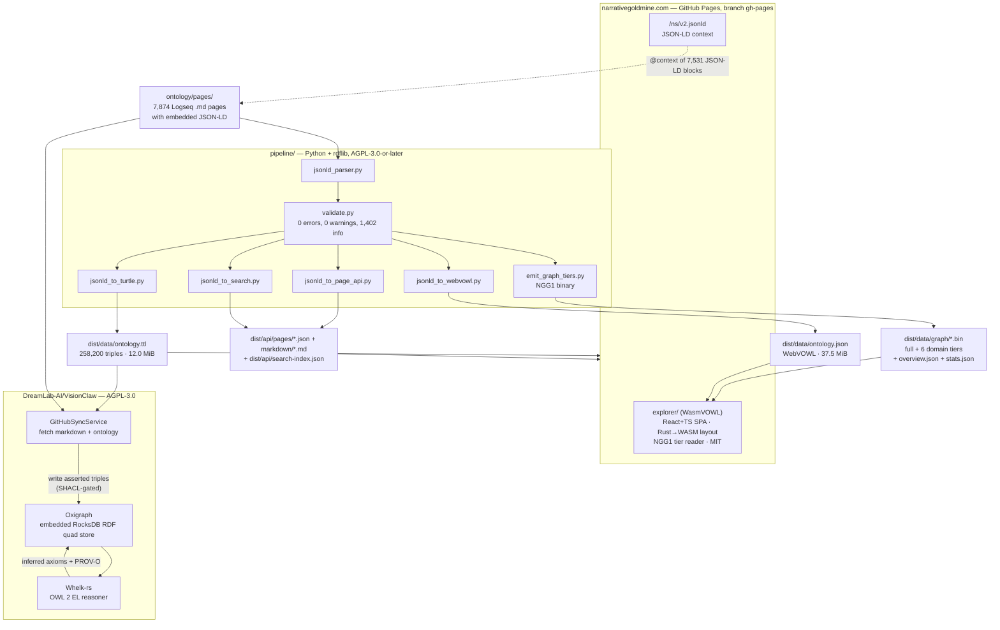

# Ecosystem

Where this repository sits among the DreamLab-AI projects, what consumes the
corpus, and which neighbouring repository names are empty.

Every repository below was checked with `gh api /repos/DreamLab-AI/<name>` on
2026-07-25. Repositories that could not be verified, or that turned out to
contain something other than their name suggests, are either excluded or called
out explicitly under [Reserved and empty names](#reserved-and-empty-names).

## What this repository is

A Logseq-authored ontology corpus and the Python/rdflib pipeline that turns it
into published RDF, a WebVOWL-format graph, a page API, a search index, and
binary graph tiers.

| Component | Path | Licence | Licence file |
|---|---|---|---|
| Build pipeline (10 Python modules + tests) | `pipeline/` | AGPL-3.0-or-later | `LICENSE` |
| Corpus (7,874 public pages) | `ontology/pages/` | ODbL-1.0 | `LICENSE-DATA` |
| Explorer (WasmVOWL derivative) | `explorer/` | MIT | `LICENSE-EXPLORER`, `explorer/license.txt` |
| JSON-LD context document | `static/ns/v2.jsonld` | AGPL-3.0-or-later | `LICENSE` |
| Built artefacts | `dist/data/`, `dist/api/` | ODbL-1.0 (data) | `LICENSE-DATA` |

The 2026-07-25 build produced 7,874 OWL classes, 0 individuals, 7,870 pages,
98,776 emitted edges (of 111,827 declared) and 258,200 Turtle triples, in 18.3
seconds. The class, page, node, edge, domain (6) and category (34) counts, plus
`pipelineVersion: ng-1.0.0` and `datasetDate: 2026-07-25`, are recorded in
`dist/data/graph/stats.json`. The triple count is a property of
`dist/data/ontology.ttl`, not of `stats.json`; `rdflib` reports 252974 on
parsing it. The 18.3 s elapsed time is printed by `pipeline/build.py` at the end
of a run and is not persisted anywhere. `stats.json` also carries the corpus
honesty statement `"corpusNature": "synthetic-ai-generated-human-directed"`. The
corpus is mostly AI-generated synthetic content produced under human direction,
by design: an ontology testbed, not an authoritative encyclopaedia. Its
provenance metadata (`did:nostr`, `generatedAtTime`, URNs) attests traceable
generation under human direction, not human authorship.

## Corpus flow



One caveat on that context edge: `static/` holds exactly one file,
`static/ns/v2.jsonld`, and it is the only context document the deploy publishes.
The corpus does not reference it uniformly. Counting `"@context"` values across
`ontology/pages/*.md` gives 7,531 pointing at `/ns/v2.jsonld`, 9,546 at
`/context/v1.jsonld`, 1,538 at `/ns/v1`, 12 at
`//visionclaw.dreamlab-ai.systems/ns/v1` and 1 at `//w3id.org/did/v1`. Only the
first of those dereferences on narrativegoldmine.com. This does not affect the
build, since `pipeline/jsonld_parser.py` never fetches a remote context, but a
consumer that expands the JSON-LD blocks over the network will fail on the
majority of them.

The VisionClaw half of that diagram is transcribed from VisionClaw's own
canonical architecture doc,
[`docs/explanation/system-overview.md`](https://github.com/DreamLab-AI/VisionClaw/blob/main/docs/explanation/system-overview.md):
the message sequence at lines 193-196 (`GitHubSyncService` → `Oxigraph` →
`Whelk reasoner`), the store description at line 122 ("an embedded,
RocksDB-backed RDF quad store opened in-process"), and the stack table's "Graph
store" row at line 244.

## Verified siblings

### DreamLab-AI/VisionClaw: AGPL-3.0, branch `main`

*Logseq Spring Thing Immersive & Agentic Knowledge Development Engine.*
The second consumer of this corpus. It fetches the markdown and the OWL from
GitHub, gates writes with SHACL-lite, stores them in an embedded Oxigraph quad
store, and reasons over them with Whelk-rs (OWL 2 EL). Where this repository
publishes a static artefact, VisionClaw runs the same triples as a live,
reasoned graph.

Its `NOTICE` (1,513 bytes) explains the AGPL-3.0 relicence: at milestone M1 of
ADR-032 the webxr workspace began linking `solid-pod-rs`, `solid-pod-rs-nostr`
and `solid-pod-rs-idp`, and "Linking these crates makes the combined webxr
binary AGPL-3.0-only." `LICENSE.MPL` survives in the repo as a historical file;
VisionClaw is **not** MPL 2.0 today, despite what VisionFlow's
`docs/architecture/licensing.md` line 11 still says.

Useful entry points, all confirmed present on `main`:
[system-overview](https://github.com/DreamLab-AI/VisionClaw/blob/main/docs/explanation/system-overview.md) ·
[insight-migration-loop](https://github.com/DreamLab-AI/VisionClaw/blob/main/docs/explanation/insight-migration-loop.md) ·
[graph-schema](https://github.com/DreamLab-AI/VisionClaw/blob/main/docs/reference/graph-schema.md) ·
[rest-api](https://github.com/DreamLab-AI/VisionClaw/blob/main/docs/reference/rest-api.md)

### DreamLab-AI/WasmVOWL: MIT, branch `master`

A fork of [VisualDataWeb/WebVOWL](https://github.com/VisualDataWeb/WebVOWL),
described as "Visualizing ontologies on the Web". This is the direct upstream of
`explorer/`. Both carry the same MIT text: `explorer/license.txt` line 3 reads
"Copyright (c) 2014-2019 Vincent Link, Steffen Lohmann, Eduard Marbach, Stefan
Negru, Vitalis Wiens".

Two divergences worth knowing. The default branch is `master`, not `main`, and
its newest commits sit on the unmerged `fix/audit-2026-07-10` (`36105cc3`,
2026-07-10); `master` HEAD is `545885c8`, "clean up directories", 2025-11-10.
The two have diverged: the branch is 3 ahead and 1 behind `master`. And
`explorer/` here is not a mirror in either direction: upstream `master` carries
`legacy/`, `modern/`, `rust-wasm/`, `tests/`, whereas `explorer/` drops the
`legacy/` D3 tree and adds `docs/` and `scripts/`, giving `docs/`, `modern/`,
`rust-wasm/`, `scripts/`, `tests/`.

`explorer/` stays MIT deliberately. AGPL-ing it would be hollow while the same
WebVOWL-derived code is MIT one repository away: `explorer/package.json` and
`explorer/license.txt` still hash to the identical git blobs as their upstream
`master` counterparts (`f01b936d` and `6df36dbf`).

### DreamLab-AI/VisionFlow: no root licence, branch `main`

<!-- slop-ignore: verbatim GitHub repo description field, em-dash included -->
*Distributed coordination platform — governed AI agent meshes with shared
semantics, self-sovereign data, and human-in-the-loop judgment.*
The ecosystem's documentation and website canon; its GitHub `homepage` field is
empty, so it publishes no canonical site URL. It carries no root
`LICENSE` (HTTP 404); `LICENSES/README.md` states that "Until a root licence file
is added, treat repository-local documentation and website assets as requiring
explicit maintainer confirmation before reuse outside the DreamLab AI ecosystem."
Its `docs/architecture/licensing.md` is dated 2026-05-20 and is stale on
VisionClaw; cite VisionClaw's own `LICENSE` and `NOTICE` instead.

### DreamLab-AI/agentbox: AGPL-3.0, branch `main`

*NIX based agent container.* The agent runtime this pipeline was built inside.
Third-generation fork: `agentbox` ← `VisionClaw` ← `origin-logseq-AR`. No code or
data dependency in either direction; it is tooling provenance, not a consumer.

### DreamLab-AI/Metaverse-Ontology: no licence file, branch `main`

The closest independent precedent to this repository's method. Its README:
"A formal ontology for metaverse concepts using an innovative hybrid approach <!-- slop-ignore: direct quote of Metaverse-Ontology's own README wording -->
that combines **Logseq markdown** for human readability with **OWL Functional
Syntax** for formal reasoning", extracted by a Rust `logseq-owl-extractor/`.

The methods differ where it matters: Metaverse-Ontology reads Logseq *properties*
and emits OWL Functional Syntax from Rust; this repository parses *embedded
JSON-LD blocks* with Python/rdflib and emits Turtle, WebVOWL JSON and NGG1 binary
tiers, set out in [`methodology/the-hybrid-approach.md`](methodology/the-hybrid-approach.md).
Its root tree carries no `LICENSE` file and `GET /repos/DreamLab-AI/Metaverse-Ontology/license`
returns HTTP 404, so nothing there is safe to vendor.

### Indirect: DreamLab-AI/solid-pod-rs, AGPL-3.0, branch `main`

*Rust-native Solid Pod server (LDP + WAC + NIP-98 + OIDC + Notifications).* No
direct relationship here; listed because, per VisionClaw's `NOTICE`, it is the
cause of the licence that governs the downstream consumer of this corpus.

## Reserved and empty names

Two repository names in the organisation describe work this repository now does.
Neither contains code. Stating this plainly is cheaper than leaving readers to
discover it.

- **DreamLab-AI/logseq-ontology-toolkit**: MIT, branch `main`, described as
  "automation for hybrid logseq ontology and web presentation". Its entire git
  tree is one blob: `LICENSE`, 1,083 bytes. One commit, `4b8cc5ed` "Initial
  commit", 2025-11-13. Its stated purpose is precisely what `pipeline/` and
  `explorer/` implement here.
- **DreamLab-AI/KG-markdown**: no licence, no description, no commits. Both
  `/git/trees/HEAD` and `/commits` return HTTP 409 `"Git Repository is empty."`

Both were registered in November 2025 for work that subsequently landed here.
The right resolution is upstream: archive them, or push a one-line README pointing
at `DreamLab-AI/knowledgeGraph`, rather than annotating the ambiguity forever.

**Excluded deliberately:** `DreamLab-AI/VisionFlow-Ontology-Engine` is not an
ontology engine. It is a fork of `ShinMegamiBoson/OpenPlanter` whose README
opens <!-- slop-ignore: direct quote of OpenPlanter's own README wording, em-dash included -->
"# OpenPlanter — A recursive-language-model investigation agent with a terminal
UI, built in Rust" and whose crates are `op-cli`, `op-core`, `op-engine`,
`op-model`, `op-runtime`, `op-scripts`, `op-tools`, `op-tui`. Nothing in it
relates to this corpus.

## Publication topology

The corpus is authored and built in a private source repository
(`jjohare/logseq`) and deployed cross-repo into this one. From
`.github/workflows/publish.yml` in that source repo:

```yaml
- name: Deploy to GitHub Pages
  uses: peaceiris/actions-gh-pages@v3
  with:
    personal_token: ${{ secrets.ACCESS_TOKEN }}
    external_repository: DreamLab-AI/knowledgeGraph
    publish_branch: gh-pages
    publish_dir: www
    commit_message: "Deploy JSON-LD v3 pipeline from jjohare/logseq @ ${{ github.sha }}"
```

The same job writes `narrativegoldmine.com` into `www/CNAME`, matching this
repo's root `CNAME`. GitHub's Pages API reports `html_url
https://narrativegoldmine.com/`, source branch `gh-pages`, cname
`narrativegoldmine.com`, status `built`. Published endpoints, as enumerated by
the workflow's own deployment summary:

- `https://narrativegoldmine.com/`: explorer
- `https://narrativegoldmine.com/ns/v2.jsonld`: JSON-LD context
- `https://narrativegoldmine.com/data/ontology.ttl`: Turtle
- `https://narrativegoldmine.com/data/ontology.json`: WebVOWL graph
- `https://narrativegoldmine.com/api/search-index.json`: search index

A markdown-mirror gate in the same job fails the build if the count of copied
public pages differs from the parser's `vc:public` count, so the published page
API cannot silently drift from the corpus.

This repository's own workflow, `.github/workflows/build.yml`, is the reproducible
half of that job and deliberately has no deploy path: its whole permission set is
`contents: read`, so it could not push even if a step tried. It runs a secret scan
over `ontology/`, the pipeline unit tests (`pipeline/tests`, including the
183-byte NGG1 golden fixture), the 7-stage build into `dist-ci/`, a hard contract
gate asserting `EXPECTED_CLASSES: '7874'` against both `stats.json` and
`ontology.json`, and `python -m pipeline.validate ontology/pages`, which must
report zero errors. It now also reports zero warnings. The 1,402 remaining
issues are `MULTI_PARENT` at `info` severity: bridging classes, which are a
design property of this corpus rather than a defect. They were published as
warnings until 2026-07-25, when the count was corrected. See
`dist/api/validation-report.json`. Reproduce it with:

```bash
pip install "rdflib>=7.0.0" pytest
python -m pytest pipeline/tests -q
python -m pipeline.build ontology/pages dist-ci
```

## Cross-referencing this repository from a sibling

Maintainers of the sibling projects can paste the following into their README.
It states only claims verifiable from files in this repository.

```markdown
### Ontology corpus

The ontology this project consumes is published from
[DreamLab-AI/knowledgeGraph](https://github.com/DreamLab-AI/knowledgeGraph)
and served at [narrativegoldmine.com](https://narrativegoldmine.com).

- Turtle: <https://narrativegoldmine.com/data/ontology.ttl> — 7,874 OWL classes,
  258,200 triples, 6 domains, 34 categories (build of 2026-07-25).
- WebVOWL graph: <https://narrativegoldmine.com/data/ontology.json>
- JSON-LD context: <https://narrativegoldmine.com/ns/v2.jsonld>
- Search index: <https://narrativegoldmine.com/api/search-index.json>
- Build statistics and provenance:
  <https://github.com/DreamLab-AI/knowledgeGraph/blob/main/dist/data/graph/stats.json>

Licensing: the corpus is ODbL-1.0; the Python/rdflib pipeline is
AGPL-3.0-or-later; the `explorer/` visualiser is MIT, being a derivative of
[WebVOWL](https://github.com/VisualDataWeb/WebVOWL) via
[DreamLab-AI/WasmVOWL](https://github.com/DreamLab-AI/WasmVOWL) (branch
`master`).

The corpus is mostly AI-generated synthetic content produced under human
direction, by design. It is an ontology testbed, not an authoritative
encyclopaedia; its provenance metadata attests traceable generation under human
direction, not human authorship.
```

Two smaller edits worth making at the same time:

1. In **VisionFlow**, `docs/architecture/licensing.md` line 11 records VisionClaw
   as MPL 2.0. VisionClaw's root `LICENSE` is AGPL-3.0 and its `NOTICE` gives the
   reason. Correct the row rather than propagating it.
2. In **logseq-ontology-toolkit** and **KG-markdown**, either archive or add a
   README redirecting to `DreamLab-AI/knowledgeGraph`.
