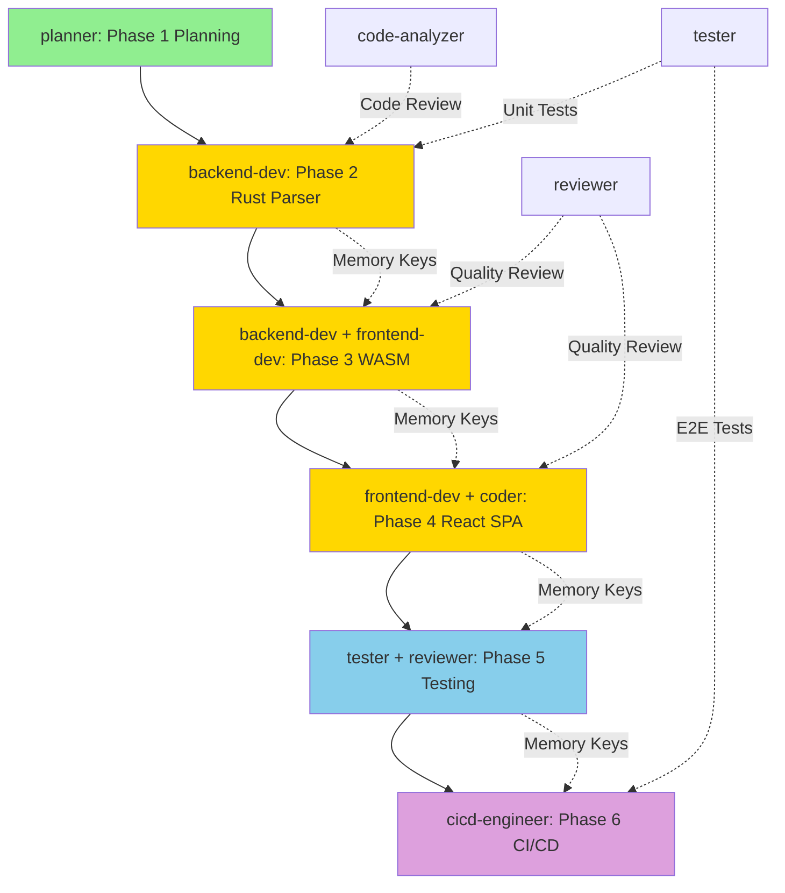

# Agent Coordination Matrix - Unified Knowledge Graph Publishing System

**Project:** Unified Knowledge Graph Publishing System
**Last Updated:** 2025-11-12
**Status:** Phase 1 (Planning)

---

## Agent Roster

| Agent ID | Agent Name | Specialization | Availability | Contact |
|----------|-----------|----------------|--------------|---------|
| **PLN-001** | planner | Project planning, task breakdown, risk management | Full-time (W1) | @planner |
| **RES-001** | researcher | Technology research, benchmarking, documentation | Part-time (W1) | @researcher |
| **ARC-001** | architect | System architecture, design validation | Part-time (W1) | @architect |
| **BKD-001** | backend-dev | Rust development, WASM, CLI, napi-rs | Full-time (W2-6) | @backend-dev |
| **COD-001** | code-analyzer | Code review, parser integration, refactoring | Part-time (W2-4) | @code-analyzer |
| **FED-001** | frontend-dev | React, TypeScript, Three.js, UI/UX | Full-time (W6-9) | @frontend-dev |
| **COD-002** | coder | Markdown rendering, API services, utilities | Part-time (W7-9) | @coder |
| **TST-001** | tester | Unit tests, integration tests, E2E, benchmarks | Full-time (W10-11) | Part-time (W2-9) | @tester |
| **REV-001** | reviewer | Code review, quality assurance, documentation | Part-time (all phases) | @reviewer |
| **CIC-001** | cicd-engineer | GitHub Actions, CI/CD, deployment, monitoring | Full-time (W12-13) | @cicd-engineer |

**Total Agents:** 10 (some part-time)

---

## Agent Coordination Matrix

### Role by Phase

| Agent | Phase 1 | Phase 2 | Phase 3 | Phase 4 | Phase 5 | Phase 6 |
|-------|---------|---------|---------|---------|---------|---------|
| **planner** | 🟢 **Lead** | - | - | - | - | - |
| **researcher** | 🟡 Support | - | - | - | - | - |
| **architect** | 🟡 Support | - | - | - | - | - |
| **backend-dev** | - | 🟢 **Lead** | 🟢 **Co-Lead** | - | 🟡 Support | - |
| **code-analyzer** | - | 🟡 Support | - | - | - | - |
| **frontend-dev** | - | - | 🟢 **Co-Lead** | 🟢 **Lead** | 🟡 Support | - |
| **coder** | - | - | - | 🟡 Support | - | - |
| **tester** | - | 🟡 Support | - | - | 🟢 **Lead** | 🟡 Support |
| **reviewer** | - | - | 🟡 Support | 🟡 Support | 🟢 **Co-Lead** | 🟡 Support |
| **cicd-engineer** | - | 🟡 Support | - | - | - | 🟢 **Lead** |

**Legend:**
- 🟢 **Lead:** Primary responsible agent (owns deliverables)
- 🟡 **Support:** Assists lead, provides reviews/testing
- **-:** Not involved in this phase

---

## Communication Protocols

### Daily Stand-Up (Async)

**Frequency:** Every morning (9 AM UTC)
**Duration:** 15 minutes (async, written updates)
**Participants:** Current phase lead + active agents

**Format (posted in GitHub Discussion):**
```markdown
## Daily Stand-Up - [Date]

**Agent:** [Agent Name]
**Phase:** [Phase Number]

### Yesterday:
- [Task 1 completed]
- [Task 2 in progress]

### Today:
- [Task 3 planned]
- [Task 4 planned]

### Blockers:
- [None / Describe blocker]

### Memory Keys Written:
- swarm/[agent]/[key]
```

**Tool:** GitHub Discussions (pinned thread per week)

---

### Weekly Sync (Synchronous)

**Frequency:** Every Monday at 10 AM UTC
**Duration:** 30 minutes
**Participants:** Planner + current phase lead + next phase lead

**Agenda:**
1. **Progress Review** (10 min)
   - Review metrics (green/yellow/red)
   - Milestones achieved vs planned

2. **Risk Review** (10 min)
   - Update risk matrix
   - Escalate new critical risks

3. **Next Week Planning** (10 min)
   - Task allocation
   - Resource conflicts
   - Handoff preparations

**Tool:** Video call (Google Meet, Zoom, etc.)

**Output:** Meeting notes committed to `docs/meetings/YYYY-MM-DD-weekly-sync.md`

---

### Phase Handoff Meeting

**Frequency:** End of each phase (before next phase starts)
**Duration:** 1 hour
**Participants:** Previous phase lead + next phase lead + planner

**Agenda:**
1. **Phase Completion Review** (15 min)
   - Deliverables checklist
   - Metrics achieved
   - Known issues

2. **Knowledge Transfer** (30 min)
   - Code walkthrough
   - Architecture decisions
   - Memory keys to read

3. **Next Phase Kickoff** (15 min)
   - Task breakdown review
   - Dependencies clarified
   - Questions answered

**Tool:** Video call + screen sharing

**Output:**
- Handoff document committed to `docs/handoffs/PHASE-[N]-HANDOFF.md`
- Memory keys documented
- Action items for next phase

---

### Hooks-Based Notifications

**Tool:** `npx claude-flow@alpha hooks notify`

**Event Types:**
1. **Task Start:**
   ```bash
   npx claude-flow@alpha hooks pre-task --description "[Task name]" --agent-id "[agent]"
   ```

2. **Task Complete:**
   ```bash
   npx claude-flow@alpha hooks post-task --task-id "[task]"
   npx claude-flow@alpha hooks notify --message "Task [name] complete" --to "[agents]"
   ```

3. **Blocker:**
   ```bash
   npx claude-flow@alpha hooks notify --message "BLOCKER: [description]" --to "planner,all" --priority "high"
   ```

4. **Critical Issue:**
   ```bash
   npx claude-flow@alpha hooks notify --message "CRITICAL: [description]" --to "all" --priority "urgent"
   ```

**Notification Targets:**
- `planner` - Project manager
- `all` - Broadcast to all agents
- `[agent-name]` - Specific agent
- `[agent1,agent2,...]` - Multiple agents (comma-separated)

---

## Memory Management

### Memory Key Naming Convention

**Format:** `swarm/[agent]/[phase]/[key-name]`

**Examples:**
- `swarm/backend-dev/phase2/owl-extractor-api` - OWL extractor public API documentation
- `swarm/frontend-dev/phase3/wasm-api-changes` - WASM API changes in Phase 3
- `swarm/planner/phase1/risk-matrix` - Risk matrix from Phase 1
- `swarm/tester/phase5/test-coverage-report` - Test coverage report

### Memory Operations

**Store Memory:**
```bash
npx claude-flow@alpha hooks memory-store \
  --key "swarm/[agent]/[key]" \
  --value "$(cat file.json | jq -Rs .)"
```

**Retrieve Memory:**
```bash
npx claude-flow@alpha hooks memory-retrieve \
  --key "swarm/[agent]/[key]"
```

**List Memories:**
```bash
npx claude-flow@alpha hooks memory-list \
  --prefix "swarm/[agent]/"
```

### Required Memory Keys by Phase

#### Phase 1 → Phase 2
**Read by backend-dev:**
- `swarm/planner/phase1/architecture-decisions` - System architecture overview
- `swarm/planner/phase1/rust-libraries` - Selected Rust libraries (sophia, etc.)

**Write by planner:**
- `swarm/planner/phase1/phase2-tasks` - Detailed Phase 2 task list
- `swarm/planner/phase1/risk-matrix` - Risk mitigation strategies

---

#### Phase 2 → Phase 3
**Read by frontend-dev:**
- `swarm/backend-dev/phase2/owl-extractor-api` - OWL extractor Rust API documentation
- `swarm/backend-dev/phase2/napi-package-name` - npm package name and version
- `swarm/backend-dev/phase2/performance-metrics` - Benchmark results (Rust vs Python)

**Write by backend-dev:**
- `swarm/backend-dev/phase2/ontology-data-structure` - OntologyBlock struct definition
- `swarm/backend-dev/phase2/ttl-output-format` - Turtle/OWL output format spec

---

#### Phase 3 → Phase 4
**Read by frontend-dev:**
- `swarm/backend-dev/phase3/wasm-api-changes` - New WASM API functions (checkNodeClick, etc.)
- `swarm/frontend-dev/phase3/click-event-format` - Click event data structure
- `swarm/frontend-dev/phase3/performance-benchmarks` - WASM performance benchmarks

**Write by frontend-dev:**
- `swarm/frontend-dev/phase3/ontology-metadata-access` - How to access ontology metadata in React
- `swarm/frontend-dev/phase3/npm-package-version` - narrativegoldmine-webvowl-wasm version

---

#### Phase 4 → Phase 5
**Read by tester:**
- `swarm/frontend-dev/phase4/routing-structure` - Router configuration and routes
- `swarm/coder/phase4/api-contracts` - API service interfaces
- `swarm/frontend-dev/phase4/search-api` - Search service API documentation
- `swarm/frontend-dev/phase4/mobile-breakpoints` - Responsive design breakpoints

**Write by frontend-dev:**
- `swarm/frontend-dev/phase4/component-list` - List of all React components to test
- `swarm/frontend-dev/phase4/test-data-fixtures` - Sample data for testing

---

#### Phase 5 → Phase 6
**Read by cicd-engineer:**
- `swarm/tester/phase5/test-coverage-report` - Coverage percentages by module
- `swarm/tester/phase5/performance-benchmarks` - Performance benchmark results
- `swarm/tester/phase5/known-issues` - List of known bugs (P2 severity or lower)

**Write by tester:**
- `swarm/tester/phase5/test-suite-structure` - Where tests are located
- `swarm/tester/phase5/e2e-scenarios` - E2E test scenarios for staging validation

---

## Conflict Resolution

### Scenario 1: Agent Overload
**Trigger:** Agent has >40h work in a single week

**Process:**
1. **Agent reports overload:**
   ```bash
   npx claude-flow@alpha hooks notify --message "OVERLOAD: [agent] has 45h work this week" --to "planner" --priority "high"
   ```
2. **Planner evaluates:**
   - Can tasks be parallelized with another agent?
   - Can non-critical tasks be deferred?
   - Should timeline be extended?

3. **Resolution options:**
   - **Option A:** Assign low-priority tasks to support agent
   - **Option B:** Extend phase by 3-5 days
   - **Option C:** Hire contractor for short-term help

4. **Decision documented:**
   - Update `docs/planning/RESOURCE-ALLOCATION.md`
   - Notify affected agents

---

### Scenario 2: Dependency Blocker
**Trigger:** Agent A waiting for Agent B's deliverable

**Process:**
1. **Agent A reports blocker:**
   ```bash
   npx claude-flow@alpha hooks notify --message "BLOCKER: Waiting for [Agent B] to complete [task]" --to "planner,[Agent B]" --priority "high"
   ```

2. **Planner investigates:**
   - Why is Agent B delayed? (underestimated, blocked, resource conflict)
   - Can Agent A work on parallel tasks?

3. **Resolution options:**
   - **Option A:** Agent B prioritizes blocker (drop other tasks)
   - **Option B:** Agent A pivots to parallel work
   - **Option C:** Escalate to daily check-in

4. **Follow-up:**
   - Daily updates until blocker resolved
   - Post-mortem to prevent recurrence

---

### Scenario 3: Merge Conflict (Code)
**Trigger:** Two agents edit same file concurrently

**Process:**
1. **Git detects conflict:**
   - Agent A opens PR, CI fails with merge conflict

2. **Agents coordinate:**
   ```bash
   npx claude-flow@alpha hooks notify --message "Merge conflict in [file]: [Agent A] + [Agent B]" --to "[Agent A],[Agent B],reviewer"
   ```

3. **Resolution:**
   - Agents review each other's changes
   - Agree on merged version
   - One agent resolves conflict, other reviews

4. **Prevention:**
   - Communicate file edits in daily stand-up
   - Use feature branches, merge frequently
   - Code review before merge

---

## Agent Handoff Procedures

### Handoff Checklist Template

**From Agent:** [Agent Name]
**To Agent:** [Agent Name]
**Phase:** [Phase Number → Phase Number]
**Date:** [YYYY-MM-DD]

#### Deliverables Checklist
- [ ] All tasks in `PHASE-[N]-TASKS.md` completed
- [ ] Code merged to main branch
- [ ] Tests passing (100% of relevant tests)
- [ ] Documentation updated (README, ARCHITECTURE.md)
- [ ] Memory keys written (see below)

#### Memory Keys Written
- [ ] `swarm/[agent]/phase[N]/[key-1]` - [Description]
- [ ] `swarm/[agent]/phase[N]/[key-2]` - [Description]
- [ ] `swarm/[agent]/phase[N]/[key-3]` - [Description]

#### Known Issues
- **Issue 1:** [Description] - [Workaround / Status]
- **Issue 2:** [Description] - [Workaround / Status]

#### Next Agent Action Items
- [ ] Read memory key `swarm/[prev-agent]/[key]`
- [ ] Review handoff document
- [ ] Attend handoff meeting (scheduled: [date/time])
- [ ] Complete Phase [N+1] setup tasks

#### Questions for Handoff Meeting
1. [Question 1]
2. [Question 2]
3. [Question 3]

**Signed:**
- **From Agent:** [Agent Name] - [Date]
- **To Agent:** [Agent Name] - [Date]
- **Planner:** [Agent Name] - [Date]

---

## Agent Collaboration Patterns

### Pattern 1: Lead + Support
**Phases:** 2, 3, 4, 5, 6

**Roles:**
- **Lead:** Owns deliverables, makes final decisions, primary coding/development
- **Support:** Reviews, tests, assists with specific tasks

**Communication:**
- Lead posts daily updates
- Support reviews PRs within 24 hours
- Lead escalates blockers to support immediately

**Example:** Phase 2 - backend-dev (Lead) + code-analyzer (Support)

---

### Pattern 2: Co-Leads
**Phases:** 3 (backend-dev + frontend-dev)

**Roles:**
- **Co-Lead A:** Responsible for Rust/WASM side
- **Co-Lead B:** Responsible for React side
- Both coordinate on API boundaries

**Communication:**
- Daily sync (15 min) to align on API changes
- Shared document for API contracts
- Both review each other's PRs

**Example:** Phase 3 - backend-dev (WASM) + frontend-dev (React Three Fiber)

---

### Pattern 3: Sequential Handoff
**Phases:** All phase transitions

**Roles:**
- **Previous Agent:** Completes phase, documents decisions
- **Next Agent:** Receives handoff, reads memory keys, asks questions

**Communication:**
- Handoff meeting (1 hour)
- Handoff document (template above)
- Slack/GitHub available for follow-up questions

**Example:** Phase 2 → Phase 3 - backend-dev hands off to frontend-dev

---

## Coordination Flow Diagram



**Legend:**
- Solid arrows: Primary responsibility handoff
- Dashed arrows: Support/review relationship
- Colors: Agent categories (planning, dev, testing, deployment)

---

## Escalation Matrix

### Issue Severity Levels

| Severity | Definition | Response Time | Escalation Path |
|----------|-----------|---------------|----------------|
| **P0 (Critical)** | Project-blocking, production down | <2 hours | Lead Agent → Planner → All Agents |
| **P1 (High)** | Phase-blocking, major feature broken | <1 day | Lead Agent → Planner |
| **P2 (Medium)** | Non-blocking, workaround available | <3 days | Lead Agent (no escalation) |
| **P3 (Low)** | Nice-to-have, cosmetic | <1 week | Lead Agent (backlog) |

### Escalation Process

**P0 Critical Issue:**
1. Agent discovers issue
2. Immediate notification:
   ```bash
   npx claude-flow@alpha hooks notify --message "P0 CRITICAL: [description]" --to "all" --priority "urgent"
   ```
3. Planner convenes emergency meeting (within 2 hours)
4. All hands on deck until resolved
5. Post-mortem after resolution

**P1 High Priority Issue:**
1. Agent discovers issue
2. Notification to planner + affected agents:
   ```bash
   npx claude-flow@alpha hooks notify --message "P1 HIGH: [description]" --to "planner,[affected-agents]" --priority "high"
   ```
3. Planner triages (within 4 hours)
4. Assigned to agent with ETA
5. Daily updates until resolved

---

## Retrospective Process

### Phase Retrospective

**Frequency:** End of each phase (before handoff)
**Duration:** 30 minutes
**Participants:** All agents involved in phase

**Agenda:**
1. **What went well?** (10 min)
   - Celebrate successes
   - Identify best practices

2. **What could be improved?** (10 min)
   - Identify pain points
   - Brainstorm solutions

3. **Action items for next phase** (10 min)
   - Concrete improvements to implement
   - Assign owners

**Output:** Retrospective notes committed to `docs/retrospectives/PHASE-[N]-RETRO.md`

---

### End-of-Project Retrospective

**Frequency:** After Phase 6 completion
**Duration:** 1 hour
**Participants:** All agents (optional attendance)

**Agenda:**
1. **Project highlights** (15 min)
2. **Challenges overcome** (15 min)
3. **Lessons learned** (20 min)
4. **Future improvements** (10 min)

**Output:** Final retrospective document with recommendations for future projects

---

## Document Metadata

**Version:** 1.0
**Last Updated:** 2025-11-12 (Phase 1)
**Owner:** Planner agent
**Next Review:** 2025-11-18 (End of Phase 1)
**Status:** Approved

---

## Quick Reference

### Frequently Used Commands

**Check agent availability:**
```bash
gh api repos/jjohare/logseq/collaborators
```

**View memory keys:**
```bash
npx claude-flow@alpha hooks memory-list --prefix "swarm/"
```

**Notify all agents:**
```bash
npx claude-flow@alpha hooks notify --message "[message]" --to "all"
```

**Create handoff document:**
```bash
cp docs/planning/handoff-template.md docs/handoffs/PHASE-[N]-HANDOFF.md
```

### Contact Information

**Primary Communication Channel:** GitHub Discussions
**Emergency Contact:** Slack #unified-kg-project channel
**Video Calls:** Google Meet (link in calendar invite)
**Code Repository:** https://github.com/jjohare/logseq

---

**End of Agent Coordination Matrix**
