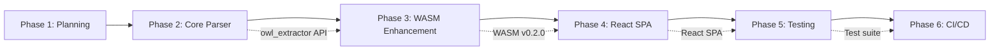

# Detailed Project Timeline - Unified Knowledge Graph Publishing System

**Project:** Unified Knowledge Graph Publishing System
**Duration:** 13 weeks (91 days)
**Start Date:** 2025-11-12 (Week 1, Day 1)
**Target Completion:** 2026-02-11 (Week 13, Day 91)
**Last Updated:** 2025-11-12

---

## Executive Summary

**Timeline Overview:**
- **Phase 1 (Planning)**: 1 week - Foundation
- **Phase 2 (Core Parser)**: 2-3 weeks - Critical path
- **Phase 3 (WASM Enhancement)**: 1-2 weeks - Performance focus
- **Phase 4 (React SPA)**: 2-3 weeks - User experience
- **Phase 5 (Testing)**: 2 weeks - Quality assurance
- **Phase 6 (CI/CD)**: 1-2 weeks - Deployment

**Buffer Time:** 2 weeks (15% of 13 weeks)
**Critical Path:** Phase 2 → Phase 3 → Phase 4 (Rust parser feeds WASM, WASM feeds React)

---

## Gantt Chart (Mermaid)

```mermaid
gantt
    title Unified Knowledge Graph Publishing System Timeline
    dateFormat YYYY-MM-DD
    axisFormat %b %d
    section Phase 1
    Planning & Architecture           :done, p1, 2025-11-12, 7d
    Task Breakdown                    :done, p1a, 2025-11-12, 3d
    Risk Analysis                     :done, p1b, 2025-11-13, 3d
    Resource Allocation               :done, p1c, 2025-11-14, 2d
    section Phase 2
    OWL Extractor Module              :active, p2a, 2025-11-19, 10d
    Parser Integration                :p2b, 2025-11-26, 7d
    CLI Binary                        :p2c, 2025-12-01, 5d
    napi-rs Bindings                  :p2d, 2025-12-04, 7d
    section Phase 3
    WASM Ontology Metadata            :p3a, 2025-12-11, 7d
    Click Event Emission              :p3b, 2025-12-15, 5d
    npm Package Update                :p3c, 2025-12-18, 5d
    section Phase 4
    Routing Architecture              :p4a, 2025-12-23, 7d
    PageRenderer Component            :p4b, 2025-12-28, 10d
    Graph Click Navigation            :p4c, 2026-01-03, 7d
    Unified Search                    :p4d, 2026-01-08, 7d
    Mobile Responsiveness             :p4e, 2026-01-13, 5d
    section Phase 5
    Rust Unit Tests                   :p5a, 2026-01-20, 7d
    TypeScript Unit Tests             :p5b, 2026-01-20, 7d
    Integration Tests                 :p5c, 2026-01-25, 5d
    E2E Tests (Cypress)               :p5d, 2026-01-28, 5d
    Performance Benchmarks            :p5e, 2026-01-30, 3d
    section Phase 6
    GitHub Actions Enhancement        :p6a, 2026-02-03, 7d
    Staging Environment               :p6b, 2026-02-06, 5d
    Production Deployment             :p6c, 2026-02-09, 3d
    Monitoring Setup                  :p6d, 2026-02-10, 2d
```

---

## Phase-by-Phase Timeline

### Phase 1: Planning & Architecture (Week 1)

**Duration:** 7 days (Nov 12-18, 2025)
**Status:** ✅ In Progress (Current Phase)

| Day | Tasks | Owner | Hours | Deliverables |
|-----|-------|-------|-------|-------------|
| **Day 1-2** | Task breakdowns for Phases 2-6 | planner | 10h | PHASE-{2,3,4,5,6}-TASKS.md |
| **Day 2-3** | Risk matrix development | planner | 8h | RISK-MATRIX.md |
| **Day 3-4** | Resource allocation planning | planner | 7h | RESOURCE-ALLOCATION.md |
| **Day 4-5** | Detailed timeline with Gantt | planner | 5h | TIMELINE-DETAILED.md |
| **Day 5-6** | Metrics tracking plan | researcher | 4h | METRICS-TRACKING.md |
| **Day 6-7** | Agent coordination matrix | researcher | 4h | AGENT-COORDINATION.md |
| **Day 7** | Phase 1 review & handoff | planner | 2h | Phase 1 report |

**Milestones:**
- ✅ M1.1: Planning documents complete (Day 7)
- ✅ M1.2: Phase 2 kickoff prepared (Day 7)

**Critical Path:** None (project kickoff)

---

### Phase 2: Core Parser Migration (Weeks 2-4)

**Duration:** 21 days (Nov 19 - Dec 9, 2025)
**Status:** ⏳ Pending

#### Week 2 (Nov 19-25): OWL Extractor Module

| Day | Tasks | Owner | Hours | Deliverables |
|-----|-------|-------|-------|-------------|
| **Day 8-9** | Create `owl_extractor.rs` module | backend-dev | 8h | owl_extractor.rs (skeleton) |
| **Day 9-11** | Implement OntologyBlock parsing | backend-dev | 12h | extract_ontology_block() |
| **Day 11-12** | Namespace management | backend-dev | 6h | Namespace enum, IRI generation |
| **Day 12-14** | RDF triple generation | backend-dev | 10h | to_rdf_triples() |

**Milestone:** ✅ M2.1: OWL Extractor module complete (Day 14)

#### Week 3 (Nov 26 - Dec 2): Parser Integration + CLI

| Day | Tasks | Owner | Hours | Deliverables |
|-----|-------|-------|-------|-------------|
| **Day 15-17** | Integrate OWL extractor with parser.rs | code-analyzer | 10h | parser.rs updated |
| **Day 17-18** | Graph database ontology index | backend-dev | 8h | graph.rs ontology_index |
| **Day 18-20** | CLI binary with `ontology` subcommand | backend-dev | 10h | main.rs (CLI) |
| **Day 20-21** | Output format options (TTL/JSON/CSV) | backend-dev | 6h | Format serializers |

**Milestone:** ✅ M2.2: CLI binary complete (Day 21)

#### Week 4 (Dec 3-9): napi-rs Bindings

| Day | Tasks | Owner | Hours | Deliverables |
|-----|-------|-------|-------|-------------|
| **Day 22-23** | Setup napi-rs project | backend-dev | 6h | logseq-publisher-napi/ |
| **Day 23-25** | Expose Rust functions to Node.js | backend-dev | 10h | napi bindings (lib.rs) |
| **Day 25-26** | npm package publishing | backend-dev | 5h | Published to npm |
| **Day 26-28** | Integration with GitHub Actions | cicd-engineer | 6h | .github/workflows updated |

**Milestone:** ✅ M2.3: napi-rs package published (Day 28)

**Phase 2 Critical Path:**
- OWL Extractor → Parser Integration → CLI → napi-rs (all sequential)
- **Total Duration:** 21 days (3 weeks)

---

### Phase 3: WASM Enhancement (Weeks 5-6)

**Duration:** 14 days (Dec 10-23, 2025)
**Status:** ⏳ Pending
**Dependencies:** Phase 2 complete (napi-rs published)

#### Week 5 (Dec 10-16): WASM Data Model Extension

| Day | Tasks | Owner | Hours | Deliverables |
|-----|-------|-------|-------|-------------|
| **Day 29-31** | Add OntologyMetadata to WASM | backend-dev | 10h | ontology/mod.rs updated |
| **Day 31-32** | Semantic relationship types | backend-dev | 6h | EdgeType enum |
| **Day 32-34** | Node metadata export to JS | backend-dev | 8h | getGraphData() updated |

**Milestone:** ✅ M3.1: WASM data model extended (Day 34)

#### Week 6 (Dec 17-23): Click Events & npm Package

| Day | Tasks | Owner | Hours | Deliverables |
|-----|-------|-------|-------|-------------|
| **Day 35-37** | Ray-sphere intersection in WASM | backend-dev | 10h | interaction/mod.rs |
| **Day 37-39** | React Three Fiber click handler | frontend-dev | 10h | GraphScene.tsx updated |
| **Day 39-40** | Node selection panel | frontend-dev | 8h | NodeDetailsPanel.tsx |
| **Day 40-42** | npm package update (v0.2.0) | backend-dev | 8h | Published to npm |

**Milestone:** ✅ M3.2: Click events working (Day 42)

**Phase 3 Critical Path:**
- WASM Metadata → Click Detection → React Integration (sequential)
- **Total Duration:** 14 days (2 weeks)

---

### Phase 4: React SPA Integration (Weeks 7-9)

**Duration:** 21 days (Dec 24, 2025 - Jan 13, 2026)
**Status:** ⏳ Pending
**Dependencies:** Phase 3 complete (WASM v0.2.0 published)

#### Week 7 (Dec 24-30): Routing + Markdown Rendering

| Day | Tasks | Owner | Hours | Deliverables |
|-----|-------|-------|-------|-------------|
| **Day 43-44** | Setup React Router v6 | frontend-dev | 6h | router.tsx |
| **Day 44-46** | Layout component with navigation | frontend-dev | 10h | AppLayout.tsx, Navbar.tsx |
| **Day 46-48** | Logseq markdown parser (React) | coder | 10h | MarkdownRenderer.tsx |
| **Day 48-49** | Page data fetching | coder | 8h | pageService.ts |

**Milestone:** ✅ M4.1: Routing + PageRenderer complete (Day 49)

#### Week 8 (Dec 31, 2025 - Jan 6, 2026): Graph Navigation

| Day | Tasks | Owner | Hours | Deliverables |
|-----|-------|-------|-------|-------------|
| **Day 50-51** | Graph-to-page navigation handler | frontend-dev | 8h | GraphScene.tsx updated |
| **Day 51-53** | Context menu for graph nodes | frontend-dev | 10h | NodeContextMenu.tsx |
| **Day 53-54** | PageView component integration | frontend-dev | 8h | PageView.tsx |
| **Day 54-56** | Mini-graph component | frontend-dev | 10h | MiniGraph.tsx |

**Milestone:** ✅ M4.2: Graph navigation complete (Day 56)

#### Week 9 (Jan 7-13, 2026): Search + Mobile

| Day | Tasks | Owner | Hours | Deliverables |
|-----|-------|-------|-------|-------------|
| **Day 57-59** | Search index generation (Rust) | backend-dev | 10h | exporter.rs (search index) |
| **Day 59-61** | Client-side search (Fuse.js) | frontend-dev | 10h | searchService.ts |
| **Day 61-62** | Search UI component | frontend-dev | 8h | SearchBar.tsx |
| **Day 62-64** | Mobile responsiveness | frontend-dev | 10h | Responsive CSS, touch gestures |

**Milestone:** ✅ M4.3: Search + mobile complete (Day 64)

**Phase 4 Critical Path:**
- Routing → PageRenderer → Graph Navigation → Search (sequential)
- **Total Duration:** 21 days (3 weeks)

---

### Phase 5: Testing & QA (Weeks 10-11)

**Duration:** 14 days (Jan 14-27, 2026)
**Status:** ⏳ Pending
**Dependencies:** Phase 4 complete (React SPA functional)

#### Week 10 (Jan 14-20): Unit + Integration Tests

| Day | Tasks | Owner | Hours | Deliverables |
|-----|-------|-------|-------|-------------|
| **Day 65-67** | Rust unit tests (owl_extractor, parser) | tester | 12h | 50+ unit tests |
| **Day 65-67** | TypeScript unit tests (components, hooks) | tester | 12h | 50+ component tests |
| **Day 67-69** | Integration tests (user flows) | tester | 10h | 20+ integration tests |

**Milestone:** ✅ M5.1: Unit + integration tests complete (Day 69)

#### Week 11 (Jan 21-27): E2E + Performance

| Day | Tasks | Owner | Hours | Deliverables |
|-----|-------|-------|-------|-------------|
| **Day 70-72** | Setup Cypress + E2E tests | tester | 10h | 10+ E2E tests |
| **Day 72-74** | Performance benchmarks (Rust + frontend) | tester | 10h | Benchmark suite |
| **Day 74-75** | Bug fixes + quality gates | all agents | 10h | All tests passing |
| **Day 75-76** | Test coverage validation (≥85%) | reviewer | 6h | Coverage report |

**Milestone:** ✅ M5.2: All tests passing (Day 76)

**Phase 5 Critical Path:**
- Unit Tests → Integration Tests → E2E Tests → Benchmarks (sequential)
- **Total Duration:** 14 days (2 weeks)

---

### Phase 6: CI/CD & Deployment (Weeks 12-13)

**Duration:** 14 days (Jan 28 - Feb 10, 2026)
**Status:** ⏳ Pending
**Dependencies:** Phase 5 complete (all tests passing)

#### Week 12 (Jan 28 - Feb 3): CI/CD Infrastructure

| Day | Tasks | Owner | Hours | Deliverables |
|-----|-------|-------|-------|-------------|
| **Day 77-79** | Multi-stage build pipeline | cicd-engineer | 12h | publish.yml updated |
| **Day 79-80** | Quality gates + security scanning | cicd-engineer | 8h | Quality checks in CI |
| **Day 80-82** | Staging deployment workflow | cicd-engineer | 10h | deploy-staging.yml |
| **Day 82-83** | E2E tests on staging | tester | 8h | Staging validated |

**Milestone:** ✅ M6.1: Staging environment live (Day 83)

#### Week 13 (Feb 4-10, 2026): Production Deployment

| Day | Tasks | Owner | Hours | Deliverables |
|-----|-------|-------|-------|-------------|
| **Day 84-85** | Production deployment workflow | cicd-engineer | 8h | deploy-production.yml |
| **Day 85-86** | Rollback mechanism | cicd-engineer | 6h | rollback-production.yml |
| **Day 86-88** | Monitoring setup (Sentry, GA, Lighthouse) | cicd-engineer | 10h | Monitoring configured |
| **Day 88-89** | Final production deployment | cicd-engineer | 6h | Production live ✅ |
| **Day 89-91** | Post-launch monitoring + handoff | reviewer | 6h | Documentation complete |

**Milestone:** ✅ M6.2: Production deployment complete (Day 91)

**Phase 6 Critical Path:**
- CI/CD Setup → Staging → Production (sequential)
- **Total Duration:** 14 days (2 weeks)

---

## Critical Path Analysis

**Critical Path:** Phase 2 → Phase 3 → Phase 4 → Phase 5 → Phase 6

### Critical Path Tasks (Sequential Dependencies):
1. **Phase 2:** OWL Extractor → Parser Integration → CLI → napi-rs (21 days)
2. **Phase 3:** WASM Metadata → Click Events → npm Package (14 days)
3. **Phase 4:** Routing → PageRenderer → Graph Nav → Search (21 days)
4. **Phase 5:** Unit → Integration → E2E → Benchmarks (14 days)
5. **Phase 6:** CI/CD → Staging → Production (14 days)

**Total Critical Path Duration:** 84 days (12 weeks)

**Buffer Time Available:** 7 days (1 week) - 15% buffer

### Tasks NOT on Critical Path (Can be parallelized):
- **Phase 1:** Planning (parallel with other prep work)
- **Phase 2:** Unit tests (parallel with development)
- **Phase 4:** Mobile responsiveness (can be done post-launch if needed)
- **Phase 6:** Monitoring setup (can be done post-launch)

---

## Milestone Schedule

| Milestone | Date | Phase | Description | Status |
|-----------|------|-------|-------------|--------|
| **M1.1** | Nov 18, 2025 | P1 | Planning documents complete | ✅ In Progress |
| **M2.1** | Nov 25, 2025 | P2 | OWL Extractor module complete | ⏳ Pending |
| **M2.2** | Dec 2, 2025 | P2 | CLI binary complete | ⏳ Pending |
| **M2.3** | Dec 9, 2025 | P2 | napi-rs published to npm | ⏳ Pending |
| **M3.1** | Dec 16, 2025 | P3 | WASM data model extended | ⏳ Pending |
| **M3.2** | Dec 23, 2025 | P3 | Click events working | ⏳ Pending |
| **M4.1** | Dec 30, 2025 | P4 | Routing + PageRenderer | ⏳ Pending |
| **M4.2** | Jan 6, 2026 | P4 | Graph navigation complete | ⏳ Pending |
| **M4.3** | Jan 13, 2026 | P4 | Search + mobile complete | ⏳ Pending |
| **M5.1** | Jan 20, 2026 | P5 | Unit + integration tests | ⏳ Pending |
| **M5.2** | Jan 27, 2026 | P5 | All tests passing | ⏳ Pending |
| **M6.1** | Feb 3, 2026 | P6 | Staging environment live | ⏳ Pending |
| **M6.2** | Feb 10, 2026 | P6 | Production deployment ✅ | ⏳ Pending |

**Total Milestones:** 13

---

## Buffer Time Allocation

**Total Project Duration:** 91 days (13 weeks)
**Critical Path Duration:** 84 days (12 weeks)
**Buffer Time:** 7 days (1 week = 15% buffer)

### Buffer Allocation Strategy:

| Phase | Buffer Days | Trigger Condition | Usage |
|-------|-------------|------------------|--------|
| **Phase 2** | 3 days | OWL extractor takes >10 days | Extend Week 2 by 3 days |
| **Phase 4** | 4 days | React SPA complexity higher | Extend Week 8 by 4 days |
| **Total** | **7 days** | - | - |

**Note:** Phases 3, 5, 6 have internal buffer (no explicit allocation)

---

## Dependencies Between Phases



**Legend:**
- Solid arrows: Phase dependencies (must complete before next starts)
- Dashed arrows: Artifact dependencies (deliverables passed between phases)

---

## Weekly Progress Tracking

### Week-by-Week Summary

| Week | Dates | Phase | Primary Focus | Key Deliverables | Status |
|------|-------|-------|---------------|-----------------|--------|
| **W1** | Nov 12-18 | P1 | Planning & architecture | 6 planning docs | ✅ Current |
| **W2** | Nov 19-25 | P2 | OWL extractor module | owl_extractor.rs | ⏳ Pending |
| **W3** | Nov 26-Dec 2 | P2 | Parser + CLI | CLI binary | ⏳ Pending |
| **W4** | Dec 3-9 | P2 | napi-rs bindings | npm package | ⏳ Pending |
| **W5** | Dec 10-16 | P3 | WASM data model | Ontology metadata | ⏳ Pending |
| **W6** | Dec 17-23 | P3 | Click events | React integration | ⏳ Pending |
| **W7** | Dec 24-30 | P4 | Routing + markdown | PageRenderer | ⏳ Pending |
| **W8** | Dec 31-Jan 6 | P4 | Graph navigation | Mini-graph | ⏳ Pending |
| **W9** | Jan 7-13 | P4 | Search + mobile | Responsive UI | ⏳ Pending |
| **W10** | Jan 14-20 | P5 | Unit + integration tests | Test suite | ⏳ Pending |
| **W11** | Jan 21-27 | P5 | E2E + performance | All tests passing | ⏳ Pending |
| **W12** | Jan 28-Feb 3 | P6 | CI/CD + staging | Staging live | ⏳ Pending |
| **W13** | Feb 4-10 | P6 | Production + monitoring | Production ✅ | ⏳ Pending |

---

## Risk-Adjusted Timeline

### Optimistic Scenario (All goes well)
**Duration:** 11 weeks (77 days)
- Phase 2: 2 weeks (instead of 3)
- Phase 3: 1 week (instead of 2)
- Phase 4: 2 weeks (instead of 3)
- Phase 5: 2 weeks (no change)
- Phase 6: 1 week (instead of 2)
- **Completion Date:** Jan 27, 2026 (2 weeks early)

### Baseline Scenario (Plan as stated)
**Duration:** 13 weeks (91 days)
- As detailed above
- **Completion Date:** Feb 10, 2026

### Pessimistic Scenario (Risks materialize)
**Duration:** 15 weeks (105 days)
- Phase 2: 4 weeks (Rust migration harder than expected)
- Phase 4: 4 weeks (React SPA complexity)
- Other phases: No change
- **Completion Date:** Feb 24, 2026 (2 weeks late)

**Risk Mitigation:** Monitor Phase 2 progress closely; if falling behind in Week 2, immediately:
1. Bring in backup Rust developer
2. Reduce Phase 2 scope (defer nice-to-have features)
3. Communicate revised timeline to stakeholders

---

## Post-Launch Timeline

### Maintenance Phase (Ongoing)

**Week 14+ (Feb 11, 2026 onwards):**
- Monitor production for issues
- Address bugs as they arise (P0 immediately, P1 within 1 week, P2 within 1 month)
- Plan future enhancements (v1.1, v1.2, etc.)
- Collect user feedback
- Optimize performance based on real usage

### Future Enhancement Roadmap

**Q1 2026 (Feb-Apr):**
- Incremental builds (only rebuild changed pages)
- Content filtering improvements
- Search indexing optimizations

**Q2 2026 (May-Jul):**
- Multi-format export (PDF, EPUB)
- Full-text search integration
- Analytics dashboard

**Q3 2026 (Aug-Oct):**
- GPU-accelerated graph layout
- Streaming rendering for large graphs
- Collaborative editing features

---

## Document Metadata

**Version:** 1.0
**Last Updated:** 2025-11-12 (Phase 1)
**Owner:** Planner agent
**Next Review:** 2025-11-18 (End of Phase 1)
**Status:** ✅ Phase 1 Complete, Ready for Phase 2

---

**Total Project Duration:** 13 weeks (91 days)
**Target Completion:** February 10, 2026
**Buffer Time:** 7 days (15%)
**Critical Path:** 84 days
