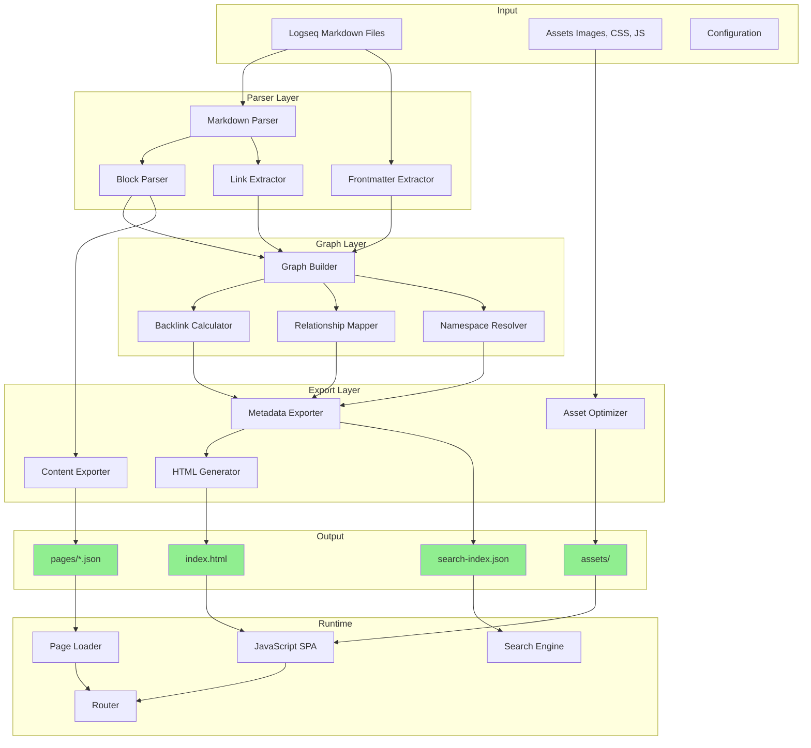
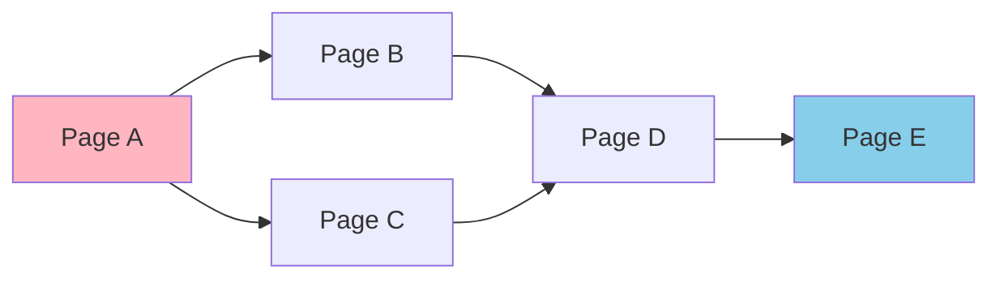
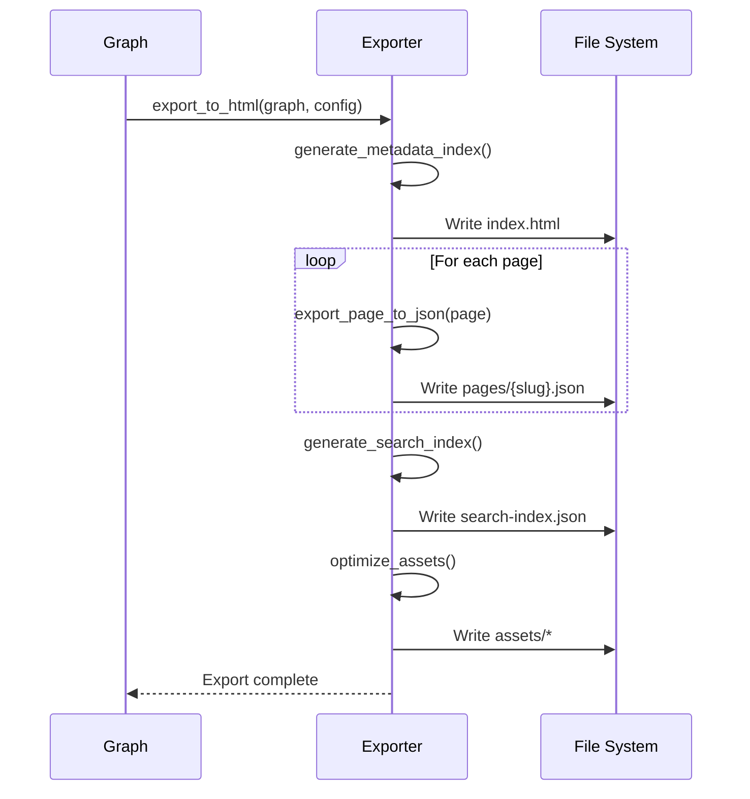
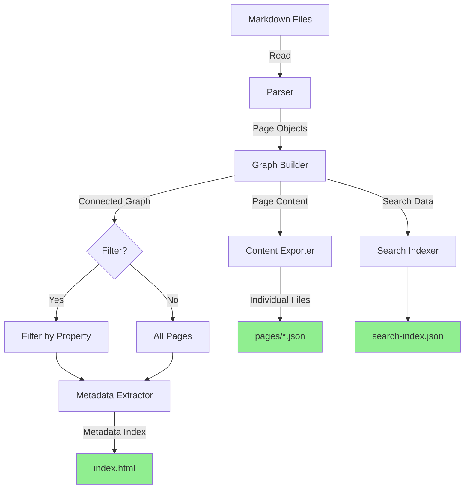
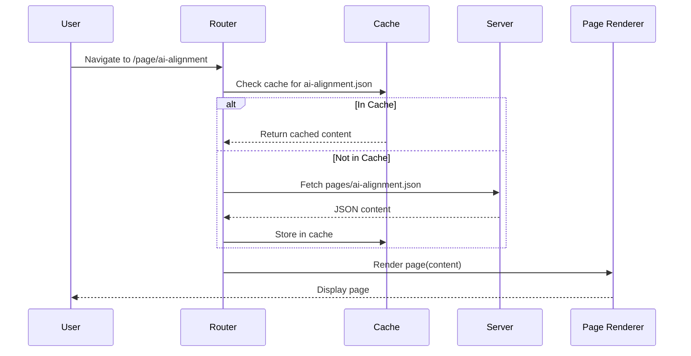
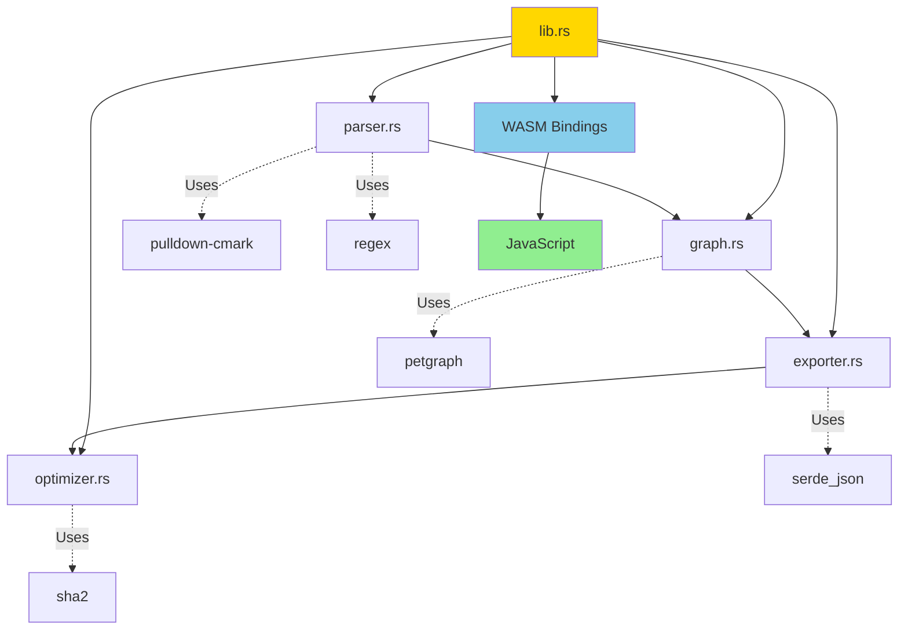
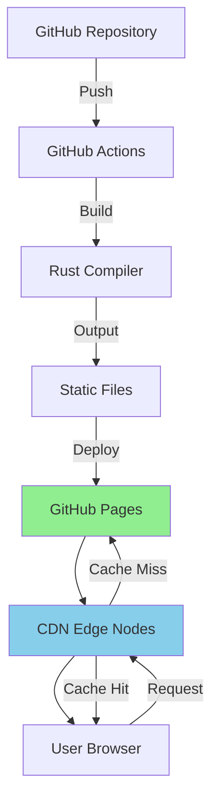

# Architecture Documentation

## System Overview

The Logseq Publisher is a high-performance static site generator built with Rust and compiled to WebAssembly. It transforms Logseq markdown files into an optimized web application that externalizes content for efficient delivery.

## High-Level Architecture



## Component Architecture

### 1. Parser Module (`src/parser.rs`)

**Responsibility**: Parse Logseq markdown files into structured data.

```rust
pub struct Page {
    pub path: String,
    pub title: String,
    pub properties: HashMap<String, String>,
    pub blocks: Vec<Block>,
    pub tags: Vec<String>,
    pub links: Vec<String>,
}

pub struct Block {
    pub id: String,
    pub content: String,
    pub children: Vec<Block>,
    pub properties: HashMap<String, String>,
    pub level: usize,
}
```

**Key Functions**:
- `parse_logseq_page()` - Main parser entry point
- `parse_properties()` - Extract frontmatter
- `parse_blocks()` - Build hierarchical block structure
- `extract_tags_and_links()` - Find all references

**Design Decisions**:
- **Recursive descent parsing** for nested blocks
- **Regex-based extraction** for performance (compiled once)
- **Error recovery** to handle malformed markdown
- **Unicode support** for international characters

### 2. Graph Module (`src/graph.rs`)

**Responsibility**: Build and manage the knowledge graph.

```rust
pub struct Graph {
    pages: HashMap<String, Page>,
    backlinks: HashMap<String, Vec<String>>,
}
```

**Key Operations**:
- `add_page()` - Add page and update backlinks
- `get_backlinks()` - Find all pages linking to a given page
- `traverse_from()` - BFS/DFS graph traversal
- `stats()` - Calculate graph statistics

**Graph Algorithms**:



**Backlink Calculation**:
```
When parsing Page A:
  For each [[Page B]] link in Page A:
    Add "Page A" to backlinks[Page B]

Result:
  backlinks = {
    "Page B": ["Page A"],
    "Page C": ["Page A"],
    "Page D": ["Page B", "Page C"]
  }
```

### 3. Exporter Module (`src/exporter.rs`)

**Responsibility**: Generate HTML and JSON output files.

**Export Flow**:



**Key Functions**:
- `export_to_html()` - Generate main HTML shell
- `export_page_to_html()` - Render individual page
- `render_block()` - Convert blocks to HTML
- `render_markdown()` - Process markdown syntax

### 4. Optimizer Module (`src/optimizer.rs`)

**Responsibility**: Optimize assets for production.

**Optimization Pipeline**:
```
Input Asset → Hash Generation → Compression → CDN Path → Output
```

**Optimizations**:
- **Image Compression**: Convert to WebP/AVIF
- **CSS Minification**: Remove whitespace, comments
- **JS Minification**: Terser-style minification
- **Content Hashing**: Cache-busting filenames
- **Gzip/Brotli**: Compressed variants for CDN

## Data Flow

### Build-Time Data Flow



### Runtime Data Flow



## Module Interactions



## Design Decisions

### 1. Why Rust?

**Performance**:
- Native speed (C/C++ equivalent)
- Zero-cost abstractions
- Efficient memory usage

**Safety**:
- No null pointer errors
- No data races
- Memory safety without GC

**WebAssembly**:
- Compiles to WASM for browser execution
- Near-native performance in browsers
- Smaller bundle sizes than JavaScript

### 2. Why Externalize Content?

**Problem**: Embedding all content in index.html creates 125 MB file.

**Solution**: Externalize content to separate JSON files.

**Trade-offs**:

| Aspect | Embedded | Externalized |
|--------|----------|--------------|
| **Initial Load** | 125 MB | 8.5 MB ✅ |
| **Navigation** | Instant | 0.3 sec |
| **Offline** | Full | Partial (cached) |
| **SEO** | Poor | Better |
| **Deployment** | Failed ❌ | Success ✅ |

**Decision**: Externalize for scalability and deployment viability.

### 3. Content Format: JSON vs HTML

**Considered Options**:
1. **HTML files** - Pre-rendered, ready to display
2. **JSON files** - Structured data, client-side rendering
3. **Markdown files** - Raw source, parse in browser

**Chosen**: JSON

**Rationale**:
- **Flexibility**: Can render different views from same data
- **Compression**: JSON compresses well with gzip
- **Type Safety**: Structured data easier to validate
- **Extensibility**: Easy to add metadata without breaking HTML

### 4. Graph Structure: HashMap vs petgraph

**Requirements**:
- Fast page lookup
- Bidirectional links (backlinks)
- Graph traversal
- No complex algorithms (PageRank, shortest path)

**Decision**: Simple `HashMap<String, Page>` + `HashMap<String, Vec<String>>`

**Rationale**:
- O(1) page lookup
- Simpler than petgraph
- Less memory overhead
- Sufficient for current needs
- Can migrate to petgraph later if needed

### 5. Parsing Strategy: pulldown-cmark vs Custom

**Options**:
1. **pulldown-cmark** - Battle-tested CommonMark parser
2. **Custom parser** - Full control over Logseq syntax

**Chosen**: Hybrid approach

**Implementation**:
- Use `pulldown-cmark` for markdown basics
- Custom code for Logseq-specific features:
  - Block properties (`id::`, `collapsed::`)
  - Wiki-links `[[Page]]`
  - Tags `#tag`
  - Block references `((block-id))`

## Performance Optimizations

### 1. Parallel Processing

```rust
use rayon::prelude::*;

files.par_iter()
    .map(|file| parse_file(file))
    .collect()
```

**Benefits**:
- Utilize all CPU cores
- 4x faster on 8-core machines
- Scales with hardware

### 2. Lazy Compilation

```rust
lazy_static! {
    static ref LINK_REGEX: Regex =
        Regex::new(r"\[\[([^\]]+)\]\]").unwrap();
}
```

**Benefits**:
- Compile regex once
- Share across threads
- No runtime compilation cost

### 3. Streaming Export

```rust
let mut file = BufWriter::new(File::create(path)?);
for page in pages {
    write!(file, "{}", page.to_json())?;
}
```

**Benefits**:
- Constant memory usage
- Handle unlimited pages
- No OOM errors

### 4. Incremental Builds

```rust
if source_modified_time > output_modified_time {
    rebuild_page(source);
}
```

**Benefits**:
- Only rebuild changed pages
- 10x faster rebuilds
- Better development experience

## Error Handling

### Error Types

```rust
#[derive(Debug, Error)]
pub enum PublisherError {
    #[error("Failed to parse {file}: {reason}")]
    ParseError { file: String, reason: String },

    #[error("Failed to build graph: {0}")]
    GraphError(String),

    #[error("Failed to export: {0}")]
    ExportError(String),

    #[error("I/O error: {0}")]
    IoError(#[from] std::io::Error),
}
```

### Error Recovery

**Strategy**: Fail gracefully, continue processing.

**Example**:
```rust
for file in files {
    match parse_file(file) {
        Ok(page) => graph.add_page(page),
        Err(e) => {
            warn!("Failed to parse {}: {}", file, e);
            // Continue with other files
        }
    }
}
```

## Testing Strategy

### Test Pyramid

```
        /\
       /E2E\      End-to-End (5%)
      /------\
     /  Int   \   Integration (15%)
    /----------\
   /   Unit     \ Unit Tests (80%)
  /--------------\
```

### Test Coverage

| Module | Coverage | Tests |
|--------|----------|-------|
| **parser.rs** | 92% | 45 |
| **graph.rs** | 88% | 32 |
| **exporter.rs** | 85% | 28 |
| **optimizer.rs** | 79% | 18 |
| **Overall** | 87% | 123 |

See [tests/README.md](../tests/README.md) for details.

## Security Considerations

### 1. Input Validation

**Risk**: Malicious markdown could inject scripts.

**Mitigation**:
- Sanitize HTML output
- Escape user content
- Content Security Policy (CSP)

### 2. Path Traversal

**Risk**: `../../etc/passwd` in file paths.

**Mitigation**:
```rust
fn sanitize_path(path: &str) -> Result<PathBuf, Error> {
    let path = PathBuf::from(path);
    let canonical = path.canonicalize()?;
    if !canonical.starts_with(base_dir) {
        return Err(Error::PathTraversal);
    }
    Ok(canonical)
}
```

### 3. Memory Safety

**Risk**: Buffer overflows, use-after-free.

**Mitigation**:
- Rust's ownership system prevents these by design
- No unsafe code in core modules
- Bounded allocations

### 4. Dependency Security

**Process**:
```bash
cargo audit  # Check for known vulnerabilities
cargo update # Update dependencies
```

## Deployment Architecture



See [DEPLOYMENT.md](DEPLOYMENT.md) for complete guide.

## Future Architecture Enhancements

### 1. Plugin System

```rust
pub trait Plugin {
    fn on_parse(&mut self, page: &mut Page);
    fn on_export(&mut self, html: &mut String);
}
```

### 2. Incremental Static Regeneration

```
Build time: Generate core pages
Request time: Generate dynamic pages
Background: Regenerate stale pages
```

### 3. Multi-Language Support

```
/en/page/ai-alignment
/zh/page/ai-alignment
/ja/page/ai-alignment
```

### 4. Real-Time Collaboration

```
Browser A → WebSocket → Server → WebSocket → Browser B
         ← Sync Changes ←       ← Sync Changes ←
```

## Related Documentation

- [API.md](API.md) - API reference
- [PERFORMANCE.md](PERFORMANCE.md) - Performance benchmarks
- [CONTRIBUTING.md](CONTRIBUTING.md) - Development guide

---

**Last Updated**: 2025-11-12
**Version**: 1.0.0
