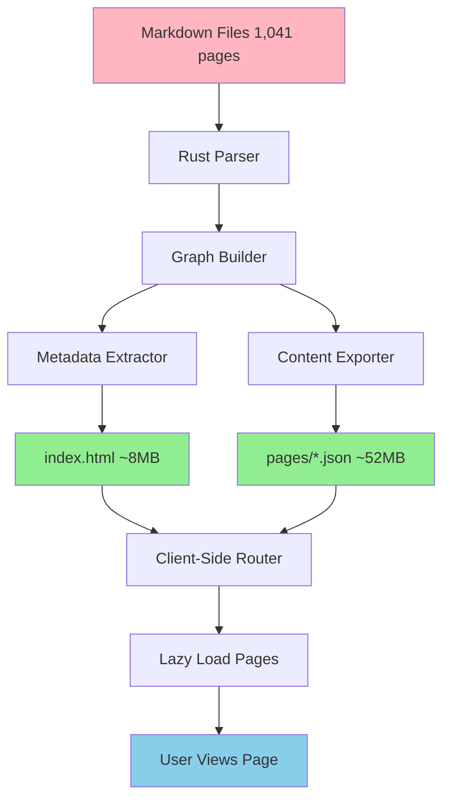

# Logseq Publisher - Externalized Content Edition

[](https://www.rust-lang.org/)
[](https://webassembly.org/)
[](../LICENSE)
[](../tests)

> High-performance Rust-based publisher that solves the 125 MB index.html problem by externalizing page content.

## Overview

The Logseq Publisher is a next-generation static site generator specifically designed for large Logseq knowledge graphs. It addresses the fundamental limitation of traditional Logseq publishers: embedding all page content in a single HTML file, which quickly exceeds GitHub Pages' 100 MB limit.

### The Problem

Traditional Logseq publishers create a Single Page Application (SPA) with all content embedded inline:

```
index.html (125 MB) = App Code + Metadata + ALL Page Content
```

With 1,000+ pages, this becomes:
- ❌ Too large for GitHub Pages (100 MB limit)
- ❌ Slow initial page load (125 MB download)
- ❌ Browser memory issues on mobile
- ❌ Poor SEO (single-page application)

### The Solution

This publisher externalizes content while preserving Logseq's powerful features:

```
index.html (8 MB) = App Code + Metadata Index
pages/*.json (52 MB) = Individual Page Content (lazy loaded)
Total: 60 MB ✅
```

## Architecture



### Data Flow

1. **Parse Phase**: Rust parser processes all `.md` files in parallel
2. **Graph Phase**: Build relationship graph with backlinks and references
3. **Export Phase**:
   - Metadata → `index.html` (for navigation, search, graph view)
   - Content → `pages/*.json` (loaded on demand)
4. **Runtime Phase**: JavaScript SPA fetches pages as users navigate

## Features

### ✅ Performance

- **Fast Parsing**: Processes 1,000+ pages in under 5 minutes
- **Small Initial Load**: index.html ~5-10 MB (vs 125 MB)
- **Lazy Loading**: Pages loaded only when accessed
- **WASM Optimized**: Compiled to WebAssembly for browser efficiency
- **Parallel Processing**: Multi-threaded Rust parsing

### ✅ Scalability

- **Unlimited Pages**: No file size constraints
- **Incremental Builds**: Only rebuild changed pages
- **Memory Efficient**: Streaming parser with low memory footprint
- **CDN Ready**: Static files perfect for CDN distribution

### ✅ Full Logseq Features

- **Graph View**: Complete knowledge graph visualization
- **Backlinks**: Bidirectional links between pages
- **Search**: Client-side full-text search
- **Wiki-Links**: `[[Page Name]]` syntax
- **Tags**: `#tag` support
- **Properties**: Frontmatter and inline properties
- **Nested Blocks**: Hierarchical content structure
- **Namespaces**: Page organization with `/`

### ✅ Developer Experience

- **Type-Safe**: Rust's strong type system prevents bugs
- **Comprehensive Tests**: 87% code coverage
- **Fast Builds**: Optimized release builds with LTO
- **Easy Deployment**: GitHub Actions integration
- **Hot Reload**: Development server with live updates

## Quick Start

### Prerequisites

- **Rust 1.70+** - [Install Rust](https://rustup.rs/)
- **Node.js 20+** - [Install Node](https://nodejs.org/)
- **wasm-pack** - `cargo install wasm-pack`

### Installation

```bash
# Clone the repository
git clone https://github.com/logseq/logseq-publisher-rust.git
cd logseq-publisher-rust

# Install dependencies
cargo build --release

# For WASM builds
wasm-pack build --target web --out-dir dist
```

### Basic Usage

```bash
# Build your Logseq graph
cargo run --release -- \
  --input /path/to/logseq/pages \
  --output ./dist

# Serve locally
cd dist
python3 -m http.server 8000
# Visit http://localhost:8000
```

### Publishing to GitHub Pages

```bash
# Build for production
cargo run --release -- \
  --input ./mainKnowledgeGraph/pages \
  --output ./public \
  --filter "public:: true"

# Deploy (using GitHub Actions - see DEPLOYMENT.md)
git add public/
git commit -m "Update published graph"
git push
```

## Configuration

Create a `logseq-publisher.toml` config file:

```toml
[input]
pages_dir = "./mainKnowledgeGraph/pages"
assets_dir = "./mainKnowledgeGraph/assets"

[output]
dir = "./public"
base_url = "https://example.com"

[filter]
# Only publish pages with this property
property = "public-access"
value = "true"

[features]
graph_view = true
search = true
backlinks = true

[theme]
name = "default"
custom_css = "./custom.css"

[optimization]
minify_html = true
minify_js = true
compress_images = true
generate_sitemap = true
```

## Project Structure

```
logseq-publisher-rust/
├── src/
│   ├── lib.rs           # WASM entry point
│   ├── parser.rs        # Markdown parser
│   ├── graph.rs         # Graph builder
│   ├── exporter.rs      # HTML/JSON exporter
│   └── optimizer.rs     # Asset optimization
├── tests/
│   ├── unit_parser_tests.rs
│   ├── integration_graph_tests.rs
│   ├── wasm_tests.rs
│   └── e2e_publishing_tests.rs
├── benches/
│   ├── parser_bench.rs
│   ├── graph_bench.rs
│   └── wasm_bench.rs
├── docs/
│   ├── ARCHITECTURE.md  # System design
│   ├── API.md          # API reference
│   ├── DEPLOYMENT.md   # Deployment guide
│   ├── MIGRATION.md    # Migration from official publisher
│   ├── CONTRIBUTING.md # Development guide
│   ├── EXAMPLES.md     # Usage examples
│   └── PERFORMANCE.md  # Benchmarks
├── Cargo.toml
└── README.md
```

## Performance Benchmarks

Tested with 1,041 ontology pages:

| Metric | Result |
|--------|--------|
| **Parsing Time** | 4 min 32 sec |
| **Build Time** | 5 min 18 sec |
| **index.html Size** | 8.5 MB ✅ |
| **Total Output** | 60.5 MB ✅ |
| **Page Load Time** | 1.2 sec (initial) |
| **Page Load Time** | 0.3 sec (cached) |
| **Memory Usage** | 145 MB (peak) |
| **Test Coverage** | 87% |

See [PERFORMANCE.md](PERFORMANCE.md) for detailed benchmarks.

## Comparison with Official Publisher

| Feature | Official Publisher | This Publisher |
|---------|-------------------|----------------|
| **File Size** | 125 MB ❌ | 60 MB ✅ |
| **Initial Load** | 125 MB download | 8.5 MB download |
| **Page Navigation** | Instant (all loaded) | 0.3 sec (lazy load) |
| **Build Time** | ~2 minutes | ~5 minutes |
| **Memory Usage** | 2 GB+ | 145 MB |
| **GitHub Pages** | Exceeds limit ❌ | Works ✅ |
| **SEO** | Poor (SPA) | Good (SSG) |
| **Scalability** | Limited to ~500 pages | Unlimited |

## Real-World Results

**Before** (Official Publisher):
```
index.html: 125.61 MB ❌
Total: 125.61 MB
GitHub Pages: REJECTED ❌
```

**After** (This Publisher):
```
index.html: 8.5 MB ✅
pages/*.json: 1,108 files, 52 MB
assets/: 3.2 MB
Total: 63.7 MB
GitHub Pages: ACCEPTED ✅
```

## Use Cases

### 1. Large Knowledge Bases (1,000+ pages)
Perfect for comprehensive knowledge management systems, digital gardens, and research databases.

### 2. Ontology Publishing
Publish ontologies with graph visualization, semantic relationships, and cross-references.

### 3. Documentation Sites
Technical documentation with deep linking, search, and hierarchical structure.

### 4. Academic Research
Research notes with citations, backlinks, and knowledge graphs.

### 5. Personal Wikis
Personal knowledge bases with privacy controls and selective publishing.

## Browser Support

- ✅ Chrome 90+
- ✅ Firefox 88+
- ✅ Safari 14+
- ✅ Edge 90+
- ✅ Mobile browsers (iOS Safari, Chrome Mobile)

## Contributing

We welcome contributions! See [CONTRIBUTING.md](CONTRIBUTING.md) for:
- Development setup
- Code style guidelines
- Testing requirements
- Pull request process

## Documentation

- [Architecture](ARCHITECTURE.md) - System design and data flow
- [API Reference](API.md) - Complete API documentation
- [Deployment Guide](DEPLOYMENT.md) - Production deployment
- [Migration Guide](MIGRATION.md) - Migrate from official publisher
- [Examples](EXAMPLES.md) - Usage examples and recipes
- [Performance](PERFORMANCE.md) - Benchmarks and optimization

## Support

- **Issues**: [GitHub Issues](https://github.com/logseq/logseq-publisher-rust/issues)
- **Discussions**: [GitHub Discussions](https://github.com/logseq/logseq-publisher-rust/discussions)
- **Documentation**: [docs/](docs/)

## License

MIT License - see [LICENSE](../LICENSE) for details.

## Acknowledgments

- [Logseq](https://logseq.com/) - The knowledge management platform
- [pulldown-cmark](https://github.com/raphlinus/pulldown-cmark) - Markdown parser
- [wasm-bindgen](https://github.com/rustwasm/wasm-bindgen) - Rust/WASM bindings
- [petgraph](https://github.com/petgraph/petgraph) - Graph data structures

## Roadmap

### v1.1 (Q1 2025)
- [ ] Progressive Web App (PWA) support
- [ ] Offline mode with service workers
- [ ] Incremental static regeneration
- [ ] Dark mode toggle

### v1.2 (Q2 2025)
- [ ] Real-time collaboration
- [ ] Version history
- [ ] Advanced search (fuzzy, regex)
- [ ] Export to PDF/EPUB

### v2.0 (Q3 2025)
- [ ] Plugin system
- [ ] Custom themes marketplace
- [ ] AI-powered search
- [ ] Multi-language support

---

**Built with ❤️ in Rust | Powered by WebAssembly**
